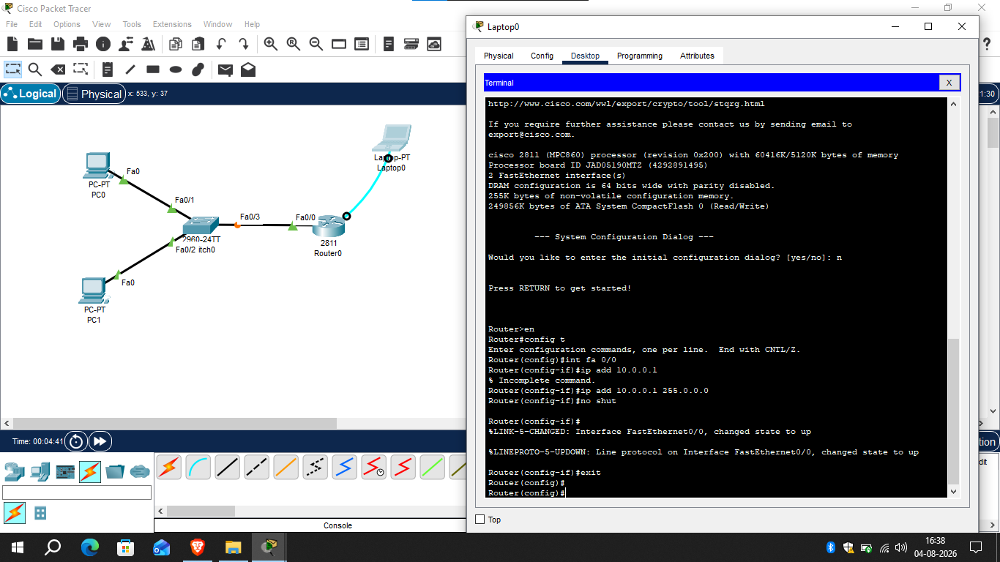

# Basic Connectivity

## 📌 Overview
Basic Connectivity is the first step in building any computer network. This lab demonstrates how to connect network devices using the correct cables and verify that the physical connections are working properly in Cisco Packet Tracer.

---

## 🎯 Objective

- Understand physical network connectivity.
- Identify different network devices.
- Connect devices using the correct cable types.
- Access the router CLI using a console connection.
- Verify that all physical links are operational.

---

## 🖥️ Devices Used

- 1 × Cisco Router
- 1 × Cisco Switch
- 1 × PC
- 1 × Laptop

---

## 🔌 Cables Used

| Cable Type | Connection |
|------------|------------|
| Copper Straight-Through | PC ↔ Switch |
| Copper Straight-Through | Switch ↔ Router |
| Console Cable | Laptop ↔ Router Console Port |

---

## 🌐 Network Topology

---

## 📝 Configuration Steps

1. Added the router, switch, PC, and laptop.
2. Connected the PC to the switch using a Copper Straight-Through cable.
3. Connected the switch to the router using a Copper Straight-Through cable.
4. Connected the laptop to the router's console port using a Console cable.
5. Opened the Terminal application on the laptop.
6. Accessed the Cisco IOS Command Line Interface (CLI).
7. Verified that all physical connections were active.

---

## ✅ Verification

- All interfaces came up successfully.
- Link LEDs turned green.
- Router CLI was accessible through the console connection.
- Physical connectivity was successfully established.

---

## 📚 Skills Practiced

- Physical Network Connectivity
- Cisco Packet Tracer
- Router Console Access
- Cable Identification
- Cisco IOS CLI

---

## 🎓 Learning Outcome

After completing this lab, I learned how to establish physical connectivity between Cisco network devices, choose the appropriate cable type for different connections, and access the Cisco IOS CLI using a console connection.

---

## 🛠️ Software Used

- Cisco Packet Tracer 9.x

---

## 👨‍💻 Author

**Mohamed Ashik**

CCNA (200-301) Student | Aspiring Network Engineer

GitHub: https://github.com/mohamedashik-cpu
