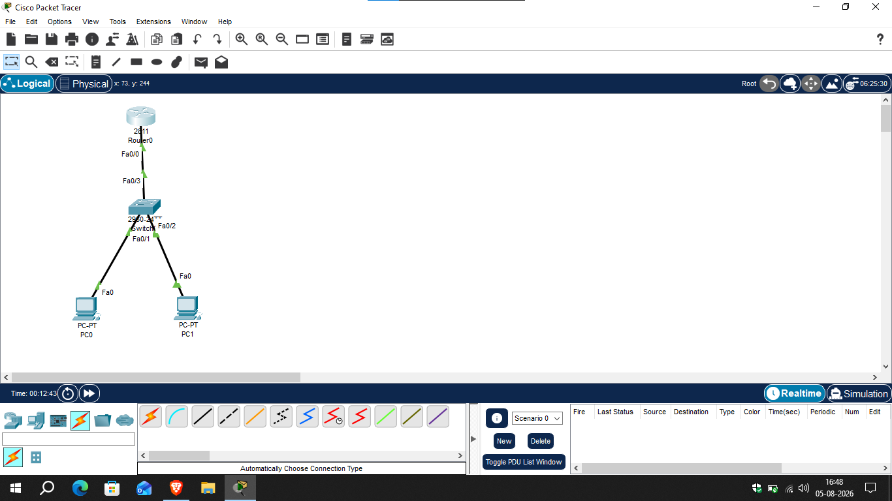

# IP Addressing

## 📖 Overview

IP Addressing is used to uniquely identify devices in a network. Every device connected to a network must have a valid IP address to communicate with other devices. In this lab, static IPv4 addressing is configured and verified using Cisco Packet Tracer.

---

## 🎯 Objective

- Configure static IPv4 addresses on end devices.
- Configure an IP address on the router interface.
- Understand the purpose of the subnet mask.
- Understand the role of the default gateway.
- Verify end-to-end connectivity using the ping command.

---

## 🖥️ Devices Used

| Device | Quantity |
|---------|---------:|
| Cisco Router | 1 |
| Cisco Switch | 1 |
| PC | 2 |

---

## 🌐 IP Addressing Table

| Device | Interface | IP Address | Subnet Mask | Default Gateway |
|---------|-----------|------------|-------------|-----------------|
| Router0 | G0/0 | 192.168.1.1 | 255.255.255.0 | N/A |
| PC0 | NIC | 192.168.1.10 | 255.255.255.0 | 192.168.1.1 |
| PC1 | NIC | 192.168.1.20 | 255.255.255.0 | 192.168.1.1 |

> Replace the IP addresses above if your lab uses different addressing.

---

## 🖼️ Network Topology



---

## ⚙️ Configuration

### Router Configuration

```bash
enable
configure terminal
interface g0/0
ip address 192.168.1.1 255.255.255.0
no shutdown
end
```

### PC Configuration

Configure the following on both PCs:

- IP Address
- Subnet Mask
- Default Gateway

---

## ✅ Verification

Commands used:

```text
show ip interface brief
```

On PC:

```text
ipconfig
```

Connectivity Test:

```text
ping 192.168.1.20
```

Expected Result:

- Router interface should be Up/Up.
- Both PCs should communicate successfully.
- Ping should receive successful replies.

---

## 📚 Concepts Covered

- IPv4 Address
- Static IP Addressing
- Subnet Mask
- Default Gateway
- Network Communication
- Cisco IOS CLI

---

## 🎓 Learning Outcome

After completing this lab, I successfully configured static IPv4 addressing on Cisco devices, understood the importance of subnet masks and default gateways, and verified connectivity using the ping command.

---

## 💡 Interview Questions

1. What is an IPv4 address?
2. What is the purpose of a subnet mask?
3. What is a default gateway?
4. What is the difference between a static IP address and a dynamic IP address?
5. Why can't two devices have the same IP address in the same network?

---

## 🛠️ Software Used

- Cisco Packet Tracer 9.x

---

## 👨‍💻 Author

**Mohamed Ashik**

Aspiring Network Engineer | CCNA (200-301) Student

GitHub: https://github.com/mohamedashik-cpu
