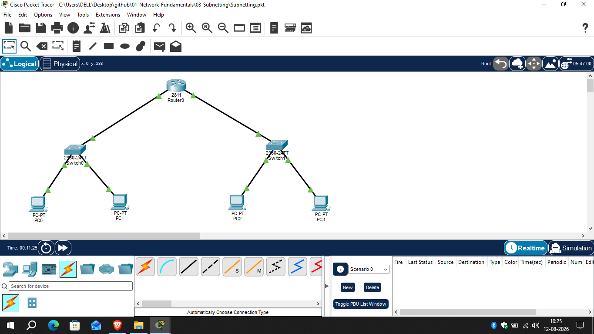

# Subnetting

## 📖 Overview

Subnetting is the process of dividing a larger IP network into smaller logical networks called subnets. This lab demonstrates how to divide a /24 network into two /25 subnets and configure the resulting networks in Cisco Packet Tracer.

---

## 🎯 Objective

- Understand the purpose of subnetting.
- Divide a /24 network into two /25 subnets.
- Calculate network, usable host, and broadcast addresses.
- Configure IP addresses on router interfaces and PCs.
- Verify communication within and between different subnets.

---

## 🌐 Network Topology



---

## 🖥️ Devices Used

- 1 × Cisco Router
- 2 × Cisco Switches
- 4 × PCs

---

## 📊 Subnet Calculation

### Original Network

```text
Network: 192.168.10.0/24
Subnet Mask: 255.255.255.0
```

The /24 network was divided into two /25 subnets.

### Subnet 1

```text
Network Address:   192.168.10.0/25
Usable IP Range:   192.168.10.1 - 192.168.10.126
Broadcast Address: 192.168.10.127
```

### Subnet 2

```text
Network Address:   192.168.10.128/25
Usable IP Range:   192.168.10.129 - 192.168.10.254
Broadcast Address: 192.168.10.255
```

---

## 📋 IP Addressing Table

| Device | Interface | IP Address | Subnet Mask | Default Gateway |
|--------|-----------|------------|-------------|-----------------|
| Router0 | G0/0 | 192.168.10.1 | 255.255.255.128 | N/A |
| PC0 | NIC | 192.168.10.10 | 255.255.255.128 | 192.168.10.1 |
| PC1 | NIC | 192.168.10.20 | 255.255.255.128 | 192.168.10.1 |
| Router0 | G0/1 | 192.168.10.129 | 255.255.255.128 | N/A |
| PC2 | NIC | 192.168.10.140 | 255.255.255.128 | 192.168.10.129 |
| PC3 | NIC | 192.168.10.150 | 255.255.255.128 | 192.168.10.129 |

---

## ⚙️ Router Configuration

```bash
enable
configure terminal

interface fa0/0
ip address 192.168.10.1 255.255.255.128
no shutdown
exit

interface fa0/1
ip address 192.168.10.129 255.255.255.128
no shutdown
exit

end
```

---

## 🔍 Verification

### Check Router Interfaces

```bash
show ip interface brief
```

Both router interfaces were verified as operational.

### Test Same-Subnet Connectivity

```text
PC0 → PC1
192.168.10.10 → 192.168.10.20
```

### Test Inter-Subnet Connectivity

```text
PC0 → PC2
192.168.10.10 → 192.168.10.140
```

Successful ping responses confirmed connectivity between the two subnets through the router.

---

## 📚 Concepts Covered

- IPv4 Addressing
- Subnetting
- CIDR Notation
- /24 to /25 Subnetting
- Network Address
- Broadcast Address
- Usable Host Range
- Subnet Mask
- Default Gateway
- Inter-Subnet Communication

---

## 🎓 Learning Outcome

After completing this lab, I learned how to divide a /24 IPv4 network into /25 subnets, calculate network and broadcast addresses, configure the resulting subnets, and verify communication between different networks using a router.

---

## 💡 Interview Questions

1. What is subnetting?
2. Why is subnetting used?
3. How many subnets are created when a /24 network is changed to /25?
4. What is the subnet mask for /25?
5. What is the network address of 192.168.10.140/25?
6. What is the broadcast address of the second subnet?
7. How many usable hosts are available in a /25 subnet?
8. What is the difference between a network address and a broadcast address?

---

## 🛠️ Software Used

- Cisco Packet Tracer 9.0.1.0858

---

## 👨‍💻 Author

**Mohamed Ashik**

Aspiring Network Engineer | CCNA (200-301) Student

GitHub: https://github.com/mohamedashik-cpu
