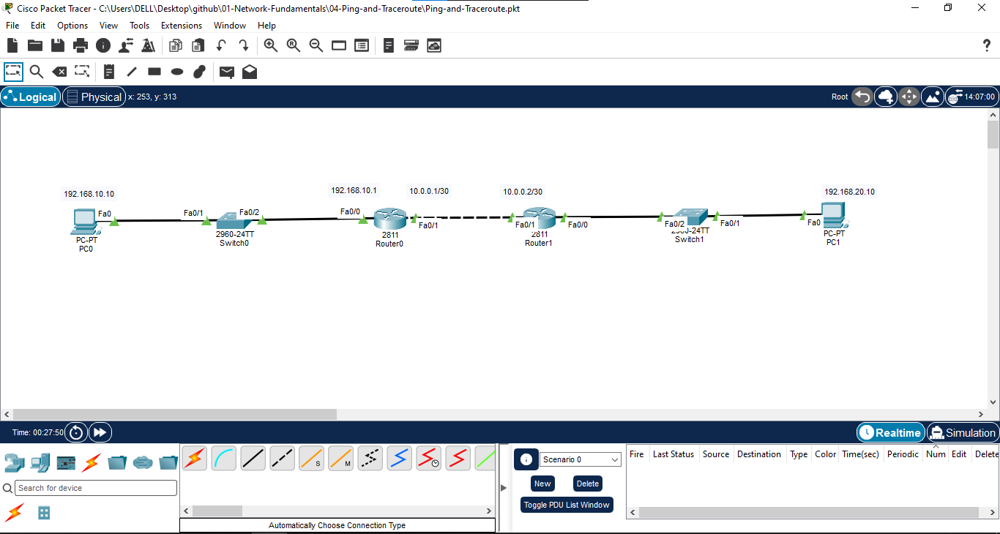
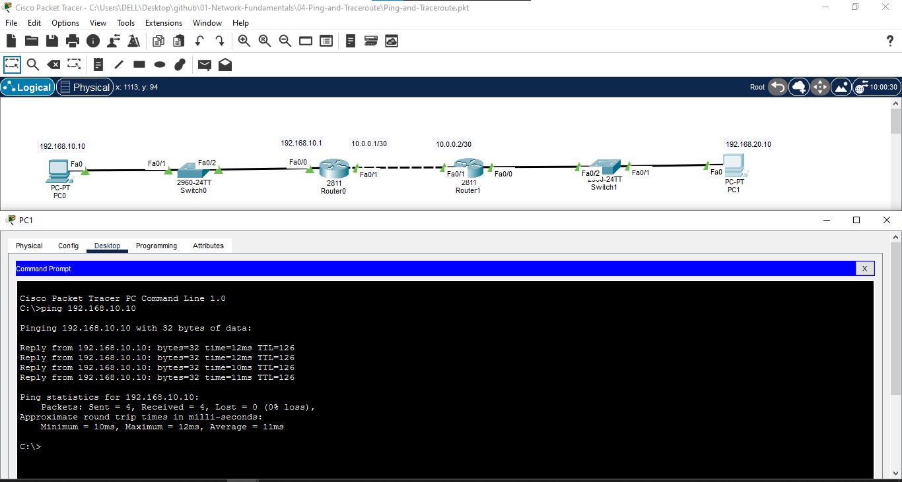
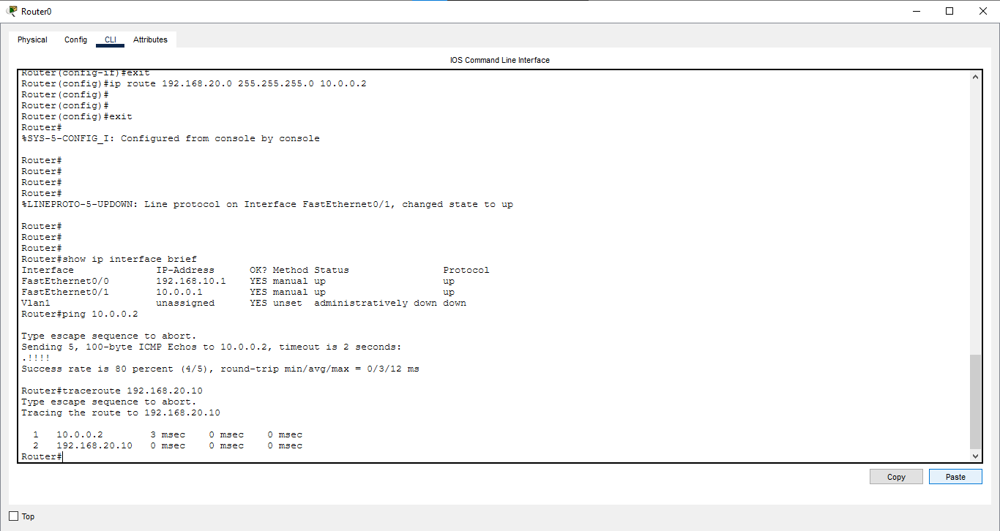
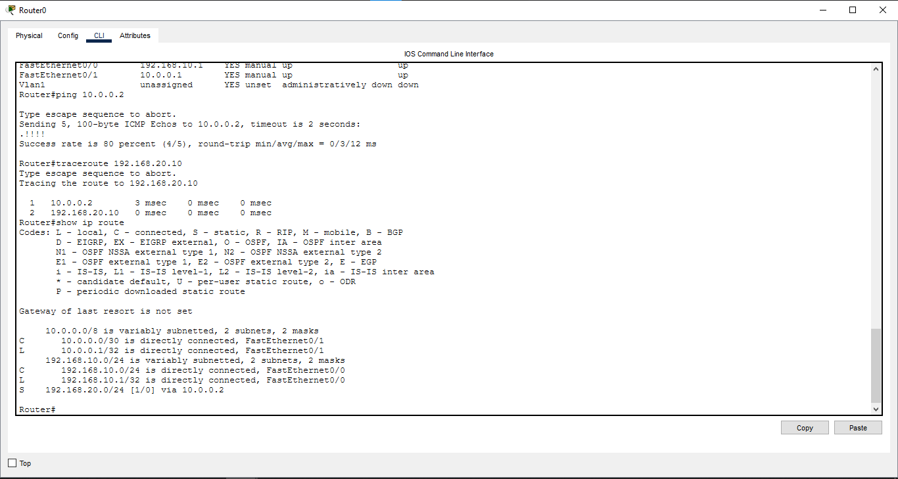
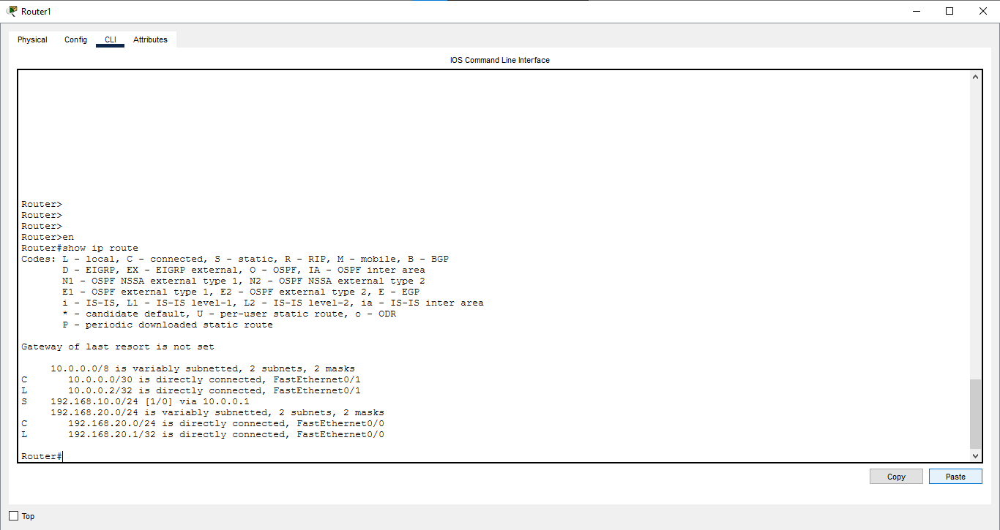

# Ping and Traceroute

## 📖 Overview

Ping and Traceroute are important network troubleshooting tools used to verify connectivity and identify the path taken by packets across a network.

In this lab, two PCs are connected through two Cisco routers. Static routing is configured between the routers, and connectivity is verified using `ping` and `tracert`.

---

## 🎯 Objective

- Understand the purpose of the `ping` command.
- Understand the purpose of the `traceroute` / `tracert` command.
- Configure IPv4 addresses on router interfaces and PCs.
- Configure static routes between two networks.
- Verify end-to-end connectivity.
- Identify the packet path between two different networks.

---

## 🖥️ Devices Used

- 2 × Cisco Routers
- 2 × Cisco Switches
- 2 × PCs

---

## 🌐 Network Topology



---

## 📊 IP Addressing Table

| Device | Interface | IP Address | Subnet Mask | Default Gateway |
|--------|-----------|------------|-------------|-----------------|
| Router0 | Fa0/0 | 192.168.10.1 | 255.255.255.0 | N/A |
| Router0 | Fa0/1 | 10.0.0.1 | 255.255.255.252 | N/A |
| Router1 | Fa0/0 | 192.168.20.1 | 255.255.255.0 | N/A |
| Router1 | Fa0/1 | 10.0.0.2 | 255.255.255.252 | N/A |
| PC0 | NIC | 192.168.10.10 | 255.255.255.0 | 192.168.10.1 |
| PC1 | NIC | 192.168.20.10 | 255.255.255.0 | 192.168.20.1 |

---

## ⚙️ Router Configuration

### Router0

```bash
enable
configure terminal

interface fa0/0
ip address 192.168.10.1 255.255.255.0
no shutdown
exit

interface fa0/1
ip address 10.0.0.1 255.255.255.252
no shutdown
exit

ip route 192.168.20.0 255.255.255.0 10.0.0.2

end
```

### Router1

```bash
enable
configure terminal

interface fa0/0
ip address 192.168.20.1 255.255.255.0
no shutdown
exit

interface fa0/1
ip address 10.0.0.2 255.255.255.252
no shutdown
exit

ip route 192.168.10.0 255.255.255.0 10.0.0.1

end
```

---

## 💻 PC Configuration

### PC0

```text
IP Address:      192.168.10.10
Subnet Mask:     255.255.255.0
Default Gateway: 192.168.10.1
```

### PC1

```text
IP Address:      192.168.20.10
Subnet Mask:     255.255.255.0
Default Gateway: 192.168.20.1
```

---

## 🔍 Verification

### 1. Check Interface Status

```bash
show ip interface brief
```

The configured router interfaces should be in an **up/up** state.

### 2. Check Routing Table

Router0:

```bash
show ip route
```

Router1:

```bash
show ip route
```

The configured static routes should be visible in the routing table.

### 3. Ping Test

From PC0:

```text
ping 192.168.20.10
```

Successful replies confirm end-to-end connectivity between the two LANs.

### 4. Traceroute Test

From PC0:

```text
tracert 192.168.20.10
```

The traceroute output shows the intermediate router hops used to reach PC1.

---

## 📸 Verification Screenshots

### Ping Result



### Traceroute Result



### Router0 Routing Table



### Router1 Routing Table



---

## 📚 Concepts Covered

- IPv4 Addressing
- Ping
- Traceroute
- Static Routing
- Default Gateway
- Routing Table
- Network Connectivity
- Network Troubleshooting

---

## 🎓 Learning Outcome

After completing this lab, I learned how to verify network connectivity using `ping`, identify the path taken by packets using `tracert`, configure static routes between different networks, and troubleshoot basic connectivity issues using Cisco IOS verification commands.

---

## 💡 Interview Questions

1. What is the purpose of the ping command?
2. What is the difference between ping and traceroute?
3. What information does traceroute provide?
4. Why is a default gateway required?
5. What is a static route?
6. How can you verify a static route on a Cisco router?
7. What does `show ip interface brief` display?
8. What does an `up/up` interface status indicate?

---

## 🛠️ Software Used

- Cisco Packet Tracer 9.0.1.0858

---

## 👨‍💻 Author

**Mohamed Ashik**

Aspiring Network Engineer | CCNA (200-301) Student

GitHub: https://github.com/mohamedashik-cpu
