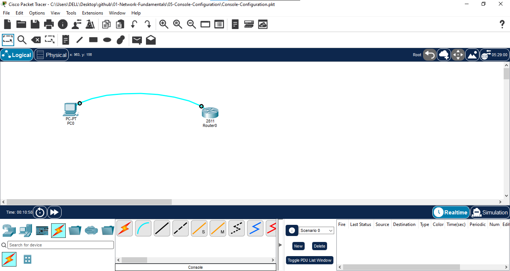
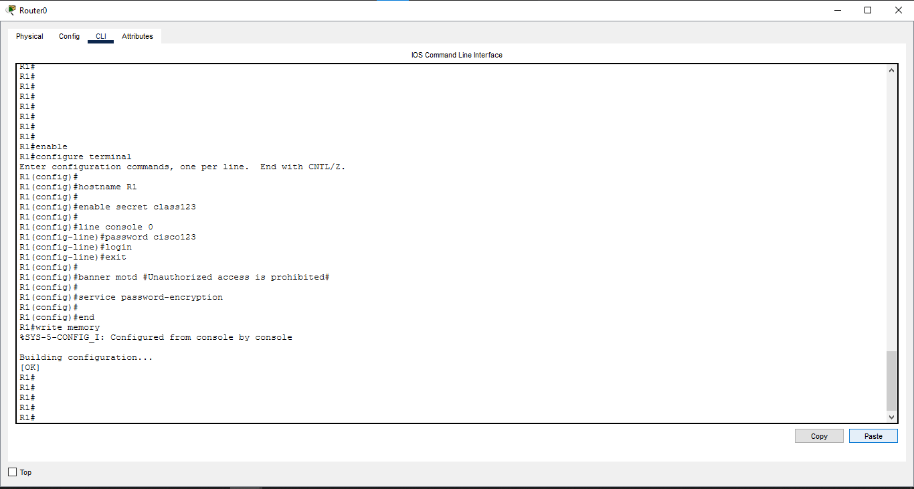
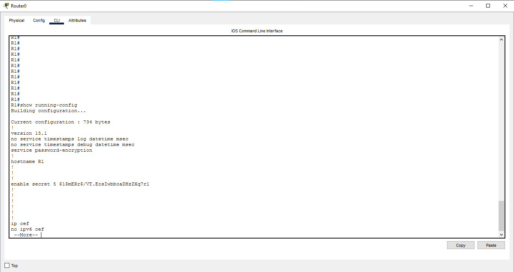
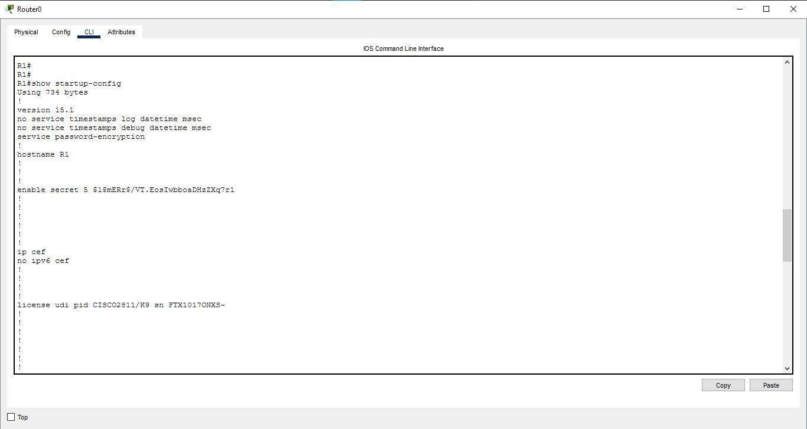

# Console Configuration

## 📖 Overview

Console configuration provides local management access to a Cisco network device. In this lab, a Cisco router is accessed through the console connection and basic device security and management settings are configured using Cisco IOS commands.

---

## 🎯 Objective

- Access a Cisco router using a console connection.
- Configure the router hostname.
- Configure an enable secret password.
- Configure a console line password.
- Configure a MOTD banner.
- Enable password encryption.
- Save the device configuration.
- Verify the running and startup configurations.

---

## 🖥️ Devices Used

- 1 × Cisco Router
- 1 × PC

---

## 🌐 Network Topology



---

## 🔌 Console Connection

The PC is connected to the router using a console cable.

```text
PC0 (RS232)
     |
     | Console Cable
     |
Router0 (Console)
```

---

## ⚙️ Router Configuration

### Basic Configuration

```bash
enable
configure terminal

hostname R1

enable secret class123

line console 0
password cisco123
login
exit

banner motd #Unauthorized access is prohibited#

service password-encryption

end
```

---

## 💾 Save Configuration

```bash
copy running-config startup-config
```

or:

```bash
write memory
```

---

## 🔍 Verification

### Check Running Configuration

```bash
show running-config
```

The output was verified for:

- Hostname
- Enable secret
- Console password
- MOTD banner
- Password encryption

### Check Startup Configuration

```bash
show startup-config
```

The saved configuration was verified in NVRAM.

---

## 📸 Verification Screenshots

### Console Configuration



### Running Configuration



### Startup Configuration



---

## 📚 Concepts Covered

- Cisco IOS CLI
- Console Access
- Hostname Configuration
- Enable Secret
- Console Password
- MOTD Banner
- Password Encryption
- Running Configuration
- Startup Configuration
- Configuration Backup

---

## 🎓 Learning Outcome

After completing this lab, I learned how to access a Cisco router through a console connection, configure basic device security settings, manage Cisco IOS configurations, and save and verify device configurations.

---

## 💡 Interview Questions

1. What is console access?
2. What is the purpose of `enable secret`?
3. What is the difference between `enable password` and `enable secret`?
4. What is the purpose of `line console 0`?
5. What is the purpose of the `login` command?
6. What is an MOTD banner?
7. What does `service password-encryption` do?
8. What is the difference between running-config and startup-config?
9. Where is the startup configuration stored?
10. Why do we use `copy running-config startup-config`?

---

## 🛠️ Software Used

- Cisco Packet Tracer 9.0.1.0858

---

## 👨‍💻 Author

**Mohamed Ashik**

Aspiring Network Engineer | CCNA (200-301) Student

GitHub: https://github.com/mohamedashik-cpu
