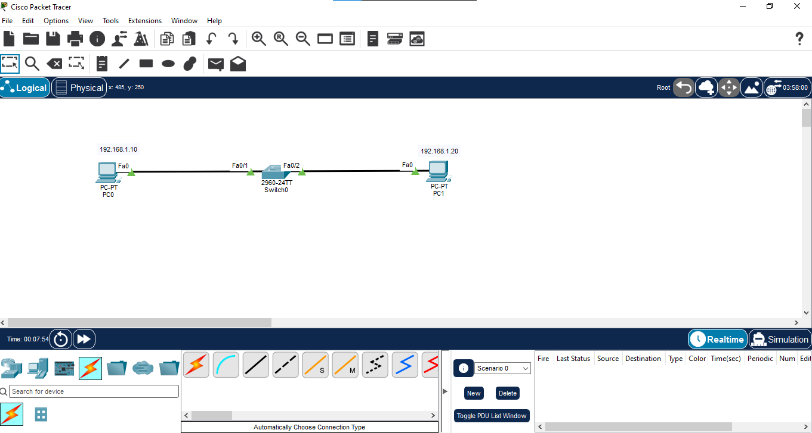
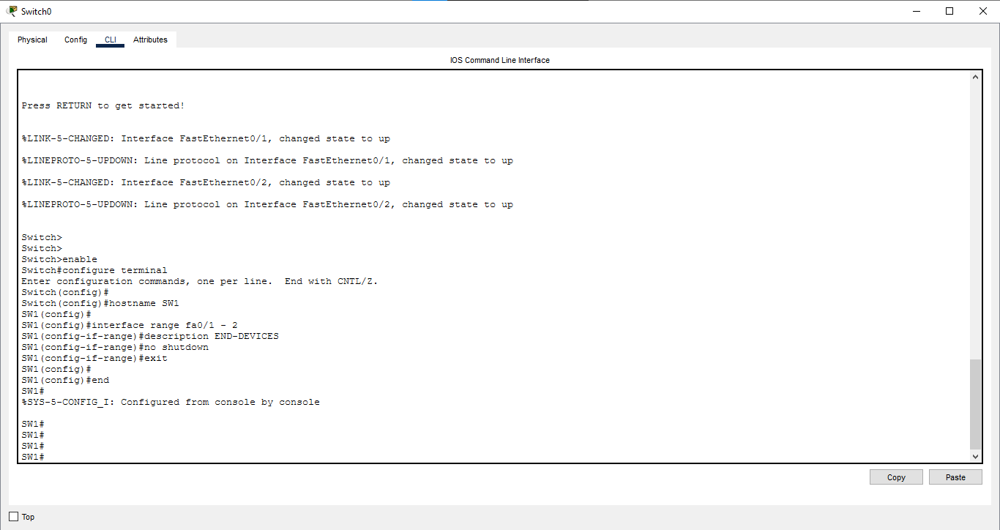
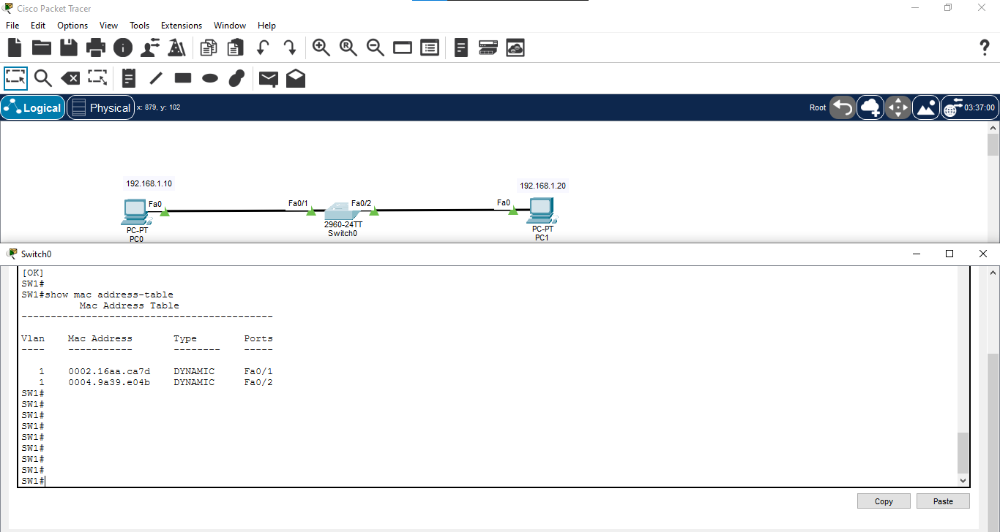
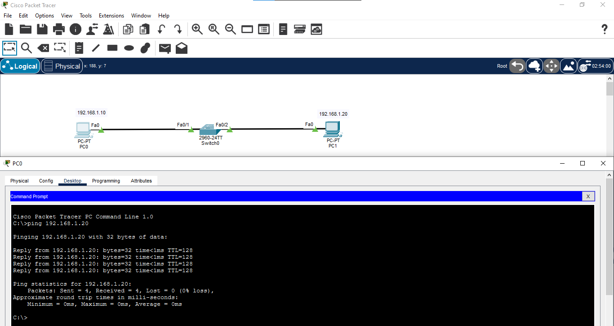

# Basic Switch Configuration

## 📖 Overview

A Layer 2 switch is used to connect devices within the same local area network (LAN). In this lab, a Cisco switch is configured with basic settings and used to connect two PCs. MAC address learning and basic switch verification are also performed.

---

## 🎯 Objective

- Understand the basic function of a Layer 2 switch.
- Configure a Cisco switch using Cisco IOS CLI.
- Configure a hostname.
- Configure switch interfaces.
- Connect end devices to the switch.
- Verify connectivity between PCs.
- Verify MAC address learning using the MAC address table.
- Verify interface status and running configuration.

---

## 🖥️ Devices Used

- 1 × Cisco 2960 Switch
- 2 × PCs

---

## 🌐 Network Topology



---

## 📊 IP Addressing Table

| Device | Interface | IP Address | Subnet Mask |
|--------|-----------|------------|-------------|
| PC0 | NIC | 192.168.1.10 | 255.255.255.0 |
| PC1 | NIC | 192.168.1.20 | 255.255.255.0 |

> Both PCs are configured in the same IPv4 network.

---

## 🔌 Port Connections

| Device | Port | Connected To |
|--------|------|--------------|
| Switch0 | Fa0/1 | PC0 |
| Switch0 | Fa0/2 | PC1 |

---

## ⚙️ Switch Configuration

```bash
enable
configure terminal

hostname SW1

interface range fa0/1 - 2
description END-DEVICES
no shutdown
exit

end
```

---

## 💾 Save Configuration

```bash
copy running-config startup-config
```

---

## 🔍 Verification

### 1. Check Interface Status

```bash
show interfaces status
```

The connected switch ports should be operational.

### 2. Check Running Configuration

```bash
show running-config
```

Verify the configured hostname and interface settings.

### 3. Test Connectivity

From PC0:

```text
ping 192.168.1.20
```

Successful replies confirm connectivity between the two PCs through the switch.

### 4. Check MAC Address Table

```bash
show mac address-table
```

The switch learns the MAC addresses of connected devices and stores them in its MAC address table.

---

## 📸 Verification Screenshots

### Switch Configuration



### MAC Address Table



### Ping Result



---

## 📚 Concepts Covered

- Layer 2 Switching
- LAN
- Cisco 2960 Switch
- Cisco IOS CLI
- Switch Ports
- FastEthernet
- MAC Address
- MAC Address Table
- MAC Address Learning
- Interface Status
- Basic Switch Configuration

---

## 🎓 Learning Outcome

After completing this lab, I learned how a Layer 2 switch connects devices within a LAN, configured basic Cisco switch settings using IOS CLI, verified interface status, tested end-to-end connectivity, and observed how the switch learns and stores MAC addresses.

---

## 💡 Interview Questions

1. What is a Layer 2 switch?
2. What is the main function of a switch?
3. What is a MAC address?
4. What is a MAC address table?
5. How does a switch learn MAC addresses?
6. What happens when a switch receives a frame with an unknown destination MAC address?
7. What is the difference between a switch and a router?
8. What does `show mac address-table` display?
9. What does `show interfaces status` display?
10. Why is `no shutdown` used on an interface?

---

## 🛠️ Software Used

- Cisco Packet Tracer 9.0.1.0858

---

## 👨‍💻 Author

**Mohamed Ashik**

Aspiring Network Engineer | CCNA (200-301) Student

GitHub: [mohamedashik-cpu](https://github.com/mohamedashik-cpu)
