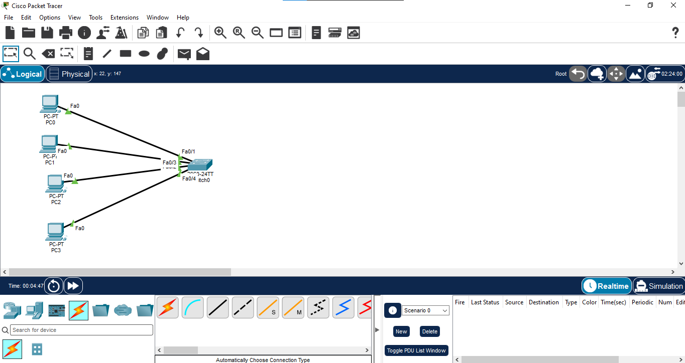
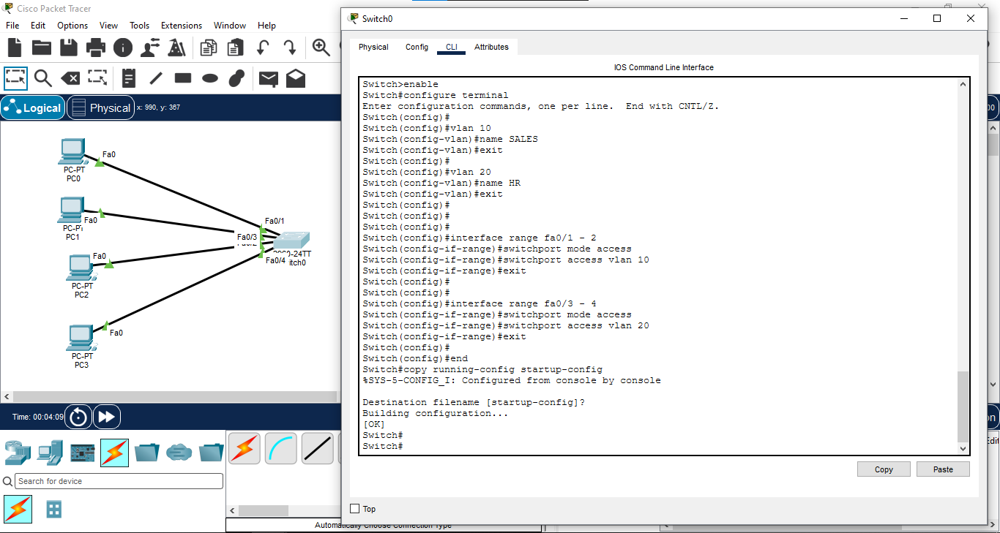
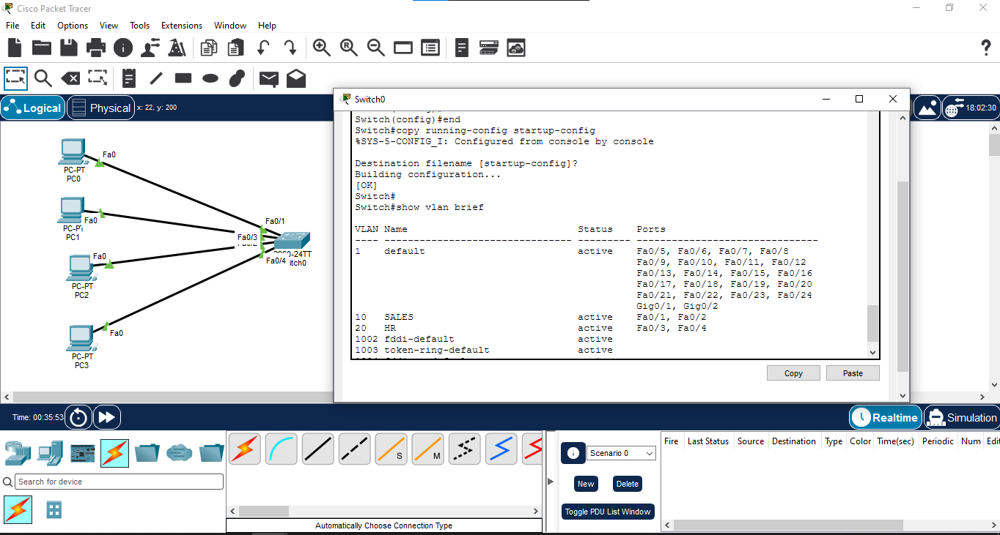
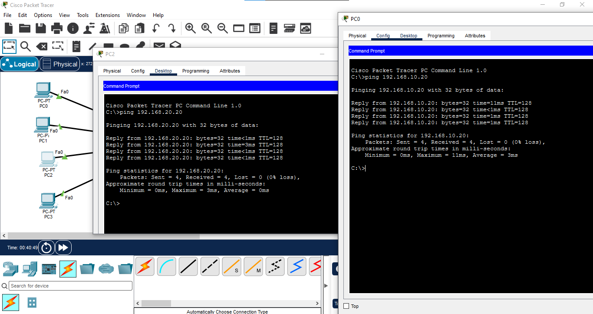
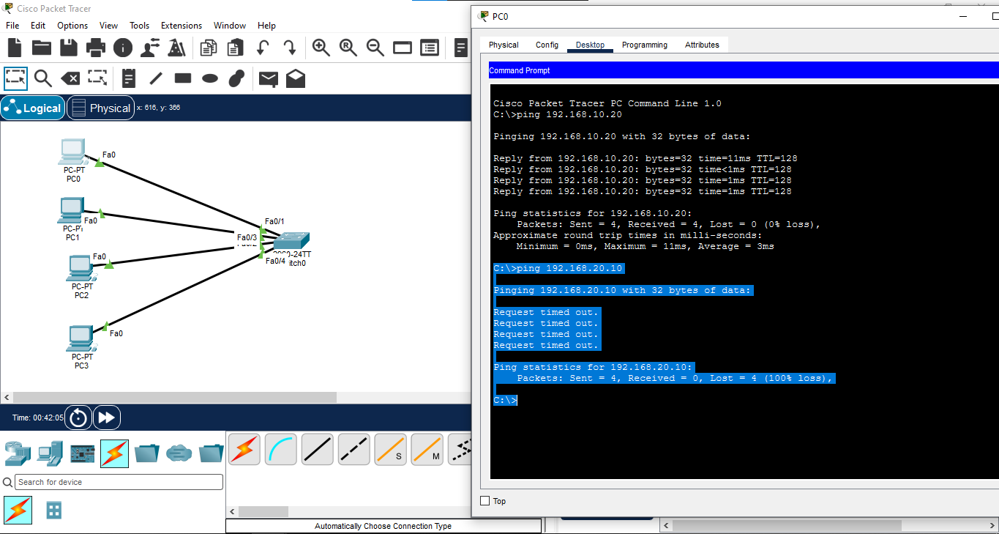

# VLAN Configuration

## 📖 Overview

A Virtual Local Area Network (VLAN) is used to logically divide a Layer 2 network into separate broadcast domains. In this lab, two VLANs are created on a Cisco switch and end devices are assigned to their respective VLANs.

---

## 🎯 Objective

- Understand the purpose of VLANs.
- Create VLANs on a Cisco switch.
- Assign switch ports to specific VLANs.
- Configure access ports.
- Verify VLAN membership.
- Test communication between devices in the same VLAN.
- Understand why devices in different VLANs cannot communicate without Layer 3 routing.

---

## 🖥️ Devices Used

- 1 × Cisco 2960 Switch
- 4 × PCs

---

## 🌐 Network Topology



---

## 📋 VLAN Configuration

| VLAN ID | VLAN Name | Switch Ports |
|---------|-----------|--------------|
| 10 | SALES | Fa0/1, Fa0/2 |
| 20 | HR | Fa0/3, Fa0/4 |

---

## 📊 IP Addressing Table

| Device | VLAN | IP Address | Subnet Mask |
|--------|------|------------|-------------|
| PC0 | VLAN 10 | 192.168.10.10 | 255.255.255.0 |
| PC1 | VLAN 10 | 192.168.10.20 | 255.255.255.0 |
| PC2 | VLAN 20 | 192.168.20.10 | 255.255.255.0 |
| PC3 | VLAN 20 | 192.168.20.20 | 255.255.255.0 |

---

## ⚙️ Switch Configuration

### Create VLANs

```bash
enable
configure terminal

vlan 10
name SALES
exit

vlan 20
name HR
exit
```

### Configure VLAN 10 Access Ports

```bash
interface range fa0/1 - 2
switchport mode access
switchport access vlan 10
exit
```

### Configure VLAN 20 Access Ports

```bash
interface range fa0/3 - 4
switchport mode access
switchport access vlan 20
exit
```

### Save Configuration

```bash
end
copy running-config startup-config
```

---

## 🔍 Verification

### Verify VLANs

```bash
show vlan brief
```

The output should show:

```text
VLAN 10 - SALES
Fa0/1
Fa0/2

VLAN 20 - HR
Fa0/3
Fa0/4
```

---

## 🧪 Connectivity Testing

### Same VLAN Communication

PC0 → PC1:

```text
ping 192.168.10.20
```

Expected result: **Successful**

PC2 → PC3:

```text
ping 192.168.20.20
```

Expected result: **Successful**

### Different VLAN Communication

PC0 → PC2:

```text
ping 192.168.20.10
```

Expected result: **Unsuccessful**

This is expected because VLAN 10 and VLAN 20 are separate Layer 2 broadcast domains. Communication between different VLANs requires a Layer 3 routing device.

---

## 📸 Verification Screenshots

### VLAN Configuration



### VLAN Verification



### Same VLAN Ping



### Different VLAN Ping



---

## 📚 Concepts Covered

- Virtual LAN (VLAN)
- VLAN ID
- VLAN Name
- Access Port
- VLAN Port Assignment
- Layer 2 Switching
- Broadcast Domain
- Same-VLAN Communication
- Inter-VLAN Communication
- `show vlan brief`

---

## 🎓 Learning Outcome

After completing this lab, I learned how to create and configure VLANs on a Cisco switch, assign access ports to different VLANs, verify VLAN membership, and understand communication behavior within the same VLAN and between different VLANs.

---

## 💡 Interview Questions

1. What is a VLAN?
2. Why are VLANs used?
3. What is a broadcast domain?
4. What is an access port?
5. What is the difference between VLAN 10 and VLAN 20?
6. Can devices in different VLANs communicate directly?
7. What is required for communication between different VLANs?
8. What does `show vlan brief` display?
9. What happens when a switch port is assigned to a VLAN?
10. What is the difference between a VLAN and a subnet?

---

## 🛠️ Software Used

- Cisco Packet Tracer 9.0.1.0858

---

## 👨‍💻 Author

**Mohamed Ashik**

Aspiring Network Engineer | CCNA (200-301) Student

GitHub: [mohamedashik-cpu](https://github.com/mohamedashik-cpu)
