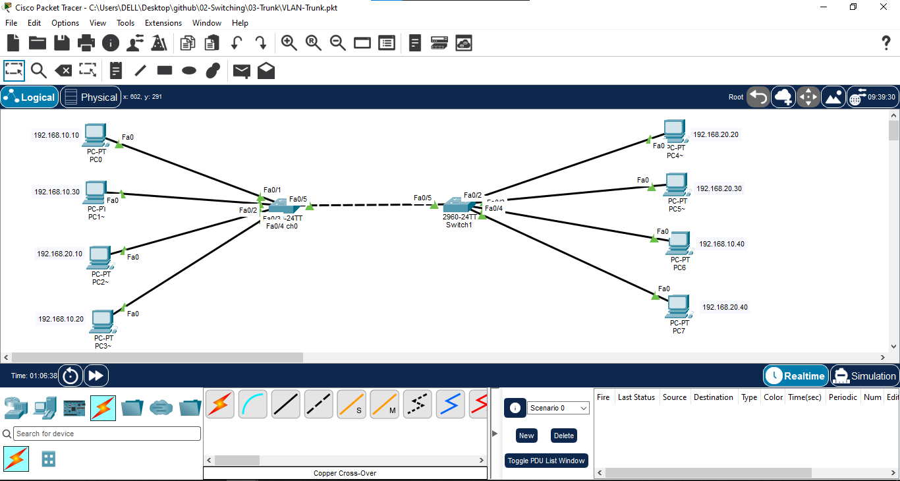
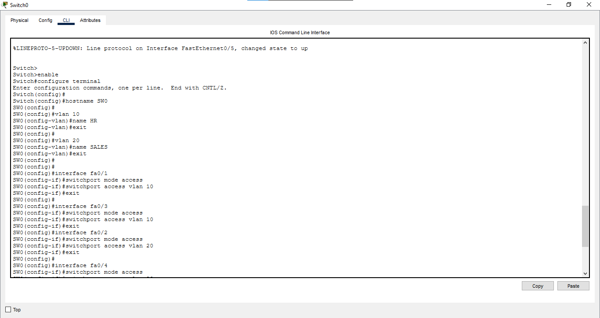
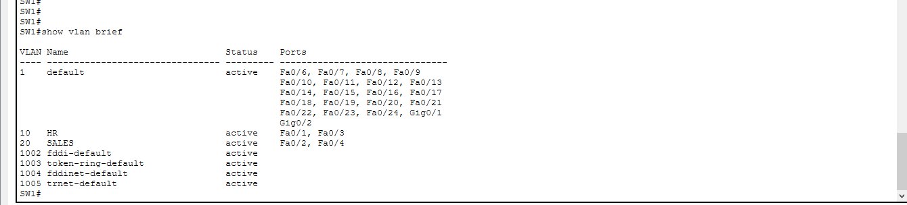
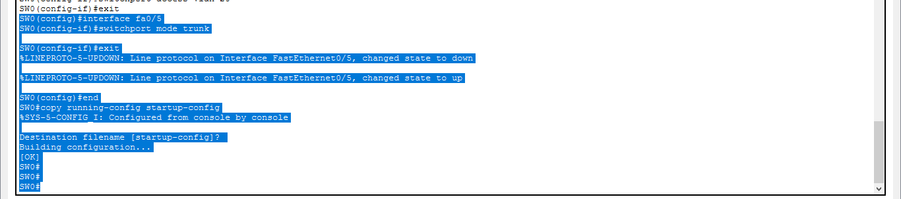
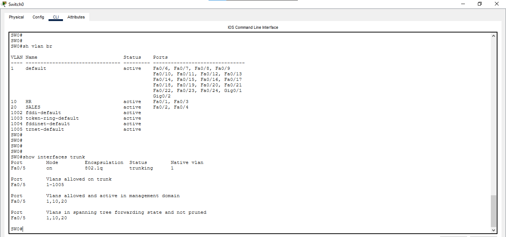
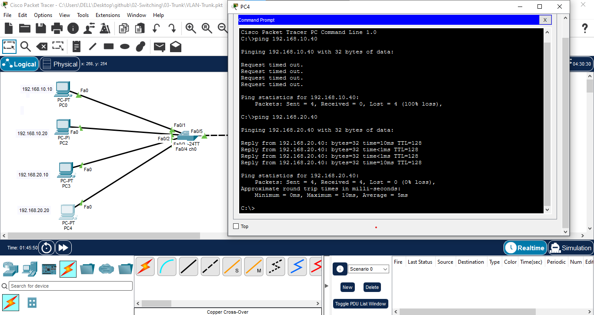
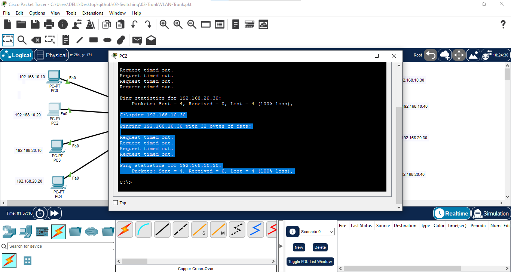

# VLAN and Trunk Configuration

## 📖 Overview

In this lab, two Cisco Layer 2 switches are configured with VLAN 10 and VLAN 20. Access ports are assigned to the appropriate VLANs, and a trunk link is configured between the two switches to carry traffic from multiple VLANs.

The lab demonstrates how devices in the same VLAN can communicate across different switches using a trunk link, while devices in different VLANs cannot communicate without Layer 3 routing.

---

## 🎯 Objectives

- Create VLAN 10 and VLAN 20.
- Assign switch access ports to the appropriate VLANs.
- Configure a trunk link between two Cisco switches.
- Verify VLAN membership.
- Verify trunk operation.
- Test same-VLAN communication across two switches.
- Test communication between different VLANs.
- Understand the difference between access ports and trunk ports.

---

## 🖥️ Devices Used

- 2 × Cisco 2960 Switches
- 8 × PCs
- Cisco Packet Tracer

---

## 🌐 Network Topology



---

## 🔌 Port Mapping

| Switch | Port | Connected Device | VLAN |
|---|---|---|---|
| SW0 | Fa0/1 | PC0 | VLAN 10 |
| SW0 | Fa0/2 | PC2 | VLAN 10 |
| SW0 | Fa0/3 | PC3 | VLAN 20 |
| SW0 | Fa0/4 | PC4 | VLAN 20 |
| SW0 | Fa0/5 | SW1 Fa0/5 | Trunk |
| SW1 | Fa0/1 | PC1 | VLAN 10 |
| SW1 | Fa0/2 | PC5 | VLAN 10 |
| SW1 | Fa0/3 | PC6 | VLAN 20 |
| SW1 | Fa0/4 | PC7 | VLAN 20 |

---

## 📊 VLAN Configuration

| VLAN ID | VLAN Name | Purpose |
|---|---|---|
| 10 | HR | HR Department |
| 20 | SALES | Sales Department |

---

## 🌐 IP Addressing

| Device | Switch Port | VLAN | IP Address | Subnet Mask |
|---|---|---:|---|---|
| PC0 | SW0 Fa0/1 | 10 | 192.168.10.10 | 255.255.255.0 |
| PC2 | SW0 Fa0/2 | 10 | 192.168.10.20 | 255.255.255.0 |
| PC3 | SW0 Fa0/3 | 20 | 192.168.20.10 | 255.255.255.0 |
| PC4 | SW0 Fa0/4 | 20 | 192.168.20.20 | 255.255.255.0 |
| PC1 | SW1 Fa0/1 | 10 | 192.168.10.30 | 255.255.255.0 |
| PC5 | SW1 Fa0/2 | 10 | 192.168.10.40 | 255.255.255.0 |
| PC6 | SW1 Fa0/3 | 20 | 192.168.20.30 | 255.255.255.0 |
| PC7 | SW1 Fa0/4 | 20 | 192.168.20.40 | 255.255.255.0 |

> Default gateway is not configured because Inter-VLAN Routing is not used in this lab.

---

# ⚙️ Configuration

## 1. Configure SW0

### Create VLANs

```bash
enable
configure terminal

hostname SW0

vlan 10
name HR
exit

vlan 20
name SALES
exit
```

### Configure VLAN 10 Access Ports

```bash
interface range fa0/1 - 2
switchport mode access
switchport access vlan 10
exit
```

### Configure VLAN 20 Access Ports

```bash
interface range fa0/3 - 4
switchport mode access
switchport access vlan 20
exit
```

### Configure Trunk Port

```bash
interface fa0/5
switchport mode trunk
exit
```

### Save Configuration

```bash
end
copy running-config startup-config
```

---

## 2. Configure SW1

### Create VLANs

```bash
enable
configure terminal

hostname SW1

vlan 10
name HR
exit

vlan 20
name SALES
exit
```

### Configure VLAN 10 Access Ports

```bash
interface range fa0/1 - 2
switchport mode access
switchport access vlan 10
exit
```

### Configure VLAN 20 Access Ports

```bash
interface range fa0/3 - 4
switchport mode access
switchport access vlan 20
exit
```

### Configure Trunk Port

```bash
interface fa0/5
switchport mode trunk
exit
```

### Save Configuration

```bash
end
copy running-config startup-config
```

---

# 🔍 Verification

## Verify VLAN Configuration

On both switches:

```bash
show vlan brief
```

Expected:

```text
VLAN 10
Fa0/1
Fa0/2

VLAN 20
Fa0/3
Fa0/4
```

---

## Verify Trunk Configuration

On both switches:

```bash
show interfaces trunk
```

The `Fa0/5` interface should be displayed as a trunking port.

---

# 🧪 Connectivity Testing

## Same VLAN Communication

### VLAN 10

PC0 → PC1:

```bash
ping 192.168.10.30
```

Expected result:

```text
Successful
```

PC2 → PC5:

```bash
ping 192.168.10.40
```

Expected result:

```text
Successful
```

### VLAN 20

PC3 → PC6:

```bash
ping 192.168.20.30
```

Expected result:

```text
Successful
```

PC4 → PC7:

```bash
ping 192.168.20.40
```

Expected result:

```text
Successful
```

---

## Different VLAN Communication

PC0 → PC3:

```bash
ping 192.168.20.10
```

Expected result:

```text
Unsuccessful
```

PC2 → PC6:

```bash
ping 192.168.20.30
```

Expected result:

```text
Unsuccessful
```

This is expected because VLAN 10 and VLAN 20 are separate Layer 2 broadcast domains. Communication between different VLANs requires a Layer 3 routing device.

---

# 📸 Verification Screenshots

## VLAN Configuration



## VLAN Verification



## Trunk Configuration



## Trunk Verification



## Same VLAN Connectivity



## Different VLAN Connectivity



---

# 📚 Concepts Covered

- VLAN
- VLAN 10 and VLAN 20
- Access Port
- Trunk Port
- 802.1Q Trunking
- VLAN Segmentation
- Broadcast Domain
- Inter-Switch Connectivity
- Same-VLAN Communication
- Inter-VLAN Communication
- `show vlan brief`
- `show interfaces trunk`

---

# 🎓 Learning Outcome

After completing this lab, I learned how to configure VLANs on multiple Cisco switches, assign access ports to different VLANs, configure a trunk link between switches, verify VLAN and trunk status, and test communication between devices across the network.

This lab helped me understand how trunk links carry multiple VLANs between switches while maintaining VLAN separation.

---

# 💡 Interview Questions

1. What is a VLAN?
2. What is a trunk port?
3. What is an access port?
4. Why is a trunk link required between switches?
5. What is the difference between an access port and a trunk port?
6. What is 802.1Q?
7. Can a trunk port carry multiple VLANs?
8. Can devices in different VLANs communicate without a router?
9. What command is used to verify VLANs?
10. What command is used to verify trunking?
11. What is a broadcast domain?
12. Why does same-VLAN communication work across two switches?

---

## 🛠️ Software Used

- Cisco Packet Tracer 9.0.1.0858

---

## 👨‍💻 Author

**Mohamed Ashik**

Aspiring Network Engineer | CCNA (200-301) Student

GitHub: [mohamedashik-cpu](https://github.com/mohamedashik-cpu)
