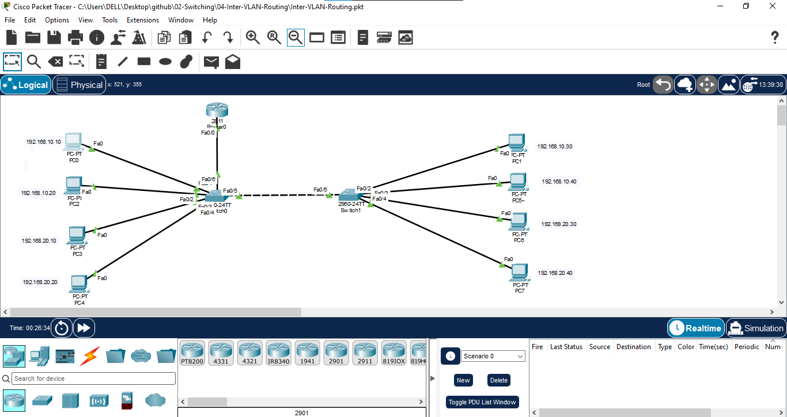
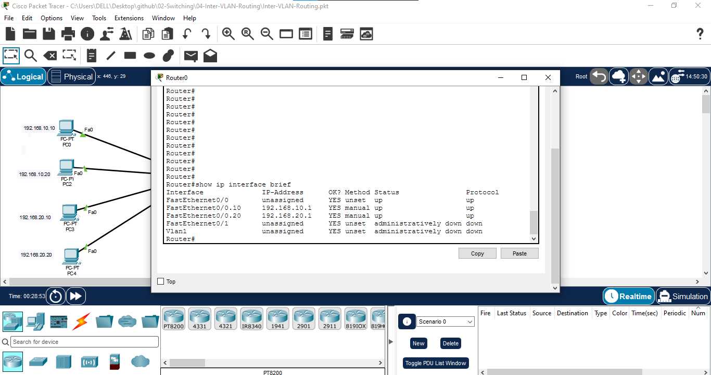
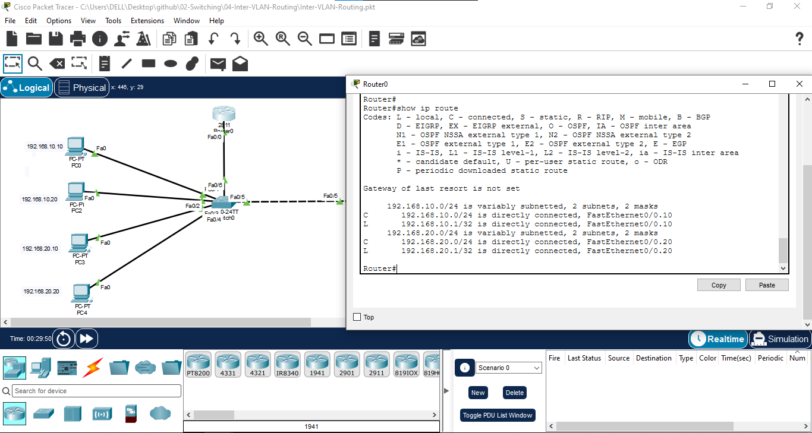
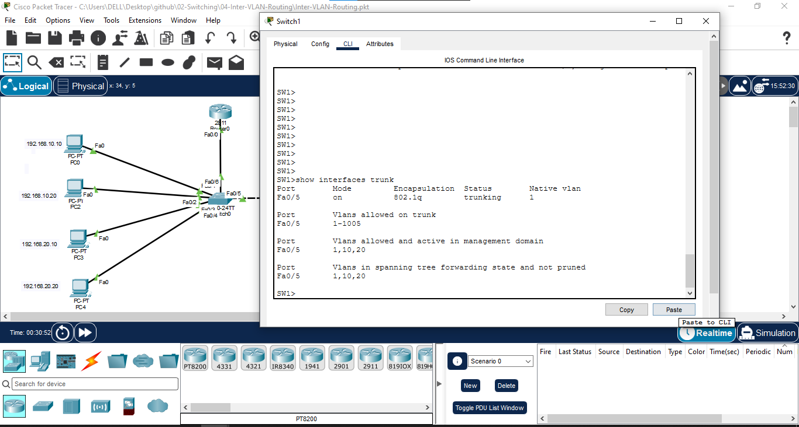
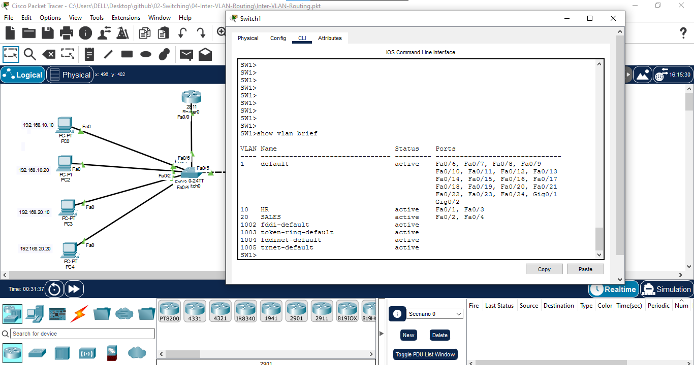
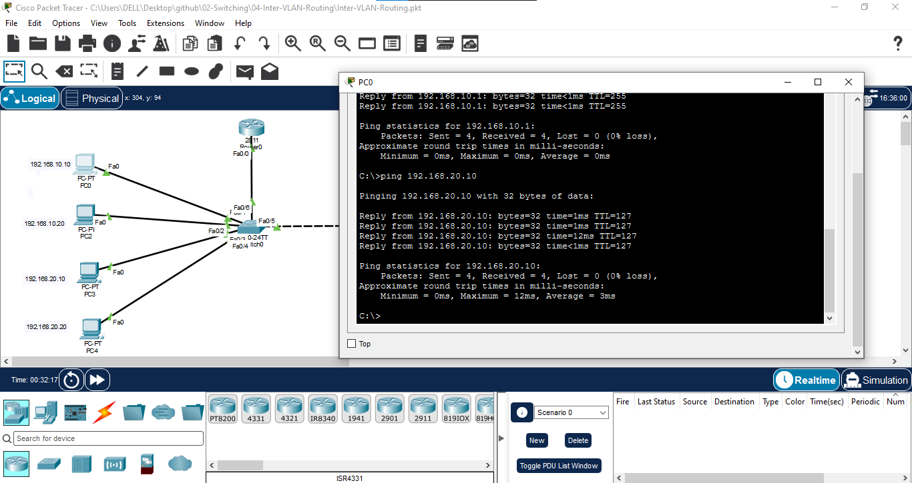

# Inter-VLAN Routing using Router-on-a-Stick

## 📖 Overview

In this lab, Inter-VLAN Routing is configured using a Cisco router and two Layer 2 switches.

VLAN 10 and VLAN 20 are created to separate the network into different broadcast domains. A trunk link is configured between the switches, and another trunk link connects the switch to the router.

Router-on-a-Stick is implemented using router subinterfaces to enable communication between VLAN 10 and VLAN 20.

---

## 🎯 Objectives

- Create VLAN 10 and VLAN 20.
- Assign switch ports to the appropriate VLANs.
- Configure trunk links between switches.
- Configure a trunk link between the switch and router.
- Configure router subinterfaces.
- Configure 802.1Q encapsulation.
- Configure default gateways for each VLAN.
- Enable communication between different VLANs.
- Verify routing and connectivity.

---

## 🖥️ Devices Used

- 1 × Cisco Router
- 2 × Cisco Layer 2 Switches
- 8 × PCs
- Cisco Packet Tracer

---

## 🌐 Network Topology



---

## 🔌 Port Mapping

### SW0

| Switch Port | Connected Device | VLAN |
|---|---|---|
| Fa0/1 | PC0 | VLAN 10 |
| Fa0/2 | PC2 | VLAN 10 |
| Fa0/3 | PC3 | VLAN 20 |
| Fa0/4 | PC4 | VLAN 20 |
| Fa0/5 | SW1 Fa0/5 | Trunk |
| Fa0/6 | Router Fa0/0 | Trunk |

### SW1

| Switch Port | Connected Device | VLAN |
|---|---|---|
| Fa0/1 | PC1 | VLAN 10 |
| Fa0/2 | PC5 | VLAN 10 |
| Fa0/3 | PC6 | VLAN 20 |
| Fa0/4 | PC7 | VLAN 20 |
| Fa0/5 | SW0 Fa0/5 | Trunk |

---

## 📊 VLAN Configuration

| VLAN ID | VLAN Name | Network |
|---|---|---|
| 10 | HR | 192.168.10.0/24 |
| 20 | SALES | 192.168.20.0/24 |

---

## 🌐 IP Addressing

| Device | VLAN | IP Address | Subnet Mask | Default Gateway |
|---|---:|---|---|---|
| PC0 | 10 | 192.168.10.10 | 255.255.255.0 | 192.168.10.1 |
| PC2 | 10 | 192.168.10.20 | 255.255.255.0 | 192.168.10.1 |
| PC3 | 20 | 192.168.20.10 | 255.255.255.0 | 192.168.20.1 |
| PC4 | 20 | 192.168.20.20 | 255.255.255.0 | 192.168.20.1 |
| PC1 | 10 | 192.168.10.30 | 255.255.255.0 | 192.168.10.1 |
| PC5 | 10 | 192.168.10.40 | 255.255.255.0 | 192.168.10.1 |
| PC6 | 20 | 192.168.20.30 | 255.255.255.0 | 192.168.20.1 |
| PC7 | 20 | 192.168.20.40 | 255.255.255.0 | 192.168.20.1 |

---

# ⚙️ Configuration

## 1. Configure VLANs on SW0

```bash
enable
configure terminal

hostname SW0

vlan 10
name HR
exit

vlan 20
name SALES
exit
```

### Configure VLAN 10

```bash
interface range fa0/1 - 2
switchport mode access
switchport access vlan 10
exit
```

### Configure VLAN 20

```bash
interface range fa0/3 - 4
switchport mode access
switchport access vlan 20
exit
```

### Configure Trunk to SW1

```bash
interface fa0/5
switchport mode trunk
exit
```

### Configure Trunk to Router

```bash
interface fa0/6
switchport mode trunk
exit
```

---

## 2. Configure VLANs on SW1

```bash
enable
configure terminal

hostname SW1

vlan 10
name HR
exit

vlan 20
name SALES
exit
```

### Configure VLAN 10

```bash
interface range fa0/1 - 2
switchport mode access
switchport access vlan 10
exit
```

### Configure VLAN 20

```bash
interface range fa0/3 - 4
switchport mode access
switchport access vlan 20
exit
```

### Configure Trunk to SW0

```bash
interface fa0/5
switchport mode trunk
exit
```

---

# 3. Configure Router-on-a-Stick

Router interface connected to SW0:

```text
Router Fa0/0 ↔ SW0 Fa0/6
```

### Enable Physical Interface

```bash
enable
configure terminal

interface fa0/0
no shutdown
exit
```

### VLAN 10 Subinterface

```bash
interface fa0/0.10
encapsulation dot1Q 10
ip address 192.168.10.1 255.255.255.0
exit
```

### VLAN 20 Subinterface

```bash
interface fa0/0.20
encapsulation dot1Q 20
ip address 192.168.20.1 255.255.255.0
exit
```

Save configuration:

```bash
end
copy running-config startup-config
```

---

# 🔍 Verification

## Verify VLANs

On SW0 and SW1:

```bash
show vlan brief
```

Expected:

```text
VLAN 10 → Fa0/1, Fa0/2
VLAN 20 → Fa0/3, Fa0/4
```

---

## Verify Trunk Ports

```bash
show interfaces trunk
```

Expected trunk interfaces:

```text
SW0 Fa0/5 → SW1
SW0 Fa0/6 → Router
SW1 Fa0/5 → SW0
```

---

## Verify Router Interfaces

```bash
show ip interface brief
```

Expected:

```text
FastEthernet0/0      up/up
FastEthernet0/0.10   192.168.10.1   up/up
FastEthernet0/0.20   192.168.20.1   up/up
```

---

## Verify Routing Table

```bash
show ip route
```

Expected connected networks:

```text
C 192.168.10.0/24
C 192.168.20.0/24
```

---

# 🧪 Connectivity Testing

## VLAN 10 Gateway Test

From PC0:

```bash
ping 192.168.10.1
```

Expected:

```text
Successful
```

## VLAN 20 Gateway Test

From PC3:

```bash
ping 192.168.20.1
```

Expected:

```text
Successful
```

## Inter-VLAN Communication

From PC0:

```bash
ping 192.168.20.10
```

PC0 belongs to VLAN 10 and PC3 belongs to VLAN 20.

Expected:

```text
Successful
```

This confirms that traffic is successfully routed between VLAN 10 and VLAN 20 through the router.

---

## 🔄 Traffic Flow

```text
PC0
192.168.10.10
     |
   VLAN 10
     |
    SW0
     |
   Trunk
     |
 Router Fa0/0
     |
Fa0/0.10 / Fa0/0.20
     |
   Routing
     |
    VLAN 20
     |
    SW0
     |
   PC3
192.168.20.10
```

---

# 📸 Screenshots

## Network Topology


## Router Interface Verification



## Routing Table



## Trunk Verification



## VLAN Verification



## Inter-VLAN Ping



---

# 📚 Concepts Covered

- VLAN
- Access Port
- Trunk Port
- 802.1Q
- Inter-VLAN Routing
- Router-on-a-Stick
- Router Subinterfaces
- Default Gateway
- Broadcast Domains
- Layer 2 Switching
- Layer 3 Routing
- Connectivity Testing
- Network Troubleshooting

---

# 🎓 Learning Outcome

This lab helped me understand how communication between different VLANs is achieved using a Layer 3 router.

I configured Router-on-a-Stick using router subinterfaces, assigned VLAN-specific gateway addresses, configured trunk links, and verified end-to-end connectivity between different VLANs using ping.

---

## 🛠️ Software Used

- Cisco Packet Tracer 9.x

---

## 👨‍💻 Author

**Mohamed Ashik**

Aspiring Network Engineer | CCNA (200-301)

GitHub: https://github.com/mohamedashik-cpu
