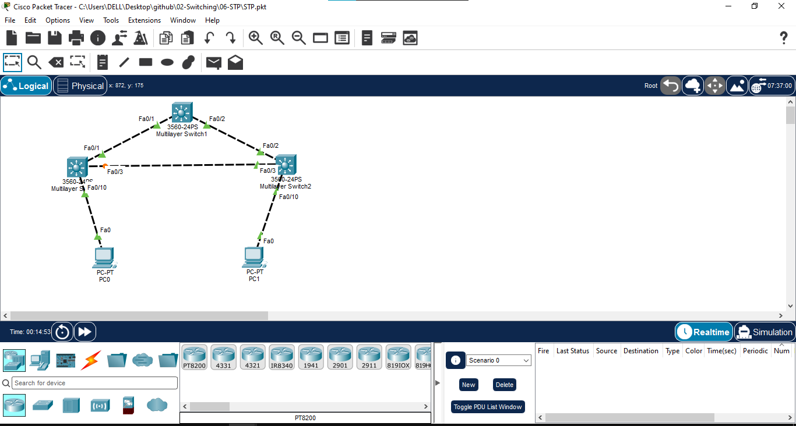

# Spanning Tree Protocol (STP)

## 📖 Overview

In this lab, Spanning Tree Protocol (STP) is configured on three Cisco Layer 2 switches connected in a redundant triangle topology.

A redundant Layer 2 topology provides multiple paths between switches, but it can also create switching loops. STP prevents Layer 2 loops by selecting a loop-free forwarding topology and placing redundant paths into an alternate or blocking state.

In this lab, VLAN 10 is configured across all three switches. SW1 is configured as the Root Bridge, while SW2 is configured as the Secondary Root Bridge.

The STP topology is verified using `show spanning-tree` commands, and Root Port, Designated Port, and Alternate Port roles are identified.

---

## 🎯 Objectives

- Create a redundant Layer 2 topology.
- Configure VLAN 10 on all switches.
- Configure access ports for end devices.
- Configure trunk links between switches.
- Understand the purpose of STP.
- Verify the default STP election.
- Configure SW1 as the Root Bridge.
- Configure SW2 as the Secondary Root Bridge.
- Identify Root Ports.
- Identify Designated Ports.
- Identify Alternate Ports.
- Verify STP operation.
- Test network connectivity.
- Understand how STP prevents Layer 2 loops.

---

## 🖥️ Devices Used

- 3 × Cisco Catalyst 3560-24PS Switches
- 2 × PCs
- Cisco Packet Tracer

---

## 🌐 Network Topology

The following redundant topology was created in Cisco Packet Tracer:



### Topology

```text
                    SW1
                Root Bridge
                  /     \
                 /       \
                /         \
              SW0 ------- SW2
               |           |
              PC0         PC1
The three switches form a triangle to provide redundant Layer 2 paths.

STP is used to prevent the redundant topology from creating a Layer 2 switching loop.

🔌 Port Mapping
SW0
Switch Port	Connected Device	Purpose
Fa0/1	SW1 Fa0/1	Trunk
Fa0/3	SW2 Fa0/3	Trunk
Fa0/10	PC0	VLAN 10
SW1
Switch Port	Connected Device	Purpose
Fa0/1	SW0 Fa0/1	Trunk
Fa0/2	SW2 Fa0/2	Trunk
SW2
Switch Port	Connected Device	Purpose
Fa0/2	SW1 Fa0/2	Trunk
Fa0/3	SW0 Fa0/3	Trunk
Fa0/10	PC1	VLAN 10
📊 VLAN Configuration
VLAN ID	VLAN Name	Network
10	USERS	192.168.10.0/24
🌐 IP Addressing
Device	VLAN	IP Address	Subnet Mask	Default Gateway
PC0	10	192.168.10.10	255.255.255.0	192.168.10.1
PC1	10	192.168.10.20	255.255.255.0	192.168.10.1
⚙️ Configuration
1. Configure VLAN 10 on SW0
enable
configure terminal


hostname SW0


no ip domain-lookup


vlan 10
name USERS
exit
Configure PC0 Access Port
interface fa0/10
switchport mode access
switchport access vlan 10
no shutdown
exit
2. Configure VLAN 10 on SW1
enable
configure terminal


hostname SW1


no ip domain-lookup


vlan 10
name USERS
exit
3. Configure VLAN 10 on SW2
enable
configure terminal


hostname SW2


no ip domain-lookup


vlan 10
name USERS
exit
Configure PC1 Access Port
interface fa0/10
switchport mode access
switchport access vlan 10
no shutdown
exit
🔗 Trunk Configuration
SW0
Trunk to SW1
interface fa0/1
switchport trunk encapsulation dot1q
switchport mode trunk
no shutdown
exit
Trunk to SW2
interface fa0/3
switchport trunk encapsulation dot1q
switchport mode trunk
no shutdown
exit
SW1
Trunk to SW0
interface fa0/1
switchport trunk encapsulation dot1q
switchport mode trunk
no shutdown
exit
Trunk to SW2
interface fa0/2
switchport trunk encapsulation dot1q
switchport mode trunk
no shutdown
exit
SW2
Trunk to SW1
interface fa0/2
switchport trunk encapsulation dot1q
switchport mode trunk
no shutdown
exit
Trunk to SW0
interface fa0/3
switchport trunk encapsulation dot1q
switchport mode trunk
no shutdown
exit
🔍 Verification
Verify VLAN Configuration

On all switches:

show vlan brief

Expected:

VLAN 10    USERS

SW0:

Fa0/10 → VLAN 10

SW2:

Fa0/10 → VLAN 10
VLAN Verification

Verify Trunk Configuration

On all switches:

show interfaces trunk

Expected:

SW0
Fa0/1
Fa0/3
SW1
Fa0/1
Fa0/2
SW2
Fa0/2
Fa0/3
Trunk Verification

🌳 Spanning Tree Verification
Verify Default STP

Before manually selecting the Root Bridge, verify the default STP election.

On SW0:

show spanning-tree vlan 10

On SW1:

show spanning-tree vlan 10

On SW2:

show spanning-tree vlan 10

The output displays:

Root ID
Bridge ID
Root Port
Designated Ports
Alternate Ports
Port State
Path Cost
Default STP Verification

👑 Configure SW1 as Root Bridge

SW1 is configured as the Primary Root Bridge for VLAN 10.

enable
configure terminal


spanning-tree vlan 10 root primary


end

Verify:

show spanning-tree vlan 10

SW1 should identify itself as the Root Bridge.

Root Bridge Verification

🥈 Configure SW2 as Secondary Root Bridge

SW2 is configured as the Secondary Root Bridge.

enable
configure terminal


spanning-tree vlan 10 root secondary


end

Verify:

show spanning-tree vlan 10
🔎 STP Port Roles

STP port roles can be verified using:

show spanning-tree vlan 10

The interface table displays the STP role and state of each port.

STP Role	Description
Root	Best forwarding path toward the Root Bridge
Designated	Forwarding port selected for a network segment
Alternate	Backup path toward the Root Bridge
STP Port Roles

🧪 Connectivity Testing
PC0 → PC1

From PC0:

ping 192.168.10.20

Expected:

Successful

This confirms that PC0 and PC1 can communicate through VLAN 10.

Connectivity Test

🔄 STP Traffic Flow
                         SW1
                    ROOT BRIDGE
                    /         \
                   /           \
                  /             \
                SW0 ----------- SW2
                 |               |
                PC0             PC1

STP logically removes one redundant path from the active forwarding topology to prevent a Layer 2 loop.

The redundant link remains available and can be used if the active path fails and STP recalculates the topology.

🔧 STP Verification Commands
Display STP Information
show spanning-tree
Display STP for VLAN 10
show spanning-tree vlan 10
Display Root Bridge Information
show spanning-tree root
Display STP Summary
show spanning-tree summary
Display Interface Status
show interfaces status
📸 Screenshots
Network Topology

VLAN Configuration

Trunk Verification

Default STP Verification

Root Bridge Verification

STP Port Roles

Connectivity Test

📚 Concepts Covered
Spanning Tree Protocol (STP)
Layer 2 Loop Prevention
Root Bridge
Root Port
Designated Port
Alternate Port
Blocking State
Forwarding State
Bridge ID
STP Priority
Path Cost
BPDU
Redundant Links
VLAN
Access Port
Trunk Port
Layer 2 Switching
Network Redundancy
STP Troubleshooting
🎓 Learning Outcome

This lab helped me understand how Spanning Tree Protocol prevents Layer 2 switching loops in a redundant network.

I created a triangle topology using three Layer 2 switches, configured VLAN 10 and trunk links, verified the default STP election, configured SW1 as the Root Bridge, configured SW2 as the Secondary Root Bridge, and identified Root, Designated, and Alternate port roles.

The lab also demonstrated how STP maintains a loop-free Layer 2 topology while keeping redundant links available for network resiliency.

🛠️ Software Used
Cisco Packet Tracer 9.x
👨‍💻 Author

Mohamed Ashik

Aspiring Network Engineer | CCNA (200-301)

GitHub: https://github.com/mohamedashik-cpu
