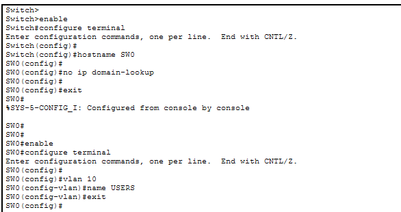
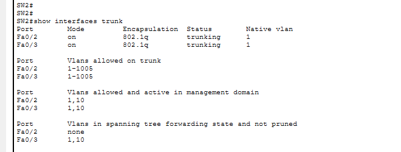
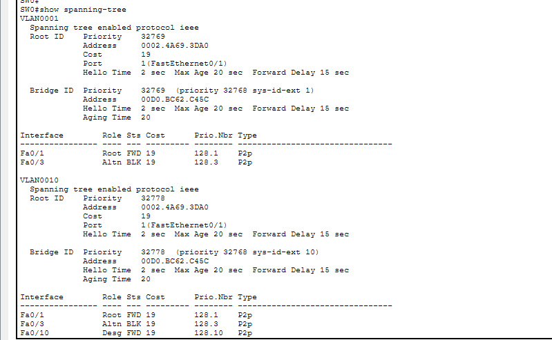
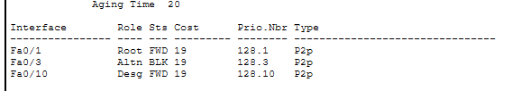
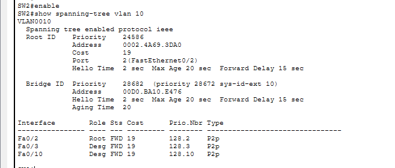
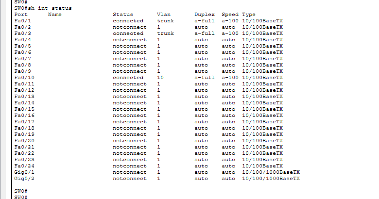

# Spanning Tree Protocol (STP)

## 📖 Overview

In this lab, Spanning Tree Protocol (STP) is configured using three Cisco Layer 2 switches connected in a redundant triangle topology.

A redundant Layer 2 topology provides multiple paths between switches. However, these redundant paths can create Layer 2 switching loops.

STP is used to prevent Layer 2 loops by selecting the best forwarding paths and placing redundant paths into an alternate or blocking state.

In this lab, VLAN 10 is configured across all three switches. SW1 is configured as the Root Bridge, while SW2 is configured as the Secondary Root Bridge.

STP operation is verified using `show spanning-tree` commands, and Root Port, Designated Port, and Alternate Port roles are identified.

---

## 🎯 Objectives

- Create a redundant Layer 2 topology.
- Configure VLAN 10 on all switches.
- Assign access ports to VLAN 10.
- Configure trunk links between switches.
- Understand the purpose of STP.
- Verify the default STP election.
- Configure SW1 as the Root Bridge.
- Configure SW2 as the Secondary Root Bridge.
- Identify Root Ports.
- Identify Designated Ports.
- Identify Alternate Ports.
- Verify STP operation.
- Test network connectivity.
- Understand Layer 2 loop prevention.

---

## 🖥️ Devices Used

- 3 × Cisco Layer 2 Switches
- 2 × PCs
- Cisco Packet Tracer

---

## 🌐 Network Topology


---

## 🔌 Port Mapping

### SW0

| Switch Port | Connected Device | Purpose |
|---|---|---|
| Fa0/1 | SW1 Fa0/1 | Trunk |
| Fa0/3 | SW2 Fa0/3 | Trunk |
| Fa0/10 | PC0 | VLAN 10 |

### SW1

| Switch Port | Connected Device | Purpose |
|---|---|---|
| Fa0/1 | SW0 Fa0/1 | Trunk |
| Fa0/2 | SW2 Fa0/2 | Trunk |

### SW2

| Switch Port | Connected Device | Purpose |
|---|---|---|
| Fa0/2 | SW1 Fa0/2 | Trunk |
| Fa0/3 | SW0 Fa0/3 | Trunk |
| Fa0/10 | PC1 | VLAN 10 |

---

## 📊 VLAN Configuration

| VLAN ID | VLAN Name | Network |
|---|---|---|
| 10 | USERS | 192.168.10.0/24 |

---

## 🌐 IP Addressing

| Device | VLAN | IP Address | Subnet Mask | Default Gateway |
|---|---:|---|---|---|
| PC0 | 10 | 192.168.10.10 | 255.255.255.0 | 192.168.10.1 |
| PC1 | 10 | 192.168.10.20 | 255.255.255.0 | 192.168.10.1 |

---

# ⚙️ Configuration

## 1. Configure VLAN 10 on SW0

```bash
enable
configure terminal

hostname SW0

vlan 10
name USERS
exit
```

### Configure PC0 Access Port

```bash
interface fa0/10
switchport mode access
switchport access vlan 10
no shutdown
exit
```

---

## 2. Configure VLAN 10 on SW1

```bash
enable
configure terminal

hostname SW1

vlan 10
name USERS
exit
```

---

## 3. Configure VLAN 10 on SW2

```bash
enable
configure terminal

hostname SW2

vlan 10
name USERS
exit
```

### Configure PC1 Access Port

```bash
interface fa0/10
switchport mode access
switchport access vlan 10
no shutdown
exit
```

---

# 🔗 Trunk Configuration

## SW0

### Trunk to SW1

```bash
interface fa0/1
switchport trunk encapsulation dot1q
switchport mode trunk
no shutdown
exit
```

### Trunk to SW2

```bash
interface fa0/3
switchport trunk encapsulation dot1q
switchport mode trunk
no shutdown
exit
```

---

## SW1

### Trunk to SW0

```bash
interface fa0/1
switchport trunk encapsulation dot1q
switchport mode trunk
no shutdown
exit
```

### Trunk to SW2

```bash
interface fa0/2
switchport trunk encapsulation dot1q
switchport mode trunk
no shutdown
exit
```

---

## SW2

### Trunk to SW1

```bash
interface fa0/2
switchport trunk encapsulation dot1q
switchport mode trunk
no shutdown
exit
```

### Trunk to SW0

```bash
interface fa0/3
switchport trunk encapsulation dot1q
switchport mode trunk
no shutdown
exit
```

---

# 🔍 Verification

## Verify VLANs

On SW0, SW1 and SW2:

```bash
show vlan brief
```

Expected:

```text
VLAN 10    USERS
```

SW0:

```text
Fa0/10 → VLAN 10
```

SW2:

```text
Fa0/10 → VLAN 10
```

---

## Verify Trunk Ports

On all switches:

```bash
show interfaces trunk
```

Expected trunk interfaces:

```text
SW0 Fa0/1 → SW1
SW0 Fa0/3 → SW2

SW1 Fa0/1 → SW0
SW1 Fa0/2 → SW2

SW2 Fa0/2 → SW1
SW2 Fa0/3 → SW0
```

---

## Verify Interface Status

```bash
show interfaces status
```

The trunk interfaces should be operational and connected.

---

# 🌳 Spanning Tree Verification

## Verify Default STP

Before configuring the Root Bridge, verify the default STP election.

On SW0:

```bash
show spanning-tree vlan 10
```

On SW1:

```bash
show spanning-tree vlan 10
```

On SW2:

```bash
show spanning-tree vlan 10
```

The output displays:

```text
Root ID
Bridge ID
Root Port
Designated Ports
Alternate Ports
Port State
Path Cost
```

---

## Configure SW1 as Root Bridge

SW1 is configured as the Primary Root Bridge for VLAN 10.

On SW1:

```bash
enable
configure terminal

spanning-tree vlan 10 root primary

end
```

Verify:

```bash
show spanning-tree vlan 10
```

SW1 should identify itself as the Root Bridge.

---

## Configure SW2 as Secondary Root Bridge

SW2 is configured as the Secondary Root Bridge.

On SW2:

```bash
enable
configure terminal

spanning-tree vlan 10 root secondary

end
```

Verify:

```bash
show spanning-tree vlan 10
```

---

## Verify STP Root Bridge

Use:

```bash
show spanning-tree root
```

This command can be used to verify the Root Bridge information for VLAN 10.

---

## Verify STP Port Roles

Use:

```bash
show spanning-tree vlan 10
```

The STP interface table displays the role and state of each port.

Example:

```text
Interface        Role Sts
---------------- ---- ---
Fa0/1            Root FWD
Fa0/2            Desg FWD
Fa0/3            Altn BLK
```

### STP Port Roles

| Role | Meaning |
|---|---|
| Root | Best path toward the Root Bridge |
| Designated | Forwarding port for a network segment |
| Alternate | Backup path toward the Root Bridge |

The Alternate port provides a redundant path while preventing a Layer 2 loop.

---

# 🧪 Connectivity Testing

## PC0 → PC1

From PC0:

```bash
ping 192.168.10.20
```

Expected:

```text
Successful
```

This confirms that PC0 and PC1 can communicate through VLAN 10.

---

## Verify VLAN 10 Gateway

From PC0:

```bash
ping 192.168.10.1
```

Expected:

```text
Successful
```

---

# 🔄 Traffic Flow

```text
                         SW1
                    ROOT BRIDGE
                    /         \
                   /           \
                  /             \
                SW0 ----------- SW2
                 |               |
                PC0             PC1
```

The three switches create redundant Layer 2 paths.

STP selects the best forwarding paths and places the redundant path into an alternate/blocking state.

This prevents Layer 2 switching loops while maintaining network redundancy.

---

# 📸 Screenshots

## Network Topology


## VLAN Verification



## Trunk Verification



## Default STP Verification



## Root Bridge Verification



## STP Port Roles



## Connectivity Test



---

# 📚 Concepts Covered

- Spanning Tree Protocol (STP)
- Layer 2 Loop Prevention
- Root Bridge
- Root Port
- Designated Port
- Alternate Port
- Blocking State
- Forwarding State
- Bridge ID
- STP Priority
- Path Cost
- BPDU
- Redundant Links
- VLAN
- Access Port
- Trunk Port
- Layer 2 Switching
- Network Redundancy
- STP Troubleshooting
- Connectivity Testing

---

# 🎓 Learning Outcome

This lab helped me understand how Spanning Tree Protocol prevents Layer 2 switching loops in a redundant network.

I created a triangle topology using three Layer 2 switches, configured VLAN 10 and trunk links, verified the default STP election, configured SW1 as the Root Bridge, configured SW2 as the Secondary Root Bridge, and identified Root, Designated, and Alternate port roles.

The lab also helped me understand how STP maintains a loop-free Layer 2 topology while keeping redundant links available for network resiliency.

---

## 🛠️ Software Used

- Cisco Packet Tracer 9.0.1.0858

---

## 👨‍💻 Author

**Mohamed Ashik**

Aspiring Network Engineer | CCNA (200-301)

GitHub: https://github.com/mohamedashik-cpu
