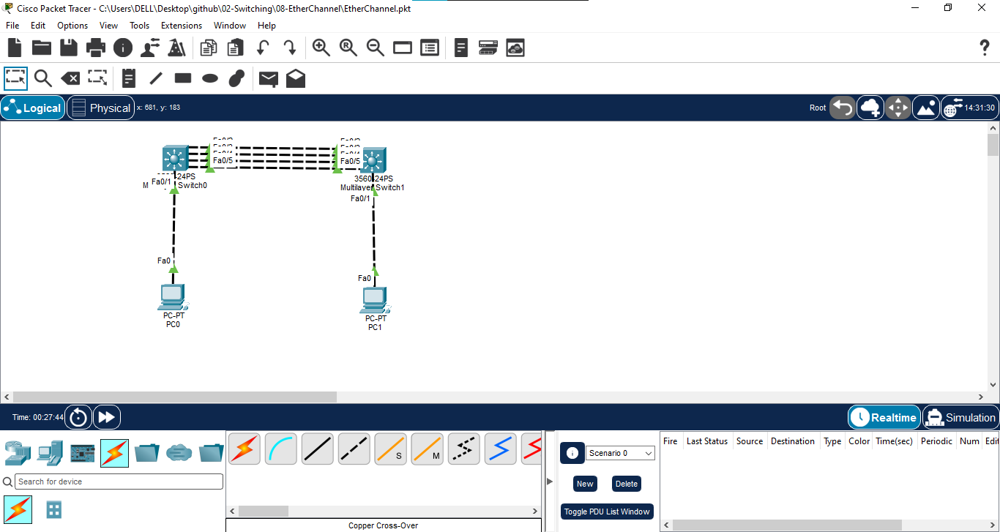

# EtherChannel using LACP

## 📖 Overview

In this lab, EtherChannel is configured between two Cisco Layer 2 switches using LACP (Link Aggregation Control Protocol).

EtherChannel combines multiple physical links into a single logical link called a Port-Channel. This provides increased bandwidth, redundancy, and better link utilization.

In this lab, four FastEthernet links are bundled together using LACP and configured as a single logical Port-Channel. The Port-Channel is configured as a trunk link between the two switches.

A link failure test is also performed to verify that network connectivity continues through the remaining EtherChannel links.

---

## 🎯 Objectives

- Understand the concept of EtherChannel.
- Understand LACP (Link Aggregation Control Protocol).
- Configure LACP using active mode.
- Bundle multiple physical links into one logical Port-Channel.
- Configure Port-Channel as a trunk.
- Configure VLAN 10 on both switches.
- Assign access ports to VLAN 10.
- Verify EtherChannel operation.
- Verify trunk operation.
- Test end-to-end connectivity.
- Test EtherChannel redundancy during link failure.
- Restore the failed physical link and verify recovery.

---

## 🖥️ Devices Used

- 2 × Cisco Catalyst 3560-24PS Switches
- 2 × PCs
- Cisco Packet Tracer

---

## 🌐 Network Topology



---

## 🔌 Port Mapping

### SW0

| Switch Port | Connected Device | Purpose |
|---|---|---|
| Fa0/1 | PC0 | Access Port - VLAN 10 |
| Fa0/2 | SW1 Fa0/2 | EtherChannel Member |
| Fa0/3 | SW1 Fa0/3 | EtherChannel Member |
| Fa0/4 | SW1 Fa0/4 | EtherChannel Member |
| Fa0/5 | SW1 Fa0/5 | EtherChannel Member |

### SW1

| Switch Port | Connected Device | Purpose |
|---|---|---|
| Fa0/1 | PC1 | Access Port - VLAN 10 |
| Fa0/2 | SW0 Fa0/2 | EtherChannel Member |
| Fa0/3 | SW0 Fa0/3 | EtherChannel Member |
| Fa0/4 | SW0 Fa0/4 | EtherChannel Member |
| Fa0/5 | SW0 Fa0/5 | EtherChannel Member |

---

## 📊 VLAN Configuration

| VLAN ID | VLAN Name | Network |
|---|---|---|
| 10 | USERS | 192.168.10.0/24 |

---

## 🌐 IP Addressing

| Device | VLAN | IP Address | Subnet Mask | Default Gateway |
|---|---:|---|---|---|
| PC0 | 10 | 192.168.10.10 | 255.255.255.0 | N/A |
| PC1 | 10 | 192.168.10.20 | 255.255.255.0 | N/A |

Both PCs are in the same VLAN and subnet, so a default gateway is not required for this same-network connectivity test.

---

# ⚙️ Configuration

## 1. Configure VLAN 10 on SW0

```bash
enable
configure terminal

hostname SW0

vlan 10
name USERS
exit
Configure PC0 Access Port
interface fa0/1
switchport mode access
switchport access vlan 10
no shutdown
exit
2. Configure VLAN 10 on SW1
enable
configure terminal


hostname SW1


vlan 10
name USERS
exit
Configure PC1 Access Port
interface fa0/1
switchport mode access
switchport access vlan 10
no shutdown
exit
🔗 3. Configure LACP EtherChannel on SW0

The four physical FastEthernet interfaces are configured as members of EtherChannel Group 1.

interface range fa0/2 - 5
channel-group 1 mode active
exit

The active mode enables LACP negotiation.

🔗 4. Configure LACP EtherChannel on SW1
interface range fa0/2 - 5
channel-group 1 mode active
exit

Both switches use LACP active mode to dynamically form the EtherChannel.

🔗 5. Configure Port-Channel as Trunk
SW0
interface port-channel 1
switchport mode trunk
no shutdown
exit
SW1
interface port-channel 1
switchport mode trunk
no shutdown
exit

The four physical links now operate as one logical Port-Channel.

🔍 Verification
Verify VLAN Configuration

On SW0 and SW1:

show vlan brief

Expected:

VLAN 10    USERS

The PC access ports should be assigned to VLAN 10.

Verify EtherChannel

On SW0 and SW1:

show etherchannel summary

Expected:

Group  Port-channel  Protocol    Ports
------+-------------+-----------+----------------
1      Po1(SU)       LACP        Fa0/2(P)
                                  Fa0/3(P)
                                  Fa0/4(P)
                                  Fa0/5(P)
Output Meaning
Symbol	Meaning
S	Layer 2 EtherChannel
U	Port-Channel is in use
P	Port is successfully bundled

Expected status:

Po1(SU)
Fa0/2(P)
Fa0/3(P)
Fa0/4(P)
Fa0/5(P)

Verify Port-Channel
show interfaces port-channel 1

This command verifies the operational status of the logical Port-Channel interface.

Verify Trunk
show interfaces trunk

Expected:

Port-channel1

The Port-Channel should be operating as a trunk.

Verify Interface Status
show interfaces status

This command can be used to verify the physical status of the switch interfaces.

🧪 Connectivity Testing
PC0 → PC1

From PC0:

ping 192.168.10.20

Expected:

Reply from 192.168.10.20

Successful ping confirms that PC0 and PC1 can communicate through VLAN 10 across the EtherChannel link.

🔥 EtherChannel Link Failure Test

To verify EtherChannel redundancy, one physical member link is manually disabled.

On SW0:

enable
configure terminal


interface fa0/2
shutdown
end
Verify EtherChannel After Link Failure

Run:

show etherchannel summary

The remaining physical interfaces should continue operating as members of the EtherChannel.

Expected:

Po1(SU)
Fa0/3(P)
Fa0/4(P)
Fa0/5(P)

The failed Fa0/2 interface should no longer be active in the bundle.

Test Connectivity After Link Failure

From PC0:

ping 192.168.10.20

Expected:

Reply from 192.168.10.20

Connectivity should continue because the remaining EtherChannel links provide redundancy.

🔄 Restore Failed Link

After completing the failure test, restore the physical interface.

enable
configure terminal


interface fa0/2
no shutdown
end

Verify:

show etherchannel summary

All four interfaces should return to the EtherChannel:

Fa0/2(P)
Fa0/3(P)
Fa0/4(P)
Fa0/5(P)
🔄 Traffic Flow
PC0
192.168.10.10
     |
   VLAN 10
     |
    SW0
     |
     +==============================+
     |      Port-Channel 1          |
     |   LACP - 4 Physical Links    |
     +==============================+
     |
    SW1
     |
   VLAN 10
     |
    PC1
192.168.10.20

The four physical links between SW0 and SW1 are bundled into one logical Port-Channel.

If one physical link fails, the remaining links continue forwarding traffic.

📸 Screenshots
Network Topology

VLAN Configuration

EtherChannel Summary

Trunk Verification

Connectivity Test

Link Failure Verification

Ping After Link Failure

📚 Concepts Covered
EtherChannel
LACP
Link Aggregation Control Protocol
LACP Active Mode
Port-Channel
Layer 2 EtherChannel
VLAN
Access Port
Trunk Port
802.1Q
Link Redundancy
Increased Bandwidth
Load Distribution
Network Resiliency
Link Failure Recovery
Connectivity Testing
Network Troubleshooting
🎓 Learning Outcome

This lab helped me understand how multiple physical links can be combined into a single logical link using EtherChannel.

I configured LACP between two Cisco switches and bundled four FastEthernet interfaces into Port-Channel 1. I configured the Port-Channel as a trunk and verified its operation using Cisco IOS commands.

I also performed a physical link failure test and verified that network connectivity continued through the remaining EtherChannel links. This demonstrated the redundancy and resiliency provided by EtherChannel.

🛠️ Verification Commands
show vlan brief
show etherchannel summary
show interfaces port-channel 1
show interfaces trunk
show interfaces status
PC Connectivity Test
ping 192.168.10.20
🛠️ Software Used
Cisco Packet Tracer 9.x
👨‍💻 Author

Mohamed Ashik

Aspiring Network Engineer | CCNA (200-301)

GitHub: https://github.com/mohamedashik-cpu
