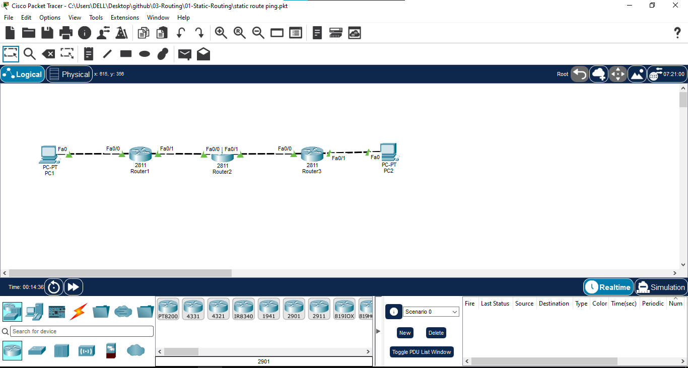

# Static Routing

## 📖 Overview
This lab demonstrates the configuration and verification of IPv4 Static Routing across a three-router topology. It showcases how to manually define network paths to remote destination networks using next-hop IP addresses, ensuring end-to-end connectivity between disparate LANs.

## 🎯 Objectives
* Design and implement a 3-router network topology.
* Assign IPv4 addresses to all router interfaces and end devices.
* Configure static routes on all routers using the next-hop IP method.
* Verify the routing tables for correct manual path injection.
* Test and verify end-to-end connectivity and traffic flow using `ping` and `tracert`.

## 🖥️ Devices Used
* 3x Cisco Routers (e.g., 2911 or 1941)
* 2x End Devices (PCs)
* Copper Straight-Through and Cross-Over Cables (as appropriate)

## 🌐 Network Topology


## 🧮 IP Addressing Table

| Device | Interface | IP Address | Subnet Mask | Default Gateway |
|---|---|---|---|---|
| **R1** | Fa0/0 (LAN 1) | 192.168.10.1 | 255.255.255.0 | N/A |
| **R1** | Fa0/1 (WAN) | 10.0.12.1 | 255.255.255.252 | N/A |
| **R2** | Fa0/0 (WAN) | 10.0.12.2 | 255.255.255.252 | N/A |
| **R2** | Fa0/1 (WAN) | 10.0.23.1 | 255.255.255.252 | N/A |
| **R3** | Fa0/0 (WAN) | 10.0.23.2 | 255.255.255.252 | N/A |
| **R3** | Fa0/1 (LAN 2) | 192.168.20.1 | 255.255.255.0 | N/A |
| **PC1** | NIC | 192.168.10.10 | 255.255.255.0 | 192.168.10.1 |
| **PC2** | NIC | 192.168.20.10 | 255.255.255.0 | 192.168.20.1 |

## ⚙️ Configuration Highlight
*Note: Point-to-Point WAN links utilize /30 subnet masks to conserve IP addresses.*

**R1 Routing Configuration:**
```text
R1(config)# ip route 192.168.20.0 255.255.255.0 10.0.12.2
R2 Routing Configuration:

Plaintext
R2(config)# ip route 192.168.10.0 255.255.255.0 10.0.12.1
R2(config)# ip route 192.168.20.0 255.255.255.0 10.0.23.2
R3 Routing Configuration:

Plaintext
R3(config)# ip route 192.168.10.0 255.255.255.0 10.0.23.1
🔍 Verification
1. Interface Status:

2. Routing Table Verification (S = Static):

🧪 Testing & Traffic Flow
End-to-End Connectivity:

Traffic Path Verification:

🛠️ Verification Commands Used
show ip interface brief - Verifies physical and line protocol status of interfaces.

show ip route - Displays the router's routing table to confirm static routes are installed.

ping [IP] - Tests ICMP connectivity between the source and destination.

tracert [IP] - (On PC) Traces the hop-by-hop path packets take to reach the destination.

📚 Concepts Covered
Static Routing configuration and logic.

Next-Hop IP Addressing.

Subnetting (using /30 for point-to-point links).

Administrative Distance (Static routes have an AD of 1).

🎓 Learning Outcome
Successfully demonstrated the ability to manually map out network paths in a multi-router environment, proving an understanding of how routers make forwarding decisions based on manually configured routing tables.

💻 Software Used
Cisco Packet Tracer

👨‍💻 Author
Mohamed Ashik M
