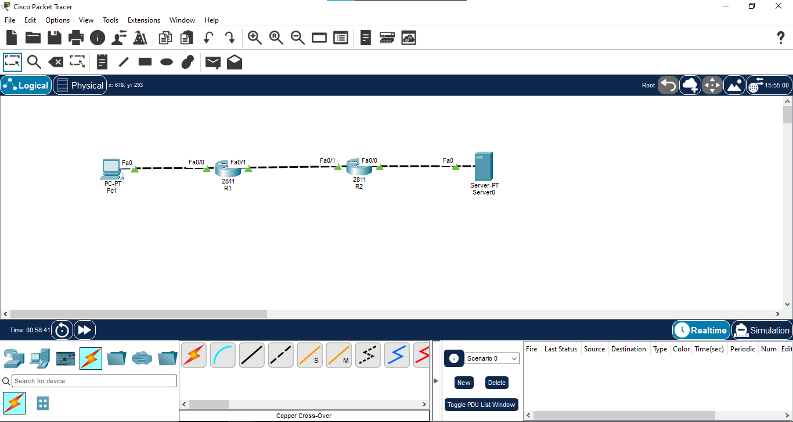

# 02 - Default Routing

## 📖 Overview
This lab demonstrates the configuration, operation, and verification of **Default Routing** (often called the "Gateway of Last Resort"). A default route is a special type of static route (`0.0.0.0 0.0.0.0`) used to forward traffic to a destination when there is no specific match in the routing table. 

In this lab, an **Enterprise Edge Router (R1)** is configured as a "stub network" that connects to an **ISP Router (R2)**. Instead of maintaining a massive routing table for every internet destination, the Enterprise router simply forwards all unknown traffic to the ISP. A simulated public internet server (`8.8.8.8`) is used to verify end-to-end connectivity.

## 🎯 Objectives
* Design a 2-router topology simulating an Enterprise-to-ISP connection.
* Apply IPv4 addressing, utilizing a public `TEST-NET-3` IP block (`203.0.113.0/30`) for the WAN link.
* Configure a Default Route (`0.0.0.0 0.0.0.0`) on the Enterprise edge router.
* Configure a standard Return Static Route on the ISP router to ensure two-way communication.
* Verify the routing tables for the Gateway of Last Resort (`S*`).
* Validate end-to-end ICMP reachability to a simulated external internet server.

## 🖥️ Devices Used

| Device Type | Device Model | Quantity | Role / Description |
|---|---|---|---|
| **Router** | Cisco 2911 / 1941 | 2 | Enterprise Edge (R1) and ISP (R2) |
| **End Device** | Generic PC | 1 | Internal Enterprise Host (PC1) |
| **Server** | Generic Server | 1 | Public Internet Server (Server0) |
| **Cabling** | Copper Straight-Through / Cross-Over | 3 | Physical media connections for LAN & WAN |

## 🌐 Network Topology


## 🔌 Port Mapping

| Source Device | Source Interface | Connected Device | Connected Interface | Link Type |
|---|---|---|---|---|
| **PC1** | FastEthernet0 | **R1-Enterprise** | FastEthernet0/0 | Enterprise LAN Link |
| **R1-Enterprise** | FastEthernet0/1 | **R2-ISP** | FastEthernet0/1 | Point-to-Point WAN Link |
| **R2-ISP** | FastEthernet0/0 | **Server0** | FastEthernet0 | Public Internet Link |

## 🌐 IP Addressing

| Device | Interface | IPv4 Address | Subnet Mask | Default Gateway | Connected Network / Role |
|---|---|---|---|---|---|
| **R1-Enterprise** | FastEthernet0/0 | `192.168.1.1` | `255.255.255.0` | N/A | Enterprise LAN Gateway |
| **R1-Enterprise** | FastEthernet0/1 | `203.0.113.1` | `255.255.255.252` | N/A | WAN to ISP |
| **R2-ISP** | FastEthernet0/1 | `203.0.113.2` | `255.255.255.252` | N/A | WAN from Enterprise |
| **R2-ISP** | FastEthernet0/0 | `8.8.8.1` | `255.255.255.0` | N/A | Internet Gateway |
| **PC1** | FastEthernet0 | `192.168.1.10` | `255.255.255.0` | `192.168.1.1` | Enterprise Host |
| **Server0** | FastEthernet0 | `8.8.8.8` | `255.255.255.0` | `8.8.8.1` | Public Server |

## ⚙️ Configuration

### 1. Configure R1 (Enterprise Edge)
Configure LAN/WAN interfaces and the Default Route pointing all unknown traffic to the ISP.

````text
enable
configure terminal
hostname R1-Enterprise

interface FastEthernet0/0
 ip address 192.168.1.1 255.255.255.0
 no shutdown
 exit

interface FastEthernet0/1
 ip address 203.0.113.1 255.255.255.252
 no shutdown
 exit

! The Default Route (Gateway of Last Resort)
ip route 0.0.0.0 0.0.0.0 203.0.113.2
end
copy running-config startup-config
````

### 2. Configure R2 (ISP)
Configure WAN/Internet interfaces and a Return Static Route back to the Enterprise LAN so the ISP can reply.

````text
enable
configure terminal
hostname R2-ISP

interface FastEthernet0/1
 ip address 203.0.113.2 255.255.255.252
 no shutdown
 exit

interface FastEthernet0/0
 ip address 8.8.8.1 255.255.255.0
 no shutdown
 exit

! Return Static Route for the Enterprise LAN
ip route 192.168.1.0 255.255.255.0 203.0.113.1
end
copy running-config startup-config
````

## 🔍 Verification

### Verify Interface Status
This command validates that the physical interfaces are up and configured correctly.
````text
show ip interface brief
````
**Expected Result:**  
All configured interfaces on R1 and R2 should display `Status: up` and `Protocol: up`.

### Verify Gateway of Last Resort (R1)
This command verifies that the default route is successfully installed on the Enterprise router.
````text
show ip route
````
**Expected Result:**  
The routing table should explicitly state:
`Gateway of last resort is 203.0.113.2 to network 0.0.0.0`
The default route entry should appear marked with a star:
`S* 0.0.0.0/0 [1/0] via 203.0.113.2`

### Verify ISP Return Route (R2)
This command ensures the ISP knows how to route traffic back to the Enterprise LAN.
````text
show ip route
````
**Expected Result:**  
The ISP routing table must contain a standard static route (`S`) for `192.168.1.0/24` pointing to `203.0.113.1`.

## 🧪 Connectivity Testing

### PC1 → Server0 (Internet Ping)
Test outbound connectivity and inbound return routing.
````text
ping 8.8.8.8
````
**Expected Result:**  
Successful. The first packet may drop due to ARP, but subsequent packets will reply, proving that the default route sent the packet out, and the static return route brought it back.

## 🔄 Traffic Flow
When PC1 pings the public server (`8.8.8.8`), the following sequence occurs:
1. **PC1** determines `8.8.8.8` is not on its local subnet and sends the packet to its Default Gateway (**R1**).
2. **R1** receives the packet. It searches its routing table for a specific match for `8.8.8.8`. Finding none, it falls back to the **Gateway of Last Resort** (`S* 0.0.0.0/0`) and forwards the packet to the ISP at `203.0.113.2`.
3. **R2 (ISP)** receives the packet. Its routing table shows that the `8.8.0.0/24` network is directly connected (`C`) on `Fa0/0`. R2 delivers the packet to **Server0**.
4. **Server0** generates an ICMP Echo Reply destined for PC1 (`192.168.1.10`) and sends it to its gateway (**R2**).
5. **R2** receives the reply. It checks its routing table for `192.168.1.10`, matches the explicitly configured static route (`S 192.168.1.0/24`), and forwards the packet back to `203.0.113.1` (R1).
6. **R1** receives the reply, sees the destination is directly connected on its LAN, and delivers the packet to PC1.

## 📸 Verification Screenshots
1. `` → Complete Packet Tracer topology.
2. `` → `show ip interface brief` on R1 proving interface status.
3. `` → `show ip route` on R1 highlighting the `S*` route and Gateway of Last Resort.
4. `` → `show ip route` on R2 highlighting the return static route `S`.
5. `` → Successful end-to-end ping from PC1 to Server0 (`8.8.8.8`).

## 📚 Concepts Covered
* **Default Routing:** Configuring the `0.0.0.0 0.0.0.0` wildcard address to forward unroutable traffic.
* **Stub Networks:** Networks with only one physical or logical exit path, making them ideal candidates for default routing rather than complex dynamic routing protocols.
* **Gateway of Last Resort:** The specific IP address (next-hop) where a router dumps all unmatched traffic.
* **Asymmetric Routing / Return Paths:** Understanding that sending traffic out via a default route is only half the battle; the upstream provider *must* have a route back.
* **TEST-NET-3 IP Addressing:** Utilizing the `203.0.113.0/24` block, designated by RFC 5737 specifically for use in professional documentation and examples.

## 🎓 Learning Outcome
By completing this lab, I demonstrated how to optimize a router's memory and CPU by replacing massive routing tables with a single Default Route. I successfully simulated an Enterprise-to-ISP edge connection and proved that bidirectional communication over a default route requires explicit return-path routing from the upstream provider.

## 💡 Interview Questions

1. **What is a Default Route?**
   A default route is a static route with the IP address `0.0.0.0` and subnet mask `0.0.0.0`. It acts as a "catch-all" for any destination network that does not have a specific entry in the routing table.

2. **What is the command to configure a default route using a next-hop IP?**
   `ip route 0.0.0.0 0.0.0.0 <next-hop-ip>`

3. **What does the asterisk (`*`) mean next to the `S` in the routing table (`S*`)?**
   The asterisk indicates that the route is a candidate for the default route, meaning it serves as the Gateway of Last Resort.

4. **When should you use a Default Route?**
   Default routes are ideal for "Stub Networks" (networks with only one exit point, such as a branch office connecting to an ISP). It saves the router from needing to learn the entire internet routing table.

5. **Why did the ISP router (R2) require a standard static route pointing back to the Enterprise router?**
   Because routing is one-way. The default route on R1 allows PC1 to reach the server, but without a return route on R2, the server's reply traffic would be dropped by the ISP router.

6. **If a router has a specific static route for `8.8.8.0/24` and a default route (`0.0.0.0/0`), which one will it use to reach `8.8.8.8`?**
   It will use the specific static route (`8.8.8.0/24`). Routers always use the **Longest Prefix Match** rule. The default route (`/0`) is only used if absolutely no other matches exist.

7. **What happens if a router does not have a default route and receives a packet for an unknown destination?**
   The router will drop the packet and send an ICMP "Destination Unreachable" message back to the source.

8. **What is a Stub Network?**
   A network that is only accessed via a single router or path. It does not act as a transit network for other routers.

9. **Can a default route be injected into dynamic routing protocols like OSPF?**
   Yes. A default route can be configured statically on an edge router and then dynamically propagated to all other internal routers using commands like `default-information originate`.

10. **What is the Administrative Distance of a statically configured default route?**
    It is `1`, exactly the same as any standard static route, meaning it is highly trusted by the router.

## 💻 Software Used
* Cisco Packet Tracer

## 👨‍💻 Author
**Mohamed Ashik M**  
Aspiring Network Engineer | CCNA (200-301) Student  
GitHub: [https://github.com/mohamedashik-cpu](https://github.com/mohamedashik-cpu)
