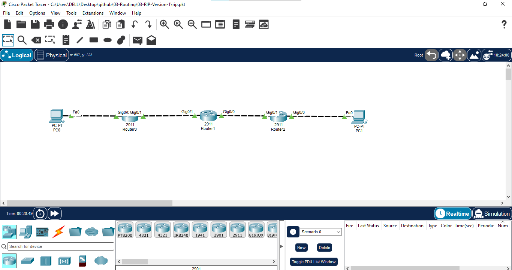

# 03 - RIP Version 1

## 📖 Overview
This lab demonstrates **Routing Information Protocol Version 1 (RIPv1)** on a three-router IPv4 network. RIPv1 is a distance-vector, classful routing protocol that uses **hop count** as its metric. The maximum usable hop count is 15; 16 represents an unreachable destination.

RIPv1 does not carry subnet-mask information in routing updates, so this lab uses classful network boundaries. R1, R2, and R3 exchange routes dynamically and provide end-to-end connectivity between two remote LANs.

## 🎯 Objectives
- Build a three-router topology using R1, R2, and R3.
- Configure IPv4 addressing on routers and PCs.
- Enable RIPv1 with `router rip` and `version 1`.
- Advertise classful networks with `network` statements.
- Verify RIP-learned routes using `show ip route` and `show ip route rip`.
- Verify RIP operation using `show ip protocols`.
- Test end-to-end connectivity and traceroute.
- Understand hop count, convergence, and RIPv1 limitations.

## 🖥️ Devices Used
| Device | Model | Qty | Role |
|---|---|---:|---|
| Router | Cisco 2911 / 1941 | 3 | R1, R2, R3 |
| PC | Generic PC | 2 | PC1 and PC3 |
| Cable | Copper | 4 | LAN/WAN links |

## 🌐 Network Topology


**Path:** PC1 → R1 → R2 → R3 → PC3

## 🔌 Port Mapping
| Source | Interface | Destination | Interface | Link |
|---|---|---|---|---|
| PC1 | Fa0 | R1 | Fa0/0 | LAN |
| R1 | Fa0/1 | R2 | Fa0/1 | WAN |
| R2 | Fa0/0 | R3 | Fa0/1 | WAN |
| R3 | Fa0/0 | PC3 | Fa0 | LAN |

## 🌐 IP Addressing
| Device | Interface | IPv4 | Mask | Gateway | Network |
|---|---|---|---|---|---|
| R1 | Fa0/0 | `192.168.1.1` | `255.255.255.0` | N/A | `192.168.1.0/24` |
| R1 | Fa0/1 | `10.0.12.1` | `255.255.255.0` | N/A | `10.0.12.0/24` |
| R2 | Fa0/1 | `10.0.12.2` | `255.255.255.0` | N/A | `10.0.12.0/24` |
| R2 | Fa0/0 | `10.0.23.1` | `255.255.255.0` | N/A | `10.0.23.0/24` |
| R3 | Fa0/1 | `10.0.23.2` | `255.255.255.0` | N/A | `10.0.23.0/24` |
| R3 | Fa0/0 | `192.168.3.1` | `255.255.255.0` | N/A | `192.168.3.0/24` |
| PC1 | Fa0 | `192.168.1.10` | `255.255.255.0` | `192.168.1.1` | `192.168.1.0/24` |
| PC3 | Fa0 | `192.168.3.10` | `255.255.255.0` | `192.168.3.1` | `192.168.3.0/24` |

## ⚙️ Configuration

### R1
```text
enable
configure terminal
hostname R1
interface FastEthernet0/0
 ip address 192.168.1.1 255.255.255.0
 no shutdown
 exit
interface FastEthernet0/1
 ip address 10.0.12.1 255.255.255.0
 no shutdown
 exit
router rip
 version 1
 network 192.168.1.0
 network 10.0.0.0
 exit
end
copy running-config startup-config
```

### R2
```text
enable
configure terminal
hostname R2
interface FastEthernet0/0
 ip address 10.0.23.1 255.255.255.0
 no shutdown
 exit
interface FastEthernet0/1
 ip address 10.0.12.2 255.255.255.0
 no shutdown
 exit
router rip
 version 1
 network 10.0.0.0
 exit
end
copy running-config startup-config
```

### R3
```text
enable
configure terminal
hostname R3
interface FastEthernet0/0
 ip address 192.168.3.1 255.255.255.0
 no shutdown
 exit
interface FastEthernet0/1
 ip address 10.0.23.2 255.255.255.0
 no shutdown
 exit
router rip
 version 1
 network 192.168.3.0
 network 10.0.0.0
 exit
end
copy running-config startup-config
```

## 💻 PC Configuration
**PC1:** `192.168.1.10 /24`, gateway `192.168.1.1`  
**PC3:** `192.168.3.10 /24`, gateway `192.168.3.1`

## 🔍 Verification

### Interface Status
```text
show ip interface brief
```
All configured interfaces should be `up/up`.

### RIP Process
```text
show ip protocols
```
Confirm RIP and **version 1** are enabled.

### Routing Table
```text
show ip route
show ip route rip
```
RIP-learned routes are marked **R**. R1 should learn `192.168.3.0/24`; R3 should learn `192.168.1.0/24`.

## 🧪 Connectivity Testing
From PC1:
```text
ping 192.168.3.10
```
From PC3:
```text
ping 192.168.1.10
```

Cisco IOS traceroute:
```text
traceroute 192.168.3.10
```
Windows Packet Tracer PC:
```text
tracert 192.168.3.10
```

Expected path: **PC1 → R1 → R2 → R3 → PC3**.

## 🔄 Traffic Flow
1. PC1 sends the remote packet to default gateway R1.
2. R1 uses its RIP-learned route toward R2.
3. R2 forwards toward R3.
4. R3 delivers the packet to PC3.
5. The reply follows the learned reverse route R3 → R2 → R1 → PC1.

## 📸 Verification Screenshots
1. `01-topology.png` → Complete topology.
2. `02-ip-addressing.png` → Interface/IP verification.
3. `03-rip-configuration.png` → `show ip protocols`.
4. `04-rip-routing-table.png` → RIP `R` routes.
5. `05-connectivity-test.png` → Successful PC1-to-PC3 ping.
6. `06-traceroute-test.png` → Routed path verification.

## ⚠️ RIPv1 Limitations
- Classful routing protocol.
- Does not carry subnet-mask information in updates.
- Not suitable for VLSM/CIDR designs.
- Maximum usable hop count is 15.
- Periodic updates can create unnecessary traffic.
- RIPv2 is normally preferred when RIP is required.

## 📚 Concepts Covered
- Distance-vector routing
- RIPv1 and classful routing
- Hop-count metric
- RIP Administrative Distance: `120`
- Maximum hop count: `15`
- RIP convergence
- `router rip`, `version 1`, `network`
- `show ip route`, `show ip route rip`, `show ip protocols`
- Ping and traceroute

## 🎓 Learning Outcome
I demonstrated how RIPv1 dynamically exchanges routes between Cisco routers, verified dynamically learned remote networks, and tested end-to-end connectivity. I also understood why RIPv1 is limited by its classful behavior and lack of subnet-mask information.

## 💡 Interview Questions
1. **What is RIPv1?** — A distance-vector IGP using hop count.
2. **Maximum usable hop count?** — 15; 16 is unreachable.
3. **Administrative Distance?** — 120.
4. **Classful or classless?** — Classful.
5. **Does RIPv1 carry subnet masks?** — No.
6. **Command to enable RIP?** — `router rip`.
7. **How to specify RIPv1?** — `version 1`.
8. **How to verify RIP routes?** — `show ip route rip`.
9. **RIP metric?** — Hop count.
10. **Why is RIPv2 preferred?** — It supports classless routing and carries subnet-mask information.

## 💻 Software Used
- Cisco Packet Tracer

## 👨‍💻 Author
**Mohamed Ashik M**  
Aspiring Network Engineer | CCNA (200-301) Student  
GitHub: [mohamedashik-cpu](https://github.com/mohamedashik-cpu)
