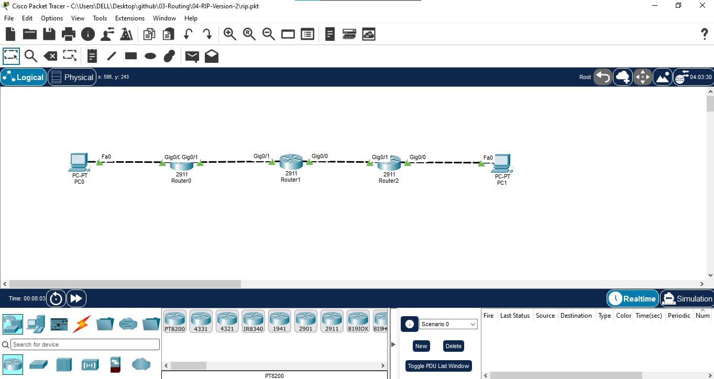

# 04 - RIP Version 2

## 📖 Overview
This lab demonstrates **Routing Information Protocol Version 2 (RIPv2)** on a three-router IPv4 network. RIPv2 is a distance-vector routing protocol that uses **hop count** as its metric and supports **classless routing**, including subnet-mask information in routing updates.

RIPv2 is configured between R1, R2, and R3 to dynamically exchange routes between two LANs. The lab also demonstrates `no auto-summary`, which prevents automatic summarization and is important when using discontiguous or non-classful network designs.

## 🎯 Objectives
- Build a three-router IPv4 topology using R1, R2, and R3.
- Configure GigabitEthernet interfaces and PC addressing.
- Enable RIPv2 using `router rip` and `version 2`.
- Disable automatic summarization with `no auto-summary`.
- Advertise the required networks using `network` statements.
- Verify RIPv2 operation with routing and protocol commands.
- Verify end-to-end connectivity using ping and traceroute.
- Understand the differences between RIPv1 and RIPv2.

## 🖥️ Devices Used
| Device | Model | Qty | Role |
|---|---|---:|---|
| Router | Cisco 2911 | 3 | R1, R2, R3 |
| PC | Generic PC | 2 | PC1 and PC2 |
| Cable | Copper | 4 | LAN/WAN links |

## 🌐 Network Topology


**Path:** PC1 → R1 → R2 → R3 → PC2

## 🔌 Port Mapping
| Source | Interface | Destination | Interface | Link |
|---|---|---|---|---|
| PC1 | Fa0 | R1 | Gi0/0 | LAN |
| R1 | Gi0/1 | R2 | Gi0/1 | WAN |
| R2 | Gi0/0 | R3 | Gi0/1 | WAN |
| R3 | Gi0/0 | PC2 | Fa0 | LAN |

## 🌐 IP Addressing
| Device | Interface | IPv4 | Mask | Gateway | Network |
|---|---|---|---|---|---|
| R1 | Gi0/0 | `192.168.1.1` | `255.255.255.0` | N/A | `192.168.1.0/24` |
| R1 | Gi0/1 | `10.0.12.1` | `255.255.255.0` | N/A | `10.0.12.0/24` |
| R2 | Gi0/1 | `10.0.12.2` | `255.255.255.0` | N/A | `10.0.12.0/24` |
| R2 | Gi0/0 | `10.0.23.1` | `255.255.255.0` | N/A | `10.0.23.0/24` |
| R3 | Gi0/1 | `10.0.23.2` | `255.255.255.0` | N/A | `10.0.23.0/24` |
| R3 | Gi0/0 | `192.168.3.1` | `255.255.255.0` | N/A | `192.168.3.0/24` |
| PC1 | Fa0 | `192.168.1.10` | `255.255.255.0` | `192.168.1.1` | `192.168.1.0/24` |
| PC2 | Fa0 | `192.168.3.10` | `255.255.255.0` | `192.168.3.1` | `192.168.3.0/24` |

## ⚙️ Configuration

### R1
```text
enable
configure terminal
hostname R1

interface GigabitEthernet0/0
 ip address 192.168.1.1 255.255.255.0
 no shutdown
 exit

interface GigabitEthernet0/1
 ip address 10.0.12.1 255.255.255.0
 no shutdown
 exit

router rip
 version 2
 no auto-summary
 network 192.168.1.0
 network 10.0.0.0
 exit

end
copy running-config startup-config
```

### R2
```text
enable
configure terminal
hostname R2

interface GigabitEthernet0/0
 ip address 10.0.23.1 255.255.255.0
 no shutdown
 exit

interface GigabitEthernet0/1
 ip address 10.0.12.2 255.255.255.0
 no shutdown
 exit

router rip
 version 2
 no auto-summary
 network 10.0.0.0
 exit

end
copy running-config startup-config
```

### R3
```text
enable
configure terminal
hostname R3

interface GigabitEthernet0/0
 ip address 192.168.3.1 255.255.255.0
 no shutdown
 exit

interface GigabitEthernet0/1
 ip address 10.0.23.2 255.255.255.0
 no shutdown
 exit

router rip
 version 2
 no auto-summary
 network 192.168.3.0
 network 10.0.0.0
 exit

end
copy running-config startup-config
```

## 💻 PC Configuration
**PC1:** `192.168.1.10 /24`, gateway `192.168.1.1`  
**PC2:** `192.168.3.10 /24`, gateway `192.168.3.1`

## 🔍 Verification

### Interface Status
```text
show ip interface brief
```
All configured interfaces should be `up/up`.

### RIP Process
```text
show ip protocols
```
Confirm that RIP is enabled and **version 2** is being used. Confirm that automatic summarization is disabled.

### Routing Table
```text
show ip route
show ip route rip
```
RIP-learned routes are marked **R**. R1 should learn `192.168.3.0/24`; R3 should learn `192.168.1.0/24`.

### RIP Database
```text
show ip rip database
```
This displays networks learned and advertised by RIP.

## 🧪 Connectivity Testing
From PC1:
```text
ping 192.168.3.10
```

From PC2:
```text
ping 192.168.1.10
```

Windows Packet Tracer PC:
```text
tracert 192.168.3.10
```

Cisco IOS:
```text
traceroute 192.168.3.10
```

Expected path: **PC1 → R1 → R2 → R3 → PC2**.

## 🔄 Traffic Flow
1. PC1 sends traffic for `192.168.3.10` to its default gateway R1.
2. R1 uses the RIPv2-learned route toward R2.
3. R2 forwards the packet toward R3.
4. R3 forwards the packet to PC2.
5. The reply uses the dynamically learned reverse route.

## 📸 Verification Screenshots
1. `01-topology.png` → Complete RIPv2 topology.
2. `02-ip-addressing.png` → Interface/IP verification.
3. `03-ripv2-configuration.png` → RIPv2 configuration and `show ip protocols`.
4. `04-rip-routing-table.png` → RIPv2-learned `R` routes.
5. `05-connectivity-test.png` → Successful PC1-to-PC2 ping.
6. `06-traceroute-test.png` → Routed path verification.

## 🔁 RIPv1 vs RIPv2
| Feature | RIPv1 | RIPv2 |
|---|---|---|
| Routing type | Distance vector | Distance vector |
| Metric | Hop count | Hop count |
| Maximum usable hops | 15 | 15 |
| Classful/Classless | Classful | Classless |
| Subnet mask in updates | No | Yes |
| VLSM/CIDR support | No | Yes |
| Auto-summary | Classful behavior | Can be disabled with `no auto-summary` |
| Update destination | Broadcast | Multicast `224.0.0.9` |
| Authentication | No | Supported |

## ⚠️ RIPv2 Limitations
- Maximum usable hop count is 15.
- Convergence is slower than modern link-state protocols such as OSPF.
- Periodic updates consume bandwidth.
- It is generally unsuitable for large enterprise networks.
- Modern networks normally prefer OSPF, EIGRP, or other more scalable routing protocols.

## 📚 Concepts Covered
- RIPv2
- Distance-vector routing
- Classless routing
- VLSM/CIDR support
- Hop-count metric
- RIP Administrative Distance: `120`
- `router rip`
- `version 2`
- `no auto-summary`
- `show ip route`
- `show ip route rip`
- `show ip protocols`
- `show ip rip database`
- Ping and traceroute

## 🎓 Learning Outcome
I demonstrated how RIPv2 dynamically exchanges classless IPv4 routing information between Cisco routers. I configured RIPv2, disabled automatic summarization, verified dynamically learned routes, and tested end-to-end connectivity. I also understood the major improvements of RIPv2 over RIPv1, including subnet-mask support, VLSM/CIDR support, multicast updates, and authentication capability.

## 💡 Interview Questions
1. **What is RIPv2?** — A classless distance-vector routing protocol using hop count.
2. **Maximum usable hop count?** — 15; 16 is unreachable.
3. **Administrative Distance?** — 120.
4. **Does RIPv2 carry subnet masks?** — Yes.
5. **Does RIPv2 support VLSM?** — Yes.
6. **Why use `no auto-summary`?** — To prevent automatic classful summarization.
7. **What multicast address does RIPv2 use?** — `224.0.0.9`.
8. **How do you verify RIP routes?** — `show ip route rip`.
9. **How do you verify the RIP process?** — `show ip protocols`.
10. **RIPv1 vs RIPv2 main difference?** — RIPv1 is classful; RIPv2 is classless and carries subnet-mask information.

## 💻 Software Used
- Cisco Packet Tracer

## 👨‍💻 Author
**Mohamed Ashik M**  
Aspiring Network Engineer | CCNA (200-301) Student  
GitHub: [mohamedashik-cpu](https://github.com/mohamedashik-cpu)
