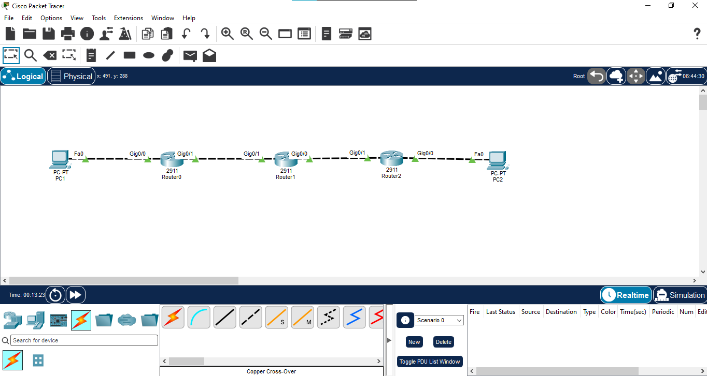

# 05 - OSPF Single Area

## 📖 Overview
This lab demonstrates **Open Shortest Path First (OSPF)** in a single-area IPv4 network using three Cisco 2911 routers. All routers operate in **Area 0**, form OSPF neighbor relationships, exchange link-state information, and dynamically learn remote LAN routes.

OSPF is a link-state Interior Gateway Protocol (IGP) that uses the **Shortest Path First (SPF)** algorithm. Unlike RIP, OSPF uses a cost-based metric and converges faster in larger networks.

## 🎯 Objectives
- Build a three-router single-area OSPF topology.
- Configure IPv4 addressing on routers and PCs.
- Enable OSPF process 1.
- Configure unique OSPF router IDs.
- Advertise connected networks into **Area 0** using wildcard masks.
- Verify OSPF neighbor adjacency.
- Verify OSPF-learned routes.
- Test end-to-end connectivity using ping and traceroute.
- Understand OSPF fundamentals, router IDs, neighbors, LSDB, and cost.

## 🖥️ Devices Used
| Device | Model | Qty | Role |
|---|---|---:|---|
| Router | Cisco 2911 | 3 | R1, R2, R3 |
| PC | Generic PC | 2 | PC1 and PC2 |
| Cable | Copper | 4 | LAN/WAN links |

## 🌐 Network Topology


**Path:** PC1 → R1 → R2 → R3 → PC2

All routers are configured in **OSPF Area 0 (backbone area)**.

## 🔌 Port Mapping
| Source | Interface | Destination | Interface | Link |
|---|---|---|---|---|
| PC1 | Fa0 | R1 | Gi0/0 | LAN |
| R1 | Gi0/1 | R2 | Gi0/1 | WAN |
| R2 | Gi0/0 | R3 | Gi0/1 | WAN |
| R3 | Gi0/0 | PC2 | Fa0 | LAN |

## 🌐 IP Addressing
| Device | Interface | IPv4 | Mask | Gateway | Network |
|---|---|---|---|---|---|
| R1 | Gi0/0 | `192.168.1.1` | `255.255.255.0` | N/A | `192.168.1.0/24` |
| R1 | Gi0/1 | `10.0.12.1` | `255.255.255.0` | N/A | `10.0.12.0/24` |
| R2 | Gi0/1 | `10.0.12.2` | `255.255.255.0` | N/A | `10.0.12.0/24` |
| R2 | Gi0/0 | `10.0.23.1` | `255.255.255.0` | N/A | `10.0.23.0/24` |
| R3 | Gi0/1 | `10.0.23.2` | `255.255.255.0` | N/A | `10.0.23.0/24` |
| R3 | Gi0/0 | `192.168.3.1` | `255.255.255.0` | N/A | `192.168.3.0/24` |
| PC1 | Fa0 | `192.168.1.10` | `255.255.255.0` | `192.168.1.1` | `192.168.1.0/24` |
| PC2 | Fa0 | `192.168.3.10` | `255.255.255.0` | `192.168.3.1` | `192.168.3.0/24` |

## ⚙️ Configuration

### R1
```text
enable
configure terminal
hostname R1

interface GigabitEthernet0/0
 ip address 192.168.1.1 255.255.255.0
 no shutdown
 exit

interface GigabitEthernet0/1
 ip address 10.0.12.1 255.255.255.0
 no shutdown
 exit

router ospf 1
 router-id 1.1.1.1
 network 192.168.1.0 0.0.0.255 area 0
 network 10.0.12.0 0.0.0.255 area 0
 exit

end
copy running-config startup-config
```

### R2
```text
enable
configure terminal
hostname R2

interface GigabitEthernet0/0
 ip address 10.0.23.1 255.255.255.0
 no shutdown
 exit

interface GigabitEthernet0/1
 ip address 10.0.12.2 255.255.255.0
 no shutdown
 exit

router ospf 1
 router-id 2.2.2.2
 network 10.0.12.0 0.0.0.255 area 0
 network 10.0.23.0 0.0.0.255 area 0
 exit

end
copy running-config startup-config
```

### R3
```text
enable
configure terminal
hostname R3

interface GigabitEthernet0/0
 ip address 192.168.3.1 255.255.255.0
 no shutdown
 exit

interface GigabitEthernet0/1
 ip address 10.0.23.2 255.255.255.0
 no shutdown
 exit

router ospf 1
 router-id 3.3.3.3
 network 192.168.3.0 0.0.0.255 area 0
 network 10.0.23.0 0.0.0.255 area 0
 exit

end
copy running-config startup-config
```

## 💻 PC Configuration
**PC1:** `192.168.1.10 /24`, gateway `192.168.1.1`  
**PC2:** `192.168.3.10 /24`, gateway `192.168.3.1`

## 🔍 Verification

### Interface Status
```text
show ip interface brief
```
All configured router interfaces should be `up/up`.

### OSPF Neighbors
```text
show ip ospf neighbor
```
R1 should form an adjacency with R2, and R2 should form an adjacency with R3.

### OSPF Process
```text
show ip ospf
```
Verify OSPF process ID `1`, router ID, area information, and interface participation.

### Routing Table
```text
show ip route
show ip route ospf
```
OSPF-learned routes are marked with **O**. R1 should learn `192.168.3.0/24`; R3 should learn `192.168.1.0/24`.

### OSPF Database
```text
show ip ospf database
```
This displays the OSPF Link-State Database (LSDB).

### Interface OSPF Details
```text
show ip ospf interface brief
```

## 🧪 Connectivity Testing
From PC1:
```text
ping 192.168.3.10
```

From PC2:
```text
ping 192.168.1.10
```

Windows Packet Tracer PC:
```text
tracert 192.168.3.10
```

Cisco IOS:
```text
traceroute 192.168.3.10
```

Expected path: **PC1 → R1 → R2 → R3 → PC2**.

## 🔄 Traffic Flow
1. PC1 sends traffic for `192.168.3.10` to its default gateway R1.
2. R1 checks its OSPF routing table and forwards the packet toward R2.
3. R2 forwards the packet toward R3 using its OSPF route.
4. R3 delivers the packet to PC2.
5. The reply follows the OSPF-learned reverse route.

## 📸 Verification Screenshots
1. `01-topology.png` → Complete single-area OSPF topology.
2. `02-ip-addressing.png` → Interface and IP verification.
3. `03-ospf-configuration.png` → OSPF configuration and process verification.
4. `04-ospf-neighbor.png` → OSPF neighbor adjacency.
5. `05-ospf-routing-table.png` → OSPF-learned routes.
6. `06-connectivity-test.png` → Successful PC1-to-PC2 ping.
7. `07-traceroute-test.png` → Routed path verification.

## 🔁 OSPF vs RIP
| Feature | RIP | OSPF |
|---|---|---|
| Routing type | Distance vector | Link state |
| Metric | Hop count | Cost |
| Maximum hop count | 15 | No RIP-style hop limit |
| Convergence | Slower | Faster |
| Network size | Small | Medium to large |
| Routing updates | Periodic | Link-state updates as needed |
| VLSM/CIDR | RIPv2 supports | Supported |
| Hierarchical design | No | Yes, using areas |
| Algorithm | Bellman-Ford family | SPF / Dijkstra |
| Administrative Distance | 120 | 110 |

## ⚠️ OSPF Key Points
- OSPF is a **link-state IGP**.
- OSPF uses the **SPF (Dijkstra) algorithm**.
- Lower OSPF cost is preferred.
- OSPF uses **Area 0** as the backbone area.
- Router IDs must be unique within the OSPF domain.
- OSPF neighbors must successfully form adjacency before exchanging routing information.
- OSPF routes appear as **O** in the IPv4 routing table.

## 📚 Concepts Covered
- OSPF Single Area
- Area 0 / Backbone Area
- Link-state routing
- SPF / Dijkstra algorithm
- OSPF router ID
- OSPF neighbor adjacency
- OSPF cost
- Link-State Database (LSDB)
- Wildcard masks
- OSPF route code `O`
- `router ospf`
- `show ip ospf neighbor`
- `show ip ospf`
- `show ip route ospf`
- `show ip ospf database`
- Ping and traceroute

## 🎓 Learning Outcome
I demonstrated how OSPF dynamically exchanges link-state information between three Cisco routers in a single Area 0 design. I configured unique router IDs, advertised connected networks using wildcard masks, verified OSPF neighbor adjacencies and learned routes, and tested end-to-end connectivity.

## 💡 Interview Questions
1. **What is OSPF?** — A link-state Interior Gateway Protocol.
2. **What algorithm does OSPF use?** — Dijkstra / SPF.
3. **What is Area 0?** — The OSPF backbone area.
4. **What is the OSPF Administrative Distance?** — 110.
5. **What is the OSPF metric?** — Cost.
6. **How do you verify OSPF neighbors?** — `show ip ospf neighbor`.
7. **How do you verify OSPF routes?** — `show ip route ospf`.
8. **Why configure a router ID?** — To uniquely identify the OSPF router.
9. **What does `network ... area 0` do?** — Enables OSPF on matching interfaces and places them in Area 0.
10. **What is an LSDB?** — The database containing the link-state information used by OSPF to calculate routes.

## 💻 Software Used
- Cisco Packet Tracer

## 👨‍💻 Author
**Mohamed Ashik M**  
Aspiring Network Engineer | CCNA (200-301) Student  
GitHub: [mohamedashik-cpu](https://github.com/mohamedashik-cpu)
