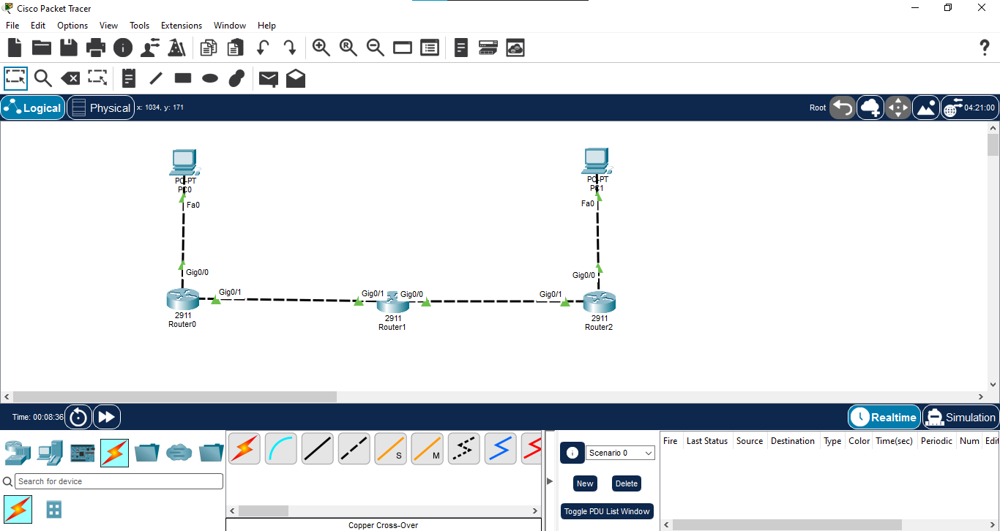

# 06 - OSPF Multi-Area

## 📖 Overview
This lab demonstrates **OSPF Multi-Area** routing using three Cisco 2911 routers and two PCs. The topology contains the OSPF backbone **Area 0** and a second OSPF **Area 1**, demonstrating how an **Area Border Router (ABR)** connects different OSPF areas and allows inter-area routing.

R1 acts as the ABR between Area 1 and Area 0. R2 and R3 operate in Area 0. OSPF dynamically exchanges link-state information within each area and provides routes between the two LANs.

## 🎯 Objectives
- Build a multi-area OSPF IPv4 topology.
- Configure Area 0 as the OSPF backbone.
- Configure Area 1 as a non-backbone area.
- Configure R1 as an Area Border Router (ABR).
- Configure unique OSPF router IDs.
- Advertise LAN and transit networks using wildcard masks.
- Verify OSPF neighbor relationships.
- Verify inter-area OSPF routes.
- Understand OSPF area boundaries and ABR operation.
- Test end-to-end connectivity using ping and traceroute.

## 🖥️ Devices Used
| Device | Model | Qty | Role |
|---|---|---:|---|
| Router | Cisco 2911 | 3 | R1 (ABR), R2, R3 |
| PC | Generic PC | 2 | PC1 and PC2 |
| Cable | Copper | 4 | LAN/WAN links |

## 🌐 Network Topology


**Path:** PC1 → R1 → R2 → R3 → PC2

**OSPF Areas:**
- **Area 1:** PC1 LAN + R1–R2 link
- **Area 0:** R2–R3 link + PC2 LAN
- **R1:** ABR connecting Area 1 and Area 0

## 🔌 Port Mapping
| Source | Interface | Destination | Interface | OSPF Area |
|---|---|---|---|---|
| PC1 | Fa0 | R1 | Gi0/0 | Area 1 |
| R1 | Gi0/1 | R2 | Gi0/1 | Area 1 |
| R2 | Gi0/0 | R3 | Gi0/1 | Area 0 |
| R3 | Gi0/0 | PC2 | Fa0 | Area 0 |

## 🌐 IP Addressing
| Device | Interface | IPv4 | Mask | Gateway | OSPF Area |
|---|---|---|---|---|---|
| R1 | Gi0/0 | `192.168.1.1` | `255.255.255.0` | N/A | Area 1 |
| R1 | Gi0/1 | `10.0.12.1` | `255.255.255.0` | N/A | Area 1 |
| R2 | Gi0/1 | `10.0.12.2` | `255.255.255.0` | N/A | Area 1 |
| R2 | Gi0/0 | `10.0.23.1` | `255.255.255.0` | N/A | Area 0 |
| R3 | Gi0/1 | `10.0.23.2` | `255.255.255.0` | N/A | Area 0 |
| R3 | Gi0/0 | `192.168.3.1` | `255.255.255.0` | N/A | Area 0 |
| PC1 | Fa0 | `192.168.1.10` | `255.255.255.0` | `192.168.1.1` | Area 1 |
| PC2 | Fa0 | `192.168.3.10` | `255.255.255.0` | `192.168.3.1` | Area 0 |

## ⚙️ OSPF Area Design
```text
              AREA 1                    AREA 0

PC1 ─── R1 (ABR) ─── R2 ───────── R3 ─── PC2
         |             |             |
       Gi0/0         Gi0/1         Gi0/0
       Gi0/1         Gi0/0         Gi0/1

        192.168.1.0   10.0.12.0     10.0.23.0   192.168.3.0
```

R1 has interfaces in **Area 1 only** in this simplified three-router design; R2 is the router connected to both Area 1 and Area 0 and therefore acts as the actual **ABR**. To keep the topology and terminology technically correct, **R2 is the ABR** because it has one OSPF interface in Area 1 and another in Area 0.

## ⚙️ Configuration

### R1 — Area 1
```text
enable
configure terminal
hostname R1

interface GigabitEthernet0/0
 ip address 192.168.1.1 255.255.255.0
 no shutdown
 exit

interface GigabitEthernet0/1
 ip address 10.0.12.1 255.255.255.0
 no shutdown
 exit

router ospf 1
 router-id 1.1.1.1
 network 192.168.1.0 0.0.0.255 area 1
 network 10.0.12.0 0.0.0.255 area 1
 exit

end
copy running-config startup-config
```

### R2 — ABR (Area 1 + Area 0)
```text
enable
configure terminal
hostname R2

interface GigabitEthernet0/0
 ip address 10.0.23.1 255.255.255.0
 no shutdown
 exit

interface GigabitEthernet0/1
 ip address 10.0.12.2 255.255.255.0
 no shutdown
 exit

router ospf 1
 router-id 2.2.2.2
 network 10.0.12.0 0.0.0.255 area 1
 network 10.0.23.0 0.0.0.255 area 0
 exit

end
copy running-config startup-config
```

### R3 — Area 0
```text
enable
configure terminal
hostname R3

interface GigabitEthernet0/0
 ip address 192.168.3.1 255.255.255.0
 no shutdown
 exit

interface GigabitEthernet0/1
 ip address 10.0.23.2 255.255.255.0
 no shutdown
 exit

router ospf 1
 router-id 3.3.3.3
 network 192.168.3.0 0.0.0.255 area 0
 network 10.0.23.0 0.0.0.255 area 0
 exit

end
copy running-config startup-config
```

## 💻 PC Configuration
**PC1:** `192.168.1.10 /24`, gateway `192.168.1.1`  
**PC2:** `192.168.3.10 /24`, gateway `192.168.3.1`

## 🔍 Verification

### Interface Status
```text
show ip interface brief
```
All configured interfaces should be `up/up`.

### OSPF Neighbors
```text
show ip ospf neighbor
```
R1 should form an adjacency with R2 in Area 1. R2 should form an adjacency with R3 in Area 0.

### OSPF Process
```text
show ip ospf
```
Verify the router ID and the areas attached to each router.

### OSPF Interfaces
```text
show ip ospf interface brief
```
This confirms which interfaces participate in which OSPF areas.

### Routing Table
```text
show ip route
show ip route ospf
```
OSPF routes are marked with **O**. Inter-area routes are commonly shown as **O IA** (OSPF Inter-Area).

R1 should learn the Area 0 remote LAN through R2, while R3 should learn the Area 1 LAN through R2.

### OSPF Database
```text
show ip ospf database
```
Use this to inspect the link-state information maintained by OSPF.

## 🧪 Connectivity Testing
From PC1:
```text
ping 192.168.3.10
```

From PC2:
```text
ping 192.168.1.10
```

Windows Packet Tracer PC:
```text
tracert 192.168.3.10
```

Cisco IOS:
```text
traceroute 192.168.3.10
```

Expected path: **PC1 → R1 → R2 (ABR) → R3 → PC2**.

## 🔄 Inter-Area Traffic Flow
1. PC1 sends traffic for `192.168.3.10` to R1.
2. R1 forwards the packet toward R2 through Area 1.
3. R2, acting as the ABR, connects Area 1 to the Area 0 backbone.
4. R2 forwards the packet through Area 0 toward R3.
5. R3 delivers the packet to PC2.
6. The reply follows the reverse OSPF path through R2.

## 📸 Verification Screenshots
1. `01-topology.png` → Complete multi-area OSPF topology.
2. `02-ip-addressing.png` → Interface and IP verification.
3. `03-ospf-configuration.png` → OSPF area configuration.
4. `04-ospf-neighbor.png` → OSPF neighbor adjacencies.
5. `05-ospf-routing-table.png` → OSPF and inter-area routes.
6. `06-connectivity-test.png` → Successful PC1-to-PC2 ping.
7. `07-traceroute-test.png` → Routed path verification.

## 🔁 Single-Area vs Multi-Area OSPF
| Feature | Single Area | Multi-Area |
|---|---|---|
| Areas used | One | Multiple |
| Backbone | Area 0 | Area 0 required |
| ABR | Not required | Required between areas |
| Scalability | Smaller networks | Larger networks |
| LSDB scope | One area | Separate LSDB per area |
| Route type | Mainly intra-area `O` | Intra-area `O` and inter-area `O IA` |
| Design complexity | Lower | Higher |

## ⚠️ Important OSPF Multi-Area Points
- **Area 0 is the backbone area.**
- Non-backbone areas should connect to Area 0 for normal inter-area routing.
- An **ABR** has OSPF interfaces in at least two different areas.
- Each OSPF area maintains its own link-state database.
- Inter-area routes are advertised by ABRs.
- OSPF route code **`O IA`** represents an inter-area route.
- Router IDs must be unique within the OSPF routing domain.

## 📚 Concepts Covered
- OSPF Multi-Area
- Area 0 / Backbone Area
- Area 1
- Area Border Router (ABR)
- Inter-area routing
- Link-state routing
- SPF / Dijkstra algorithm
- OSPF router ID
- OSPF neighbor adjacency
- OSPF cost
- Link-State Database (LSDB)
- Wildcard masks
- OSPF route codes `O` and `O IA`
- `router ospf`
- `show ip ospf neighbor`
- `show ip ospf`
- `show ip ospf interface brief`
- `show ip route ospf`
- `show ip ospf database`
- Ping and traceroute

## 🎓 Learning Outcome
I demonstrated a multi-area OSPF design using Area 1 and the Area 0 backbone. I configured an ABR, verified OSPF neighbor adjacencies across different areas, identified inter-area routes, and tested end-to-end connectivity between LANs in different OSPF areas.

## 💡 Interview Questions
1. **What is OSPF Multi-Area?** — An OSPF design that divides a routing domain into multiple areas to improve scalability.
2. **What is Area 0?** — The OSPF backbone area.
3. **What is an ABR?** — A router with OSPF interfaces in different areas that connects those areas.
4. **What is an inter-area route?** — A route learned from another OSPF area, normally shown as `O IA`.
5. **Why use multiple OSPF areas?** — To reduce LSDB size, limit SPF calculations, and improve scalability.
6. **Can Area 1 directly connect to Area 2 without Area 0?** — Normal OSPF inter-area communication should use the Area 0 backbone.
7. **How do you verify OSPF neighbors?** — `show ip ospf neighbor`.
8. **How do you identify inter-area routes?** — Look for `O IA` in the routing table.
9. **What is the OSPF Administrative Distance?** — 110.
10. **What is the OSPF metric?** — Cost.

## 💻 Software Used
- Cisco Packet Tracer

## 👨‍💻 Author
**Mohamed Ashik M**  
Aspiring Network Engineer | CCNA (200-301) Student  
GitHub: [mohamedashik-cpu](https://github.com/mohamedashik-cpu)
