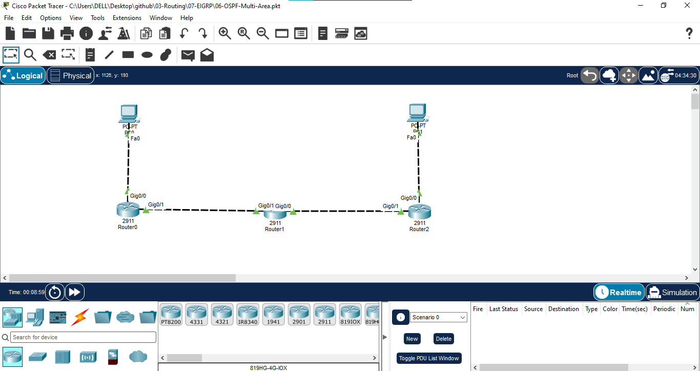
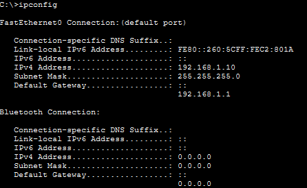
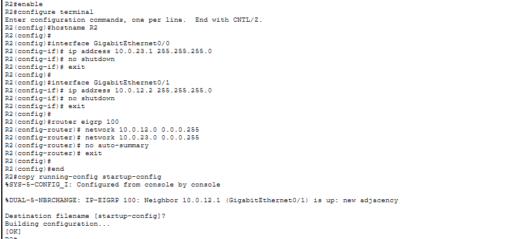
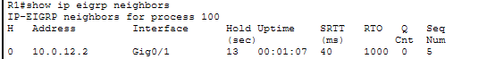
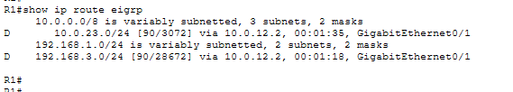
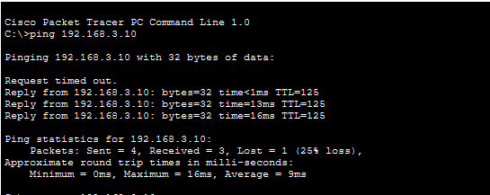
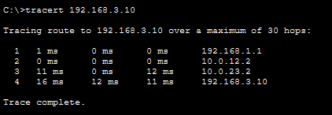

# 07 - EIGRP

## 📖 Overview
This lab demonstrates **Enhanced Interior Gateway Routing Protocol (EIGRP)** using three Cisco 2911 routers and two PCs. EIGRP is configured as a dynamic routing protocol using Autonomous System **100** to provide end-to-end connectivity between two LANs.

## 🎯 Objectives
- Configure EIGRP on three routers.
- Establish EIGRP neighbor adjacencies.
- Advertise LAN and transit networks.
- Understand EIGRP Autonomous System number.
- Verify EIGRP routes and neighbor relationships.
- Understand EIGRP DUAL, successor and feasible successor concepts.
- Test end-to-end connectivity using ping and traceroute.

## 🖥️ Devices Used
| Device | Model | Qty | Role |
|---|---|---:|---|
| Router | Cisco 2911 | 3 | R1, R2, R3 |
| PC | Generic PC | 2 | PC1, PC2 |
| Cable | Copper | 4 | LAN/WAN links |

## 🌐 Network Topology


**Path:** PC1 → R1 → R2 → R3 → PC2

## 🔌 Port Mapping
| Source | Interface | Destination | Interface |
|---|---|---|---|
| PC1 | Fa0 | R1 | Gi0/0 |
| R1 | Gi0/1 | R2 | Gi0/1 |
| R2 | Gi0/0 | R3 | Gi0/1 |
| R3 | Gi0/0 | PC2 | Fa0 |

## 🌐 IP Addressing
| Device | Interface | IPv4 Address | Subnet Mask | Default Gateway |
|---|---|---|---|---|
| PC1 | Fa0 | `192.168.1.10` | `255.255.255.0` | `192.168.1.1` |
| R1 | Gi0/0 | `192.168.1.1` | `255.255.255.0` | N/A |
| R1 | Gi0/1 | `10.0.12.1` | `255.255.255.0` | N/A |
| R2 | Gi0/1 | `10.0.12.2` | `255.255.255.0` | N/A |
| R2 | Gi0/0 | `10.0.23.1` | `255.255.255.0` | N/A |
| R3 | Gi0/1 | `10.0.23.2` | `255.255.255.0` | N/A |
| R3 | Gi0/0 | `192.168.3.1` | `255.255.255.0` | N/A |
| PC2 | Fa0 | `192.168.3.10` | `255.255.255.0` | `192.168.3.1` |

## ⚙️ EIGRP Configuration

### R1
```text
enable
configure terminal
hostname R1

interface GigabitEthernet0/0
 ip address 192.168.1.1 255.255.255.0
 no shutdown
 exit

interface GigabitEthernet0/1
 ip address 10.0.12.1 255.255.255.0
 no shutdown
 exit

router eigrp 100
 network 192.168.1.0 0.0.0.255
 network 10.0.12.0 0.0.0.255
 no auto-summary
 exit

end
copy running-config startup-config
```

### R2
```text
enable
configure terminal
hostname R2

interface GigabitEthernet0/0
 ip address 10.0.23.1 255.255.255.0
 no shutdown
 exit

interface GigabitEthernet0/1
 ip address 10.0.12.2 255.255.255.0
 no shutdown
 exit

router eigrp 100
 network 10.0.12.0 0.0.0.255
 network 10.0.23.0 0.0.0.255
 no auto-summary
 exit

end
copy running-config startup-config
```

### R3
```text
enable
configure terminal
hostname R3

interface GigabitEthernet0/0
 ip address 192.168.3.1 255.255.255.0
 no shutdown
 exit

interface GigabitEthernet0/1
 ip address 10.0.23.2 255.255.255.0
 no shutdown
 exit

router eigrp 100
 network 192.168.3.0 0.0.0.255
 network 10.0.23.0 0.0.0.255
 no auto-summary
 exit

end
copy running-config startup-config
```

## 💻 PC Configuration

### PC1
```text
IP Address:      192.168.1.10
Subnet Mask:     255.255.255.0
Default Gateway: 192.168.1.1
```

### PC2
```text
IP Address:      192.168.3.10
Subnet Mask:     255.255.255.0
Default Gateway: 192.168.3.1
```

## 🔍 Verification

### 1. Interface Status
```text
show ip interface brief
```
All configured router interfaces should be **up/up**.

### 2. EIGRP Neighbors
```text
show ip eigrp neighbors
```
Expected:
- R1 → R2
- R2 → R1 and R3
- R3 → R2

### 3. EIGRP Routes
```text
show ip route eigrp
```
EIGRP learned routes are identified with **D** in the routing table.

### 4. EIGRP Protocol Information
```text
show ip protocols
```
Verify EIGRP AS **100** and the advertised networks.

### 5. EIGRP Topology Table
```text
show ip eigrp topology
```
Use this to view successor and feasible successor information.

## 🧪 Connectivity Testing
From PC1:
```text
ping 192.168.3.10
```

From PC2:
```text
ping 192.168.1.10
```

Traceroute from PC1:
```text
tracert 192.168.3.10
```

Expected path:
```text
PC1 → R1 → R2 → R3 → PC2
```

## 🔄 Traffic Flow
1. PC1 sends traffic to its default gateway R1.
2. R1 checks the EIGRP routing table for `192.168.3.0/24`.
3. R1 forwards the packet to R2.
4. R2 forwards the packet to R3.
5. R3 delivers the packet to PC2.
6. The return traffic follows the EIGRP-learned reverse path.

## 📸 Screenshots

### 1. Network Topology


### 2. IP Addressing and Interfaces


### 3. EIGRP Configuration


### 4. EIGRP Neighbor Adjacency


### 5. EIGRP Routing Table


### 6. Connectivity Test


### 7. Traceroute Test


## 🧠 EIGRP Concepts Covered
- Enhanced Interior Gateway Routing Protocol
- Autonomous System number
- EIGRP neighbor adjacency
- Hello packets
- DUAL algorithm
- Successor
- Feasible Successor
- Feasibility Condition
- EIGRP metric
- Bandwidth and delay
- EIGRP topology table
- EIGRP routing table
- Administrative Distance
- Split horizon
- Route summarization
- `no auto-summary`
- EIGRP route code `D`

## 🔁 EIGRP vs RIP vs OSPF
| Feature | RIP | OSPF | EIGRP |
|---|---|---|---|
| Type | Distance Vector | Link State | Advanced Distance Vector / Hybrid |
| Metric | Hop Count | Cost | Composite Metric |
| Max Hop Count | 15 | No 15-hop limit | 100 by default |
| Algorithm | Bellman-Ford based | SPF / Dijkstra | DUAL |
| Convergence | Slower | Fast | Fast |
| Scalability | Low | High | High |
| Route Code | `R` | `O` | `D` |

## 🎓 Learning Outcome
I configured EIGRP across three Cisco routers using AS 100, established neighbor adjacencies, advertised LAN networks, verified EIGRP-learned routes, and tested end-to-end connectivity between two remote PCs.

## 💡 Interview Questions
1. **What is EIGRP?** — Enhanced Interior Gateway Routing Protocol, a Cisco-developed dynamic routing protocol.
2. **What is an EIGRP AS number?** — It identifies the EIGRP routing process; routers must use the same AS number to become neighbors.
3. **What algorithm does EIGRP use?** — DUAL (Diffusing Update Algorithm).
4. **What is a successor?** — The best next-hop route to a destination.
5. **What is a feasible successor?** — A loop-free backup route that satisfies the feasibility condition.
6. **How do you verify EIGRP neighbors?** — `show ip eigrp neighbors`.
7. **How do you identify EIGRP routes?** — Routes are marked with `D` in `show ip route`.
8. **What is the EIGRP metric based on?** — Primarily bandwidth and delay by default.
9. **Why use `no auto-summary`?** — To prevent automatic classful route summarization and support discontiguous/VLSM networks correctly.
10. **What is EIGRP Administrative Distance?** — 90 for internal EIGRP routes and 170 for external EIGRP routes.

## 💻 Software Used
- Cisco Packet Tracer

## 👨‍💻 Author
**Mohamed Ashik M**  
Aspiring Network Engineer | CCNA (200-301) Student  
GitHub: [mohamedashik-cpu](https://github.com/mohamedashik-cpu)
