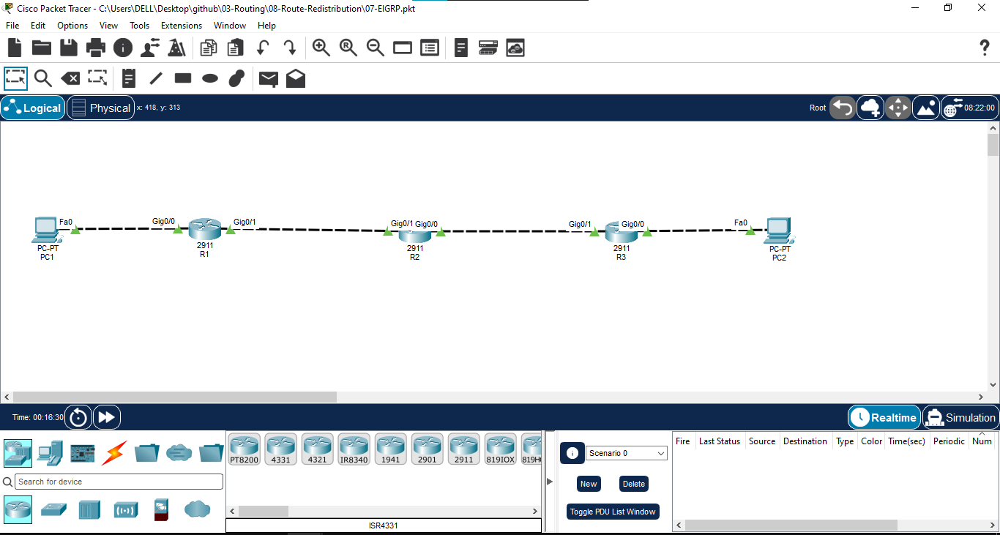
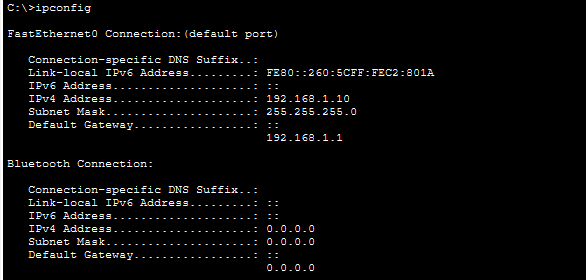
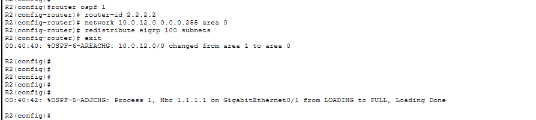
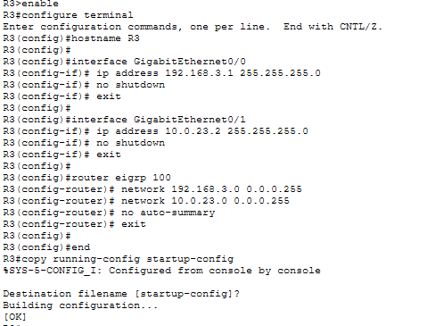
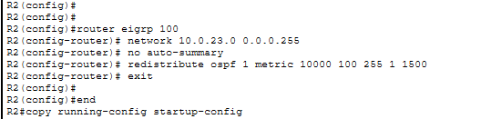
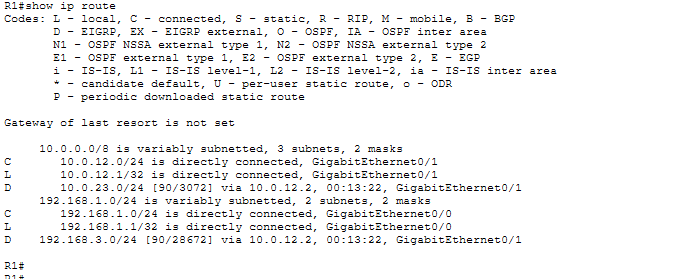
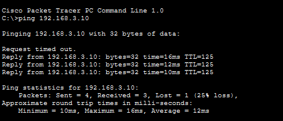
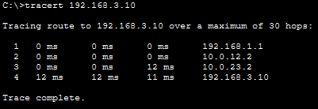

# 08 - Route Redistribution

## 📖 Overview
This lab demonstrates **OSPF ↔ EIGRP Route Redistribution** using three Cisco 2911 routers and two PCs. R1 runs OSPF, R3 runs EIGRP AS 100, and R2 acts as the redistribution router between the two routing protocols.

The purpose of this lab is to understand how routes learned by one dynamic routing protocol can be redistributed into another routing protocol so that networks using different protocols can communicate.

## 🎯 Objectives
- Configure OSPF on the R1–R2 side.
- Configure EIGRP AS 100 on the R2–R3 side.
- Configure R2 as the redistribution point.
- Redistribute EIGRP routes into OSPF.
- Redistribute OSPF routes into EIGRP.
- Understand redistribution metrics.
- Verify OSPF and EIGRP neighbor relationships.
- Verify redistributed routes in the routing table.
- Test end-to-end connectivity using ping and traceroute.

## 🖥️ Devices Used
| Device | Model | Qty | Role |
|---|---|---:|---|
| Router | Cisco 2911 | 3 | R1, R2, R3 |
| PC | Generic PC | 2 | PC1, PC2 |
| Cable | Copper | 4 | LAN/WAN connections |

## 🌐 Network Topology


**Traffic path:** PC1 → R1 → R2 → R3 → PC2

**Routing design:**
- R1 ↔ R2 = OSPF Area 0
- R2 ↔ R3 = EIGRP AS 100
- R2 = Redistribution Router

## 🔌 Port Mapping
| Source | Interface | Destination | Interface | Routing Protocol |
|---|---|---|---|---|
| PC1 | Fa0 | R1 | Gi0/0 | — |
| R1 | Gi0/1 | R2 | Gi0/1 | OSPF |
| R2 | Gi0/0 | R3 | Gi0/1 | EIGRP |
| R3 | Gi0/0 | PC2 | Fa0 | — |

## 🌐 IP Addressing
| Device | Interface | IPv4 Address | Subnet Mask | Default Gateway | Protocol |
|---|---|---|---|---|---|
| PC1 | Fa0 | `192.168.1.10` | `255.255.255.0` | `192.168.1.1` | — |
| R1 | Gi0/0 | `192.168.1.1` | `255.255.255.0` | N/A | OSPF |
| R1 | Gi0/1 | `10.0.12.1` | `255.255.255.0` | N/A | OSPF |
| R2 | Gi0/1 | `10.0.12.2` | `255.255.255.0` | N/A | OSPF |
| R2 | Gi0/0 | `10.0.23.1` | `255.255.255.0` | N/A | EIGRP |
| R3 | Gi0/1 | `10.0.23.2` | `255.255.255.0` | N/A | EIGRP |
| R3 | Gi0/0 | `192.168.3.1` | `255.255.255.0` | N/A | EIGRP |
| PC2 | Fa0 | `192.168.3.10` | `255.255.255.0` | `192.168.3.1` | — |

## ⚙️ Routing Protocol Design

```text
                  OSPF Area 0                 EIGRP AS 100

PC1 ─── R1 ───────── R2 ───────── R3 ─── PC2
                       │
               REDISTRIBUTION POINT

             OSPF  ↔  EIGRP
```

R2 participates in both routing protocols. It learns OSPF routes from the OSPF domain and EIGRP routes from the EIGRP domain, then redistributes those routes into the opposite protocol.

## ⚙️ Configuration

### R1 — OSPF
```text
enable
configure terminal
hostname R1

interface GigabitEthernet0/0
 ip address 192.168.1.1 255.255.255.0
 no shutdown
 exit

interface GigabitEthernet0/1
 ip address 10.0.12.1 255.255.255.0
 no shutdown
 exit

router ospf 1
 router-id 1.1.1.1
 network 192.168.1.0 0.0.0.255 area 0
 network 10.0.12.0 0.0.0.255 area 0
 exit

end
copy running-config startup-config
```

### R2 — OSPF + EIGRP Redistribution
```text
enable
configure terminal
hostname R2

interface GigabitEthernet0/1
 ip address 10.0.12.2 255.255.255.0
 no shutdown
 exit

interface GigabitEthernet0/0
 ip address 10.0.23.1 255.255.255.0
 no shutdown
 exit

router ospf 1
 router-id 2.2.2.2
 network 10.0.12.0 0.0.0.255 area 0
 redistribute eigrp 100 subnets
 exit

router eigrp 100
 network 10.0.23.0 0.0.0.255
 no auto-summary
 redistribute ospf 1 metric 10000 100 255 1 1500
 exit

end
copy running-config startup-config
```

### R3 — EIGRP AS 100
```text
enable
configure terminal
hostname R3

interface GigabitEthernet0/0
 ip address 192.168.3.1 255.255.255.0
 no shutdown
 exit

interface GigabitEthernet0/1
 ip address 10.0.23.2 255.255.255.0
 no shutdown
 exit

router eigrp 100
 network 192.168.3.0 0.0.0.255
 network 10.0.23.0 0.0.0.255
 no auto-summary
 exit

end
copy running-config startup-config
```

## 💻 PC Configuration

### PC1
```text
IP Address:      192.168.1.10
Subnet Mask:     255.255.255.0
Default Gateway: 192.168.1.1
```

### PC2
```text
IP Address:      192.168.3.10
Subnet Mask:     255.255.255.0
Default Gateway: 192.168.3.1
```

## 🔍 Verification

### Interface Status
```text
show ip interface brief
```
Verify all required interfaces are **up/up**.

### OSPF Neighbor
On R1/R2:
```text
show ip ospf neighbor
```
R1 and R2 should form an OSPF adjacency.

### EIGRP Neighbor
On R2/R3:
```text
show ip eigrp neighbors
```
R2 and R3 should form an EIGRP adjacency.

### Routing Table
```text
show ip route
```
Look for routes learned from the opposite routing protocol through redistribution.

### OSPF Routes
```text
show ip route ospf
```
Redistributed EIGRP routes can appear as external OSPF routes, depending on the IOS output.

### EIGRP Routes
```text
show ip route eigrp
```
Redistributed OSPF routes can appear as external EIGRP routes.

### Protocol Information
```text
show ip protocols
```
Verify OSPF process 1, EIGRP AS 100, advertised networks, and redistribution statements.

## 🧪 Connectivity Testing

From **PC1**:
```text
ping 192.168.3.10
```

From **PC2**:
```text
ping 192.168.1.10
```

Expected result: successful replies in both directions.

### Traceroute
From PC1:
```text
tracert 192.168.3.10
```

Expected path:
```text
PC1 → R1 → R2 → R3 → PC2
```

## 🔄 Traffic Flow
1. PC1 sends traffic to its default gateway R1.
2. R1 uses its OSPF-learned route toward the remote network.
3. R1 forwards the packet to R2.
4. R2 redistributes/uses the EIGRP-side route toward R3.
5. R3 forwards the packet to PC2.
6. Return traffic travels from the EIGRP domain through R2 and into the OSPF domain toward PC1.

## 🔁 Redistribution Flow

### EIGRP → OSPF
```text
R3 LAN 192.168.3.0/24
        ↓
      EIGRP
        ↓
       R2
        ↓
      OSPF
        ↓
       R1
```

### OSPF → EIGRP
```text
R1 LAN 192.168.1.0/24
        ↓
      OSPF
        ↓
       R2
        ↓
      EIGRP
        ↓
       R3
```

## 📸 Screenshots

### 1. Network Topology


### 2. IP Addressing


### 3. OSPF Configuration


### 4. EIGRP Configuration


### 5. Redistribution Configuration


### 6. Routing Table


### 7. Connectivity Test


### 8. Traceroute Test


## 🧠 Concepts Covered
- Route Redistribution
- OSPF
- OSPF Area 0
- EIGRP AS 100
- Redistribution Router
- OSPF external routes
- EIGRP external routes
- Redistribution metrics
- EIGRP composite metric
- OSPF cost
- Dynamic routing protocol integration
- Routing table verification
- Neighbor adjacency
- Ping and traceroute

## 🔁 OSPF vs EIGRP Redistribution
| Feature | OSPF | EIGRP |
|---|---|---|
| Protocol Type | Link State | Advanced Distance Vector |
| Algorithm | SPF / Dijkstra | DUAL |
| Metric | Cost | Composite Metric |
| Default AD | 110 | 90 Internal / 170 External |
| Route Code | `O` | `D` |
| Redistribution Role | Receives/exports routes through R2 | Receives/exports routes through R2 |

## ⚠️ Important Points
- Redistribution is performed at the boundary router connecting different routing domains.
- R2 must participate in both OSPF and EIGRP.
- EIGRP redistribution requires an appropriate metric when external routes are injected into EIGRP.
- The `subnets` keyword is used with OSPF redistribution to include subnetted routes.
- Route redistribution can introduce routing loops if poorly designed.
- Always verify the routing table after redistribution.

## 🎓 Learning Outcome
I configured two different dynamic routing protocols in the same topology and used R2 as the redistribution point. I redistributed OSPF routes into EIGRP and EIGRP routes into OSPF, verified neighbor relationships and learned routes, and tested end-to-end connectivity between networks running different routing protocols.

## 💡 Interview Questions
1. **What is route redistribution?** — The process of injecting routes learned from one routing protocol into another routing protocol.
2. **Why is redistribution required?** — To allow different routing domains or protocols to exchange reachability information.
3. **Where is redistribution normally configured?** — On a router participating in both routing protocols.
4. **Why is R2 the redistribution router in this lab?** — R2 runs both OSPF and EIGRP.
5. **Why does EIGRP redistribution require a metric?** — EIGRP needs a metric for externally redistributed routes.
6. **Why use `subnets` with OSPF redistribution?** — To redistribute subnetted routes instead of only classful networks.
7. **How do you verify OSPF neighbors?** — `show ip ospf neighbor`.
8. **How do you verify EIGRP neighbors?** — `show ip eigrp neighbors`.
9. **How do you verify redistributed routes?** — `show ip route` and the protocol-specific routing commands.
10. **What is a major risk of redistribution?** — Routing loops, incorrect metrics, and route feedback if the design is not controlled.

## 📁 Lab Files
- `01-topology.png`
- `02-ip-addressing.png`
- `03-ospf-configuration.png`
- `04-eigrp-configuration.png`
- `05-redistribution-configuration.png`
- `06-routing-table.png`
- `07-connectivity-test.png`
- `08-traceroute-test.png`
- `08-OSPF-EIGRP-Redistribution.pkt`

## 💻 Software Used
- Cisco Packet Tracer

## 👨‍💻 Author
**Mohamed Ashik M**  
Aspiring Network Engineer | CCNA (200-301) Student  
GitHub: [mohamedashik-cpu](https://github.com/mohamedashik-cpu)
