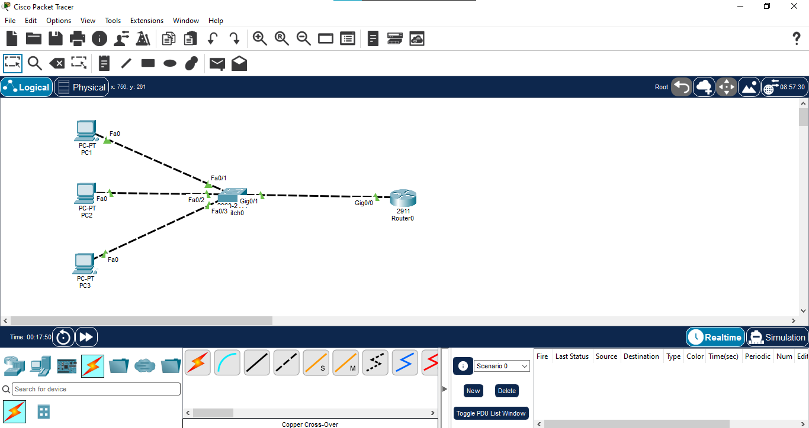
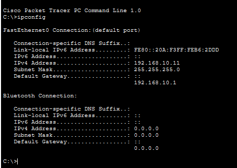
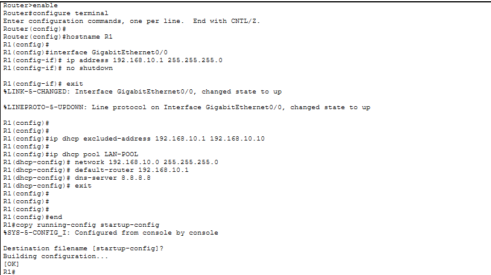
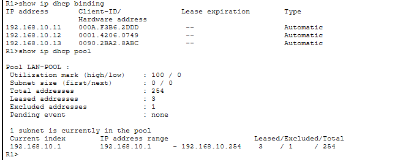
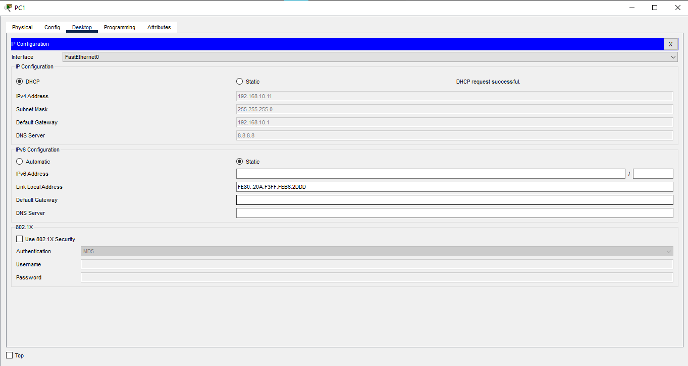
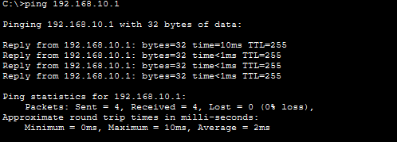

# 01 - DHCP

## 📖 Overview
This lab demonstrates how to configure a Cisco router as a **DHCP server** and automatically assign IPv4 addressing information to multiple client PCs.

R1 provides DHCP services for the `192.168.10.0/24` LAN. The router assigns IP addresses, subnet mask, default gateway, and DNS server information to the connected PCs.

## 🎯 Objectives
- Understand the purpose of DHCP.
- Configure a Cisco router as a DHCP server.
- Configure a DHCP address pool.
- Exclude reserved addresses from the DHCP pool.
- Automatically assign IPv4 addresses to PCs.
- Verify DHCP bindings and pool utilization.
- Test connectivity between DHCP clients and the default gateway.

## 🖥️ Devices Used
| Device | Model | Quantity | Role |
|---|---|---:|---|
| Router | Cisco 2911 | 1 | DHCP Server / Default Gateway |
| Switch | Cisco 2960 | 1 | LAN Connectivity |
| PC | Generic PC | 3 | DHCP Clients |

## 🌐 Network Topology


```text
       PC1
        |
       PC2 ─── SW1 ─── R1
        |
       PC3
```

R1 acts as the **DHCP server and default gateway** for the LAN.

## 🔌 Port Mapping
| Device | Interface | Connected To | Interface |
|---|---|---|---|
| R1 | Gi0/0 | SW1 | Gi0/1 |
| PC1 | Fa0 | SW1 | Fa0/1 |
| PC2 | Fa0 | SW1 | Fa0/2 |
| PC3 | Fa0 | SW1 | Fa0/3 |

## 🌐 IP Addressing Plan
| Device | Interface | IP Address | Subnet Mask | Gateway | Assignment |
|---|---|---|---|---|---|
| R1 | Gi0/0 | `192.168.10.1` | `255.255.255.0` | N/A | Static |
| PC1 | Fa0 | `192.168.10.x` | `255.255.255.0` | `192.168.10.1` | DHCP |
| PC2 | Fa0 | `192.168.10.x` | `255.255.255.0` | `192.168.10.1` | DHCP |
| PC3 | Fa0 | `192.168.10.x` | `255.255.255.0` | `192.168.10.1` | DHCP |

### DHCP Network
```text
Network:             192.168.10.0/24
Default Gateway:     192.168.10.1
Excluded Addresses:  192.168.10.1 - 192.168.10.10
DHCP Range:          192.168.10.11 - 192.168.10.254
DNS Server:          8.8.8.8
```

## ⚙️ R1 DHCP Configuration

### Interface Configuration
```text
enable
configure terminal
hostname R1

interface GigabitEthernet0/0
 ip address 192.168.10.1 255.255.255.0
 no shutdown
 exit
```

### DHCP Configuration
```text
ip dhcp excluded-address 192.168.10.1 192.168.10.10

ip dhcp pool LAN-POOL
 network 192.168.10.0 255.255.255.0
 default-router 192.168.10.1
 dns-server 8.8.8.8
 exit
```

### Save Configuration
```text
end
copy running-config startup-config
```

## 💻 PC Configuration
On each PC:

**Desktop → IP Configuration → DHCP**

The PC should automatically receive:
- IP address
- Subnet mask
- Default gateway
- DNS server

## 🔍 Verification

### Verify Interface Status
```text
show ip interface brief
```

R1 `GigabitEthernet0/0` should show an **up/up** status.

### Verify DHCP Bindings
```text
show ip dhcp binding
```

This displays the IP addresses leased to DHCP clients.

### Verify DHCP Pool
```text
show ip dhcp pool
```

This displays the configured pool, address range, and utilization.

### Check DHCP Conflicts
```text
show ip dhcp conflict
```

This can be used to identify detected IP address conflicts.

## 🧪 Connectivity Testing
From each PC, check the assigned address and then test the default gateway:

```text
ipconfig
ping 192.168.10.1
```

Test communication between DHCP clients using their dynamically assigned addresses:

```text
ping <PC2-IP>
ping <PC3-IP>
```

### Expected Result
All DHCP clients should receive valid addresses and successfully communicate with the default gateway and other PCs on the same LAN.

## 🔄 DHCP Address Allocation Flow
```text
PC1 / PC2 / PC3
       ↓
 DHCP Discover
       ↓
       R1
       ↓
 DHCP Offer
       ↓
 DHCP Request
       ↓
 DHCP ACK
       ↓
Client receives IP configuration
```

DHCP uses the **DORA process**:

```text
Discover → Offer → Request → Acknowledgement
```

## 📸 Screenshots

### 1. Network Topology


### 2. IP Addressing


### 3. DHCP Configuration


### 4. DHCP Binding


### 5. PC DHCP Address


### 6. Connectivity Test


## 🧠 Concepts Covered
- DHCP
- DHCP Server and Client
- DHCP Pool
- DHCP Excluded Addresses
- DHCP DORA Process
- IPv4 Address Assignment
- Default Gateway Assignment
- DNS Server Assignment
- DHCP Binding
- DHCP Pool Utilization
- LAN Connectivity

## 📋 Important Commands
```text
show ip interface brief
show ip dhcp binding
show ip dhcp pool
show ip dhcp conflict
show running-config
ping <destination-ip>
ipconfig
```

## 🎓 Learning Outcome
By completing this lab, I learned how a Cisco router can provide DHCP services to client devices. I configured a DHCP pool, reserved gateway and other addresses using excluded-addresses, enabled DHCP on PCs, verified active leases, and tested connectivity across the LAN.

## 💡 Interview Questions
1. **What is DHCP?** — Dynamic Host Configuration Protocol automatically provides network configuration to clients.
2. **What is the DHCP DORA process?** — Discover, Offer, Request, and Acknowledgement.
3. **Why do we use `ip dhcp excluded-address`?** — To prevent reserved addresses from being dynamically assigned.
4. **What is a DHCP pool?** — A configured group of addresses and network parameters available for DHCP clients.
5. **What command shows DHCP leases?** — `show ip dhcp binding`.
6. **What command displays DHCP pool information?** — `show ip dhcp pool`.
7. **Can a Cisco router act as a DHCP server?** — Yes.
8. **Why is the default gateway configured in the DHCP pool?** — So clients know where to send traffic destined for other networks.
9. **What happens if a client cannot reach the DHCP server?** — It may fail to obtain a valid DHCP lease and can use an APIPA address on supported client operating systems.
10. **What is the difference between DHCP and static addressing?** — DHCP assigns configuration dynamically, while static addressing is manually configured.

## 📁 Lab Files
- `01-topology.png`
- `02-ip-addressing.png`
- `03-dhcp-configuration.png`
- `04-dhcp-binding.png`
- `05-pc-dhcp-address.png`
- `06-connectivity-test.png`
- `01-DHCP.pkt`

## 💻 Software Used
- Cisco Packet Tracer
- Cisco IOS CLI

## 👨‍💻 Author
**Mohamed Ashik M**  
Aspiring Network Engineer | CCNA (200-301) Student  
GitHub: [mohamedashik-cpu](https://github.com/mohamedashik-cpu)
