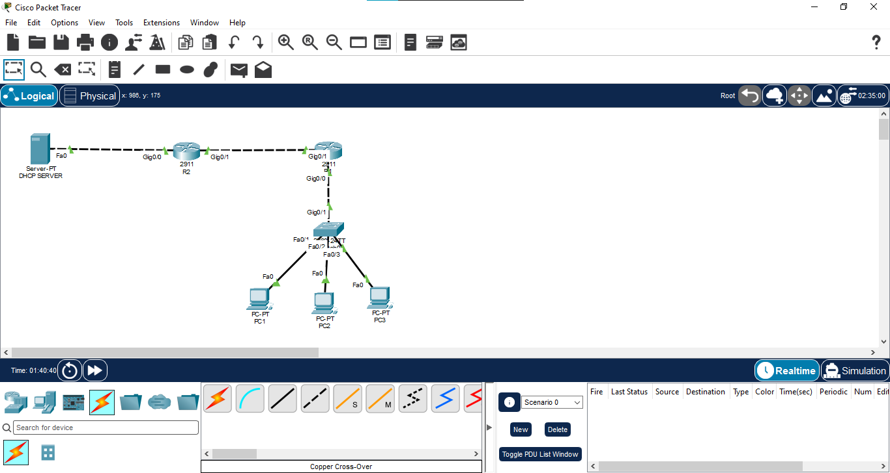
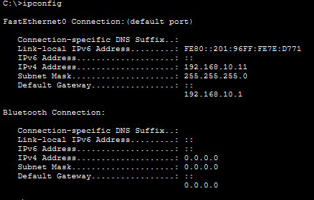
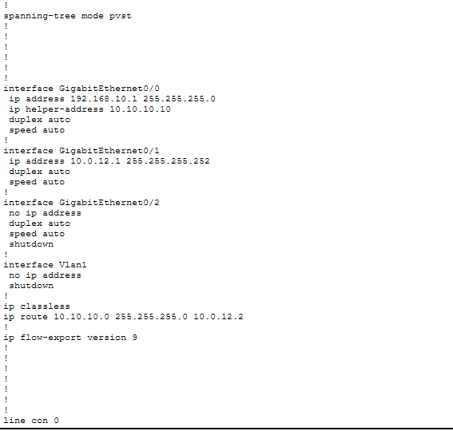
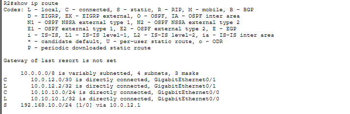
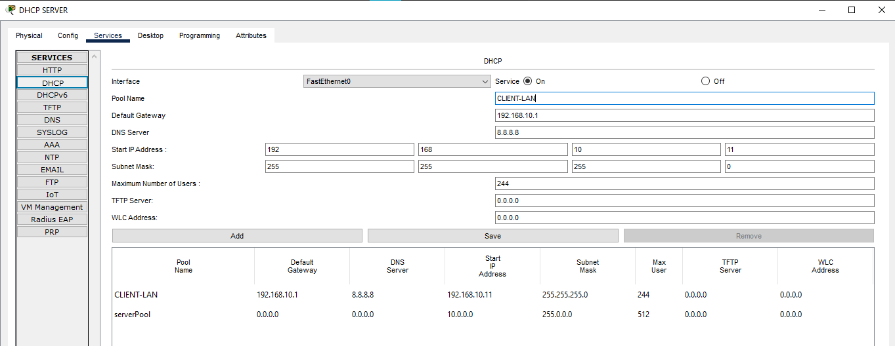
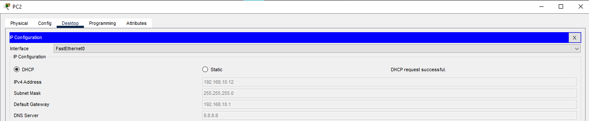
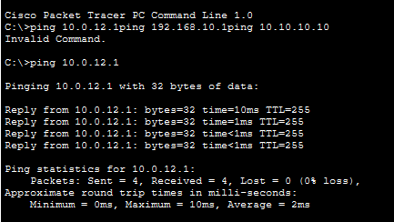

# 02 - DHCP Relay

## 📖 Overview
This lab demonstrates how to configure a Cisco router as a **DHCP Relay Agent** when the DHCP server is located on a different network from the DHCP clients.

R1 acts as the DHCP Relay Agent using `ip helper-address`. R2 provides Layer 3 connectivity between the client LAN and the DHCP server network, while the dedicated Server-PT device provides DHCP services.

## 🎯 Objectives
- Understand why DHCP relay is required across routed networks.
- Configure R1 as a DHCP Relay Agent.
- Configure `ip helper-address`.
- Configure routing between the client and server networks.
- Configure a dedicated Packet Tracer DHCP server.
- Verify DHCP address allocation to multiple clients.
- Test end-to-end connectivity.

## 🖥️ Devices Used
| Device | Model | Quantity | Role |
|---|---|---:|---|
| Router | Cisco 2911 | 2 | R1 = DHCP Relay, R2 = Routing |
| Switch | Cisco 2960 | 1 | Client LAN connectivity |
| PC | Generic PC | 3 | DHCP Clients |
| Server | Server-PT | 1 | DHCP Server |

## 🌐 Network Topology


```text
 PC1 ──┐
 PC2 ──┼── SW1 ─── R1 ───── R2 ─── DHCP Server
 PC3 ──┘          Relay
```

## 🔌 Port Mapping
| Device | Interface | Connected To | Interface |
|---|---|---|---|
| PC1 | Fa0 | SW1 | Fa0/1 |
| PC2 | Fa0 | SW1 | Fa0/2 |
| PC3 | Fa0 | SW1 | Fa0/3 |
| SW1 | Gi0/1 | R1 | Gi0/0 |
| R1 | Gi0/1 | R2 | Gi0/1 |
| R2 | Gi0/0 | DHCP Server | Fa0 |

## 🌐 IP Addressing Plan

### Client LAN
| Device | Interface | IP Address | Subnet Mask | Gateway | Assignment |
|---|---|---|---|---|---|
| R1 | Gi0/0 | `192.168.10.1` | `255.255.255.0` | N/A | Static |
| PC1 | Fa0 | `192.168.10.x` | `255.255.255.0` | `192.168.10.1` | DHCP |
| PC2 | Fa0 | `192.168.10.x` | `255.255.255.0` | `192.168.10.1` | DHCP |
| PC3 | Fa0 | `192.168.10.x` | `255.255.255.0` | `192.168.10.1` | DHCP |

### R1 ↔ R2 Transit
| Device | Interface | IP Address | Subnet Mask |
|---|---|---|---|
| R1 | Gi0/1 | `10.0.12.1` | `255.255.255.252` |
| R2 | Gi0/1 | `10.0.12.2` | `255.255.255.252` |

### DHCP Server Network
| Device | Interface | IP Address | Subnet Mask | Gateway |
|---|---|---|---|---|
| R2 | Gi0/0 | `10.10.10.1` | `255.255.255.0` | N/A |
| DHCP Server | Fa0 | `10.10.10.10` | `255.255.255.0` | `10.10.10.1` |

## ⚙️ R1 — DHCP Relay Configuration

```text
enable
configure terminal
hostname R1

interface GigabitEthernet0/0
 ip address 192.168.10.1 255.255.255.0
 ip helper-address 10.10.10.10
 no shutdown
 exit

interface GigabitEthernet0/1
 ip address 10.0.12.1 255.255.255.252
 no shutdown
 exit

ip route 10.10.10.0 255.255.255.0 10.0.12.2

end
copy running-config startup-config
```

### ⭐ Key Command
```text
ip helper-address 10.10.10.10
```

R1 receives the DHCP client broadcast and forwards the request toward the DHCP server.

## ⚙️ R2 — Routing Configuration

```text
enable
configure terminal
hostname R2

interface GigabitEthernet0/0
 ip address 10.10.10.1 255.255.255.0
 no shutdown
 exit

interface GigabitEthernet0/1
 ip address 10.0.12.2 255.255.255.252
 no shutdown
 exit

ip route 192.168.10.0 255.255.255.0 10.0.12.1

end
copy running-config startup-config
```

## 🖥️ DHCP Server Configuration

**Server → Desktop → IP Configuration**

```text
IP Address:      10.10.10.10
Subnet Mask:     255.255.255.0
Default Gateway: 10.10.10.1
DNS Server:      8.8.8.8
```

**Server → Services → DHCP → ON**

```text
Pool Name:       CLIENT-LAN
Default Gateway: 192.168.10.1
DNS Server:      8.8.8.8
Start IP:        192.168.10.11
Subnet Mask:     255.255.255.0
Maximum Users:   244
```

## 💻 PC Configuration
For PC1, PC2, and PC3:

**Desktop → IP Configuration → DHCP**

Each client should receive an address from the `192.168.10.0/24` DHCP scope.

## 🔍 Verification

### R1
```text
show ip interface brief
show ip route
show running-config
```

Verify that Gi0/0 and Gi0/1 are **up/up**, the route to `10.10.10.0/24` exists, and `ip helper-address 10.10.10.10` is configured on Gi0/0.

### R2
```text
show ip interface brief
show ip route
```

Verify the route to `192.168.10.0/24` through `10.0.12.1`.

## 🧪 Connectivity Testing

From R1:
```text
ping 10.0.12.2
ping 10.10.10.10
```

From R2:
```text
ping 10.0.12.1
ping 192.168.10.1
ping 10.10.10.10
```

From PC1:
```text
ping 192.168.10.1
ping 10.10.10.10
```

## 🔄 DHCP Relay Process
```text
DHCP Discover
     ↓
PC → SW1 → R1
     ↓
R1 (ip helper-address)
     ↓
R2
     ↓
DHCP Server
     ↓
DHCP response
     ↓
R2 → R1 → SW1 → PC
```

DHCP uses the **DORA** process:

```text
Discover → Offer → Request → Acknowledgement
```

## 📸 Screenshots

### 1. Network Topology


### 2. IP Addressing


### 3. R1 DHCP Relay Configuration


### 4. R2 Routing Configuration


### 5. DHCP Server Configuration


### 6. PC DHCP Address


### 7. Connectivity Test


## 🧠 Concepts Covered
- DHCP Relay Agent
- `ip helper-address`
- DHCP broadcast forwarding
- DHCP DORA process
- Static routing
- IPv4 addressing
- DHCP server scope
- Default gateway
- End-to-end connectivity

## 📋 Important Commands
```text
show ip interface brief
show ip route
show running-config
ping <destination-ip>
```

## 🎓 Learning Outcome
By completing this lab, I learned how DHCP clients can obtain IP configuration from a DHCP server located on another routed network. I configured R1 as a DHCP Relay Agent using `ip helper-address`, configured routing between R1 and R2, configured a dedicated DHCP server, and verified end-to-end DHCP and network connectivity.

## 💡 Interview Questions
1. Why is DHCP Relay required across routed networks?
2. What is the purpose of `ip helper-address`?
3. Where should `ip helper-address` be configured?
4. What is the DHCP DORA process?
5. What is the difference between a DHCP server and DHCP relay agent?
6. How would you troubleshoot a client that does not receive a DHCP address?

## 📁 Lab Files
- `01-topology.png`
- `02-ip-addressing.png`
- `03-r1-dhcp-relay.png`
- `04-r2-routing.png`
- `05-dhcp-server.png`
- `06-pc-dhcp-address.png`
- `07-connectivity-test.png`
- `02-DHCP-Relay.pkt`

## 💻 Software Used
- Cisco Packet Tracer
- Cisco IOS CLI

## 👨‍💻 Author
**Mohamed Ashik M**  
Aspiring Network Engineer | CCNA (200-301) Student  
GitHub: [mohamedashik-cpu](https://github.com/mohamedashik-cpu)

---

⭐ **Hands-on Cisco IP Services Lab — DHCP Relay**
