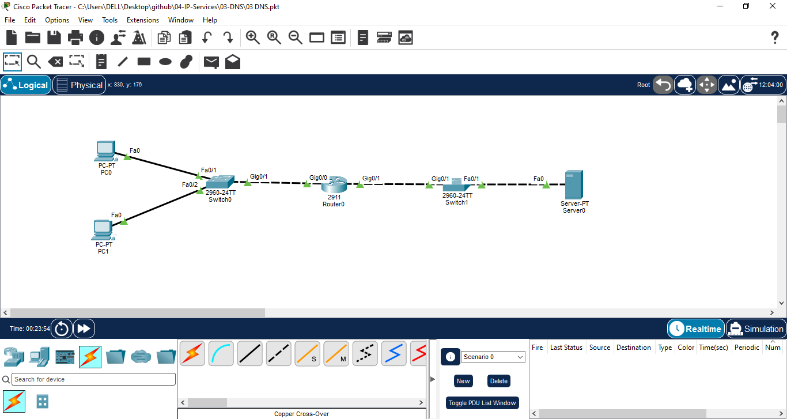
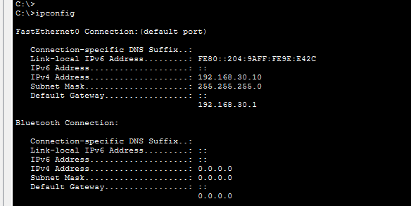
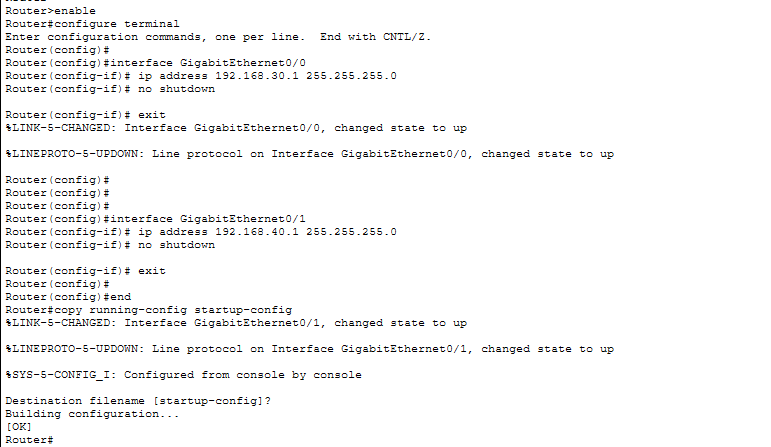
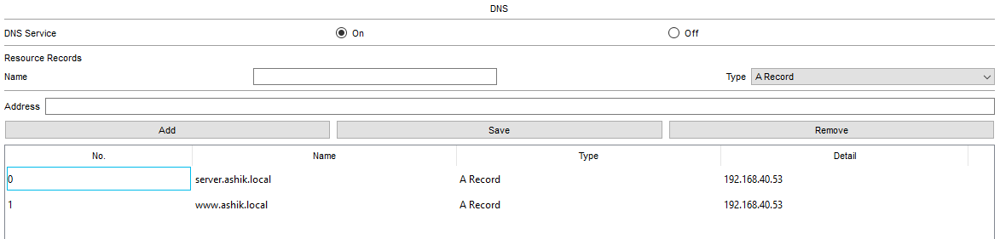
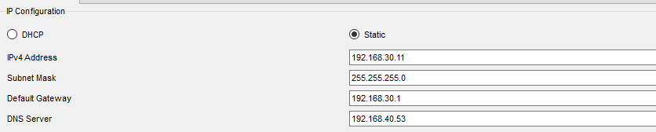
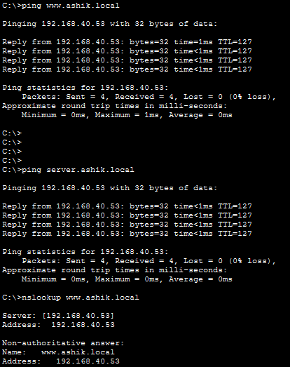
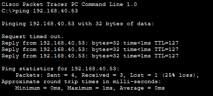

# 03 - DNS

## 📖 Overview
This lab demonstrates how to configure and verify a **DNS (Domain Name System) server** in Cisco Packet Tracer. DNS translates human-readable hostnames into IP addresses so users and network applications can access services by name instead of remembering numerical IP addresses.

In this topology, PC1 and PC2 are connected to SW1 and R1. R1 routes between the client LAN (`192.168.30.0/24`) and the DNS Server network (`192.168.40.0/24`). The DNS Server provides hostname resolution for the configured local domain records.

## 🎯 Objectives
- Understand the purpose of DNS.
- Configure IPv4 addressing on routers, PCs, and the DNS server.
- Configure a Cisco router for inter-network connectivity.
- Configure DNS service on Server-PT.
- Create DNS A records.
- Configure clients with the DNS server address.
- Test hostname resolution using `ping` and `nslookup`.
- Verify end-to-end connectivity.

## 🖥️ Devices Used
| Device | Model | Quantity | Role |
|---|---|---:|---|
| Router | Cisco 2911 | 1 | Inter-network routing |
| Switch | Cisco 2960 | 2 | LAN connectivity |
| PC | Generic PC | 2 | DNS clients |
| Server | Server-PT | 1 | DNS Server |

## 🌐 Network Topology


```text
 PC1 ──┐
       ├── SW1 ── R1 ── SW2 ── DNS Server
 PC2 ──┘
```

### Traffic Flow
```text
PC Client
   ↓
SW1
   ↓
R1
   ↓
SW2
   ↓
DNS Server
```

## 🔌 Port Mapping
| Device | Interface | Connected To | Interface |
|---|---|---|---|
| PC1 | Fa0 | SW1 | Fa0/1 |
| PC2 | Fa0 | SW1 | Fa0/2 |
| SW1 | Gi0/1 | R1 | Gi0/0 |
| R1 | Gi0/1 | SW2 | Gi0/1 |
| SW2 | Fa0/1 | DNS Server | Fa0 |

## 🌐 IP Addressing Plan

### Client LAN
| Device | Interface | IP Address | Subnet Mask | Default Gateway | DNS |
|---|---|---|---|---|---|
| R1 | Gi0/0 | `192.168.30.1` | `255.255.255.0` | N/A | N/A |
| PC1 | Fa0 | `192.168.30.10` | `255.255.255.0` | `192.168.30.1` | `192.168.40.53` |
| PC2 | Fa0 | `192.168.30.11` | `255.255.255.0` | `192.168.30.1` | `192.168.40.53` |

### DNS Server Network
| Device | Interface | IP Address | Subnet Mask | Default Gateway |
|---|---|---|---|---|
| R1 | Gi0/1 | `192.168.40.1` | `255.255.255.0` | N/A |
| DNS Server | Fa0 | `192.168.40.53` | `255.255.255.0` | `192.168.40.1` |

## ⚙️ R1 Configuration

```text
enable
configure terminal
hostname R1

interface GigabitEthernet0/0
 ip address 192.168.30.1 255.255.255.0
 no shutdown
 exit

interface GigabitEthernet0/1
 ip address 192.168.40.1 255.255.255.0
 no shutdown
 exit

end
copy running-config startup-config
```

## 🖥️ DNS Server IP Configuration

**Server → Desktop → IP Configuration**

```text
IP Address:      192.168.40.53
Subnet Mask:     255.255.255.0
Default Gateway: 192.168.40.1
DNS Server:      192.168.40.53
```

## 🌐 DNS Service Configuration

Go to:

**Server → Services → DNS → ON**

Configure the following DNS A records:

| DNS Name | Address |
|---|---|
| `www.ashik.local` | `192.168.40.53` |
| `server.ashik.local` | `192.168.40.53` |

These records allow clients to resolve the configured hostnames to the DNS server IP address.

## 💻 PC Configuration

### PC1
```text
IP Address:      192.168.30.10
Subnet Mask:     255.255.255.0
Default Gateway: 192.168.30.1
DNS Server:      192.168.40.53
```

### PC2
```text
IP Address:      192.168.30.11
Subnet Mask:     255.255.255.0
Default Gateway: 192.168.30.1
DNS Server:      192.168.40.53
```

## 🔍 Verification

### R1 Interface Verification
```text
show ip interface brief
```

Expected interfaces:
```text
Gi0/0    192.168.30.1    up    up
Gi0/1    192.168.40.1    up    up
```

### Gateway Connectivity
From PC1:
```text
ping 192.168.30.1
```

### DNS Server Connectivity
From PC1:
```text
ping 192.168.40.53
```

## 🧪 DNS Resolution Testing

### Ping by Hostname
From PC1:
```text
ping www.ashik.local
```

Expected result:
```text
Pinging www.ashik.local [192.168.40.53]
```

Also test:
```text
ping server.ashik.local
```

### NSLookup
```text
nslookup www.ashik.local
```

Expected result should identify the DNS server as `192.168.40.53` and resolve `www.ashik.local` to `192.168.40.53`.

## 🔄 DNS Resolution Process

```text
PC requests www.ashik.local
            ↓
PC sends DNS query to 192.168.40.53
            ↓
DNS Server checks its records
            ↓
www.ashik.local → 192.168.40.53
            ↓
DNS response returned to PC
            ↓
PC can communicate using the resolved IP address
```

## 📸 Screenshots

### 1. Network Topology


### 2. IP Addressing


### 3. R1 Configuration


### 4. DNS Server Configuration


### 5. PC IP Configuration


### 6. DNS Resolution


### 7. Connectivity Test


## 🧠 Concepts Covered
- DNS (Domain Name System)
- DNS A records
- Hostname resolution
- `nslookup`
- DNS client configuration
- IPv4 addressing
- Default gateway
- Inter-network routing
- End-to-end connectivity

## 📋 Important Commands
```text
show ip interface brief
ping <destination-ip>
ping <hostname>
nslookup <hostname>
```

## 🛠️ Troubleshooting Checklist
If hostname resolution fails, check:

1. DNS service is **ON** on the Server-PT device.
2. The DNS record exists and points to the correct IP address.
3. PC DNS Server is configured as `192.168.40.53`.
4. PC default gateway is `192.168.30.1`.
5. R1 interfaces are **up/up**.
6. PC can ping `192.168.40.53` before testing DNS resolution.

## 🎓 Learning Outcome
By completing this lab, I learned how DNS maps hostnames to IPv4 addresses. I configured a Packet Tracer DNS server, created DNS A records, configured client DNS settings, verified inter-network connectivity, and tested hostname resolution using `ping` and `nslookup`.

## 💡 Interview Questions
1. **What is DNS?** — DNS translates domain or hostnames into IP addresses.
2. **Why is DNS required?** — It allows users and applications to use names instead of remembering IP addresses.
3. **What is an A record?** — An A record maps a hostname to an IPv4 address.
4. **What is `nslookup` used for?** — It queries DNS and displays name-resolution information.
5. **What happens when you ping a hostname?** — The client first attempts to resolve the hostname to an IP address using DNS, then sends ICMP traffic to the resolved address.
6. **What should you check if `ping 192.168.40.53` works but `ping www.ashik.local` fails?** — Check the PC DNS server setting, DNS service status, and DNS record.
7. **What is the role of the default gateway?** — It provides the next-hop path for traffic leaving the local subnet.

## 📁 Lab Files
- `01-topology.png`
- `02-ip-addressing.png`
- `03-r1-configuration.png`
- `04-dns-server-configuration.png`
- `05-pc-ip-configuration.png`
- `06-dns-resolution.png`
- `07-connectivity-test.png`
- `03-DNS.pkt`
- `README.md`

## 💻 Software Used
- Cisco Packet Tracer
- Cisco IOS CLI

## 👨‍💻 Author
**Mohamed Ashik M**  
Aspiring Network Engineer | CCNA (200-301) Student  
GitHub: [mohamedashik-cpu](https://github.com/mohamedashik-cpu)

---

⭐ **Hands-on Cisco IP Services Lab — DNS**
