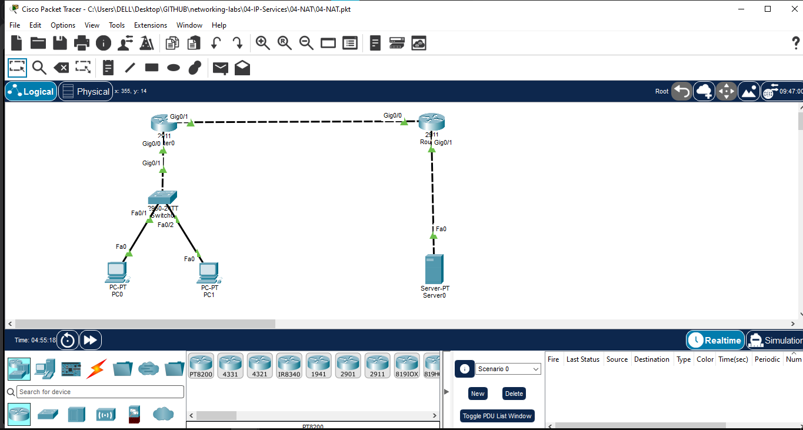
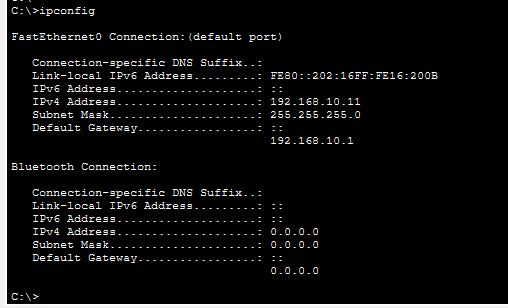
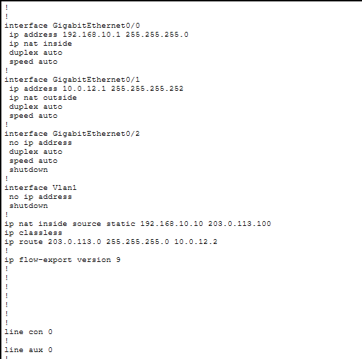
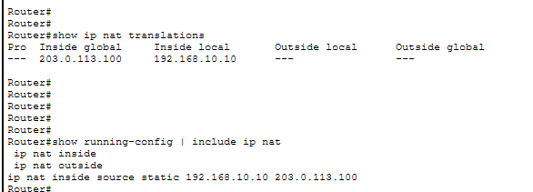
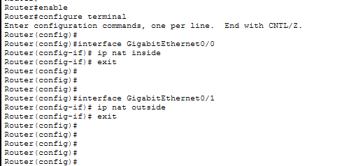
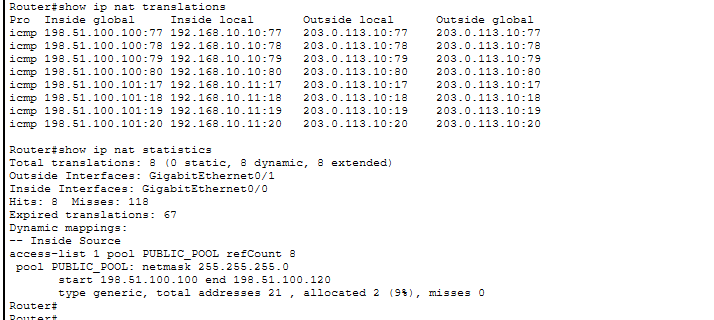
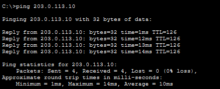

# Network Address Translation (NAT)

## Objective

Configure and verify **Static NAT** and **Dynamic NAT** using Cisco Packet Tracer.

The lab demonstrates how private inside addresses are translated into public inside-global addresses before accessing an external network.

## Topology

```text
PC0 (192.168.10.10) ─┐
                     │
PC1 (192.168.10.11) ─┴─ Switch ── R1 ── R2 ── Server
                              │      │
                         NAT Inside  NAT Outside
```

## IP Addressing

| Device | Interface | IP Address | Subnet Mask |
|---|---|---|---|
| PC0 | FastEthernet0 | 192.168.10.10 | 255.255.255.0 |
| PC1 | FastEthernet0 | 192.168.10.11 | 255.255.255.0 |
| R1 | GigabitEthernet0/0 | 192.168.10.1 | 255.255.255.0 |
| R1 | GigabitEthernet0/1 | 10.0.12.1 | 255.255.255.252 |
| R2 | GigabitEthernet0/0 | 10.0.12.2 | 255.255.255.252 |
| R2 | GigabitEthernet0/1 | 203.0.113.1 | 255.255.255.0 |
| Server0 | FastEthernet0 | 203.0.113.10 | 255.255.255.0 |

## NAT Configuration

### R1 – NAT Interfaces

```text
interface GigabitEthernet0/0
 ip nat inside

interface GigabitEthernet0/1
 ip nat outside
```

### Static NAT

Static NAT maps one inside-local address to one fixed inside-global address.

```text
ip nat inside source static 192.168.10.10 203.0.113.100
```

### Dynamic NAT

The inside network is permitted using an ACL:

```text
access-list 1 permit 192.168.10.0 0.0.0.255
```

A public NAT pool is configured separately from the server subnet:

```text
ip nat pool PUBLIC_POOL 198.51.100.100 198.51.100.120 netmask 255.255.255.0
ip nat inside source list 1 pool PUBLIC_POOL
```

R2 has a return route for the NAT pool:

```text
ip route 198.51.100.0 255.255.255.0 10.0.12.1
```

## Verification Commands

### Check NAT translations

```text
show ip nat translations
```

### Check NAT statistics

```text
show ip nat statistics
```

### Check routing

```text
show ip route
```

### Connectivity Test

From PC0/PC1:

```text
ping 203.0.113.10
```

Successful replies confirm end-to-end connectivity through NAT.

## Verification Result

- Static NAT mapping verified ✅
- Dynamic NAT translations verified ✅
- NAT pool allocation verified ✅
- PC-to-server connectivity verified ✅
- R1 → Server connectivity verified ✅
- R2 routing for the NAT pool verified ✅

## Screenshots

### 1. Topology



### 2. IP Addressing



### 3. Static NAT Configuration



### 4. Static NAT Verification



### 5. Dynamic NAT Configuration



### 6. Dynamic NAT Verification



### 7. Connectivity Test



## Packet Tracer File

[Download / Open 04-NAT.pkt](04-NAT.pkt)

## Key Learning

- NAT translates private IP addresses into public IP addresses.
- **Inside Local** is the original private address of the internal host.
- **Inside Global** is the translated public address seen outside the NAT router.
- Static NAT provides a fixed one-to-one mapping.
- Dynamic NAT assigns addresses from a configured public pool.
- NAT translations can be verified using `show ip nat translations`.
- NAT statistics can be checked using `show ip nat statistics`.

## Status

✅ **Completed – Static NAT & Dynamic NAT**
