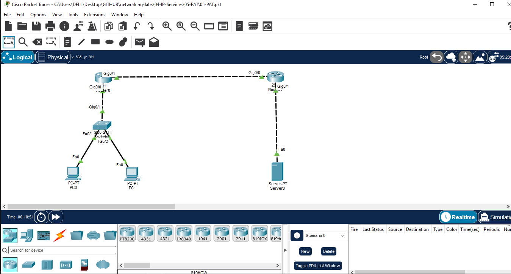
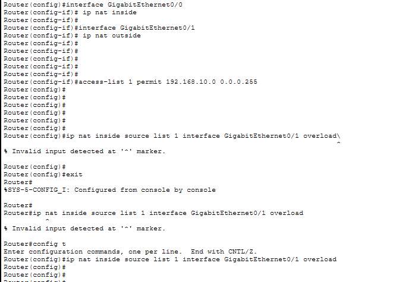
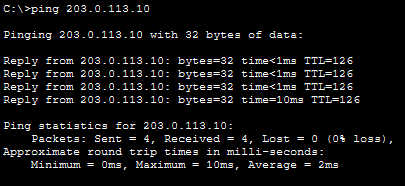
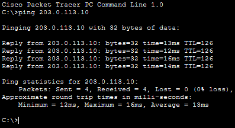
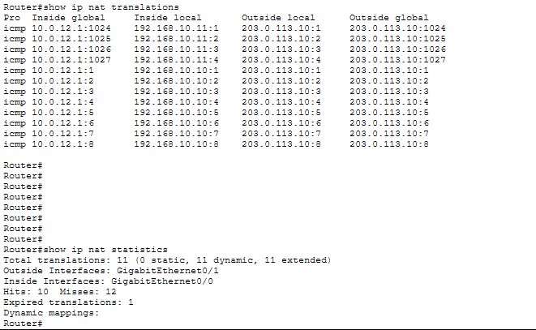

# Port Address Translation (PAT)

## Objective

Configure Port Address Translation (PAT), also known as NAT Overload, to allow multiple inside hosts to access an external network using a single public IP address.

## Topology



## IP Addressing

| Device | Interface | IP Address | Role |
|---|---|---|---|
| PC0 | NIC | 192.168.10.10/24 | Inside Host |
| PC1 | NIC | 192.168.10.11/24 | Inside Host |
| R1 | Gi0/0 | 192.168.10.1/24 | NAT Inside |
| R1 | Gi0/1 | 10.0.12.1/30 | NAT Outside |
| R2 | Gi0/0 | 10.0.12.2/30 | External Router |
| R2 | Gi0/1 | 203.0.113.1/24 | External Network |
| Server | NIC | 203.0.113.10/24 | External Server |

## PAT Configuration

### R1

```cisco
enable
configure terminal

interface GigabitEthernet0/0
 ip nat inside

interface GigabitEthernet0/1
 ip nat outside

access-list 1 permit 192.168.10.0 0.0.0.255

ip nat inside source list 1 interface GigabitEthernet0/1 overload

end
```



## R2 Return Route

R2 requires a route back to the inside network:

```cisco
ip route 192.168.10.0 255.255.255.0 10.0.12.1
```

## Connectivity Testing

PC0 and PC1 were tested against the external server:

```
PC0> ping 203.0.113.10
PC1> ping 203.0.113.10
```

Both PCs successfully reached the external server.





## PAT Verification

Use the following commands on R1:

```cisco
show ip nat translations
show ip nat statistics
```

Expected behavior:

- PC0 and PC1 use the same outside/public IP address of R1: `10.0.12.1`
- Different source port numbers are used to keep the translations unique.
- Multiple inside local addresses are translated through one inside global address.



## Verification Commands

```cisco
show running-config | include ip nat
show access-lists
show ip nat translations
show ip nat statistics
```

## Concepts Covered

- Port Address Translation (PAT)
- NAT Overload
- Inside Local Address
- Inside Global Address
- Port Translation
- NAT Inside / NAT Outside
- Access Control List for NAT
- NAT Translation Table
- PAT Verification

## Traffic Flow

```
PC0 (192.168.10.10) ─┐
                     ├──> R1 PAT (10.0.12.1) ──> R2 ──> Server
PC1 (192.168.10.11) ─┘
```

Both internal hosts share R1's outside interface IP while PAT uses different port numbers to distinguish the sessions.

## Files

- [Packet Tracer Lab](05-PAT.pkt)
- Topology screenshot
- PAT configuration screenshot
- Connectivity test screenshots
- PAT verification screenshot

## Learning Outcome

After completing this lab, I understood how PAT allows multiple private IP addresses to access an external network through a single public IP address using port numbers.

## Software Used

- Cisco Packet Tracer

## Status

✅ Completed
