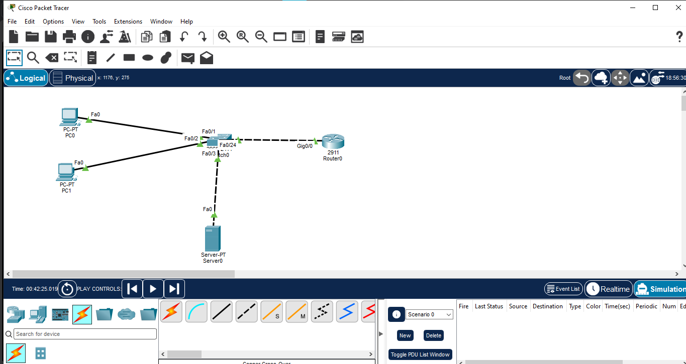
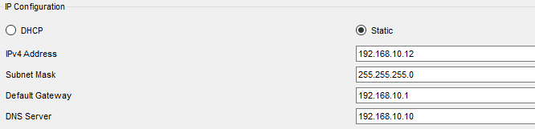
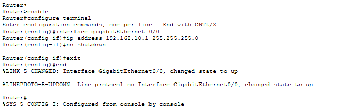
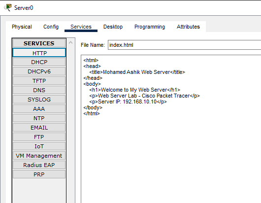
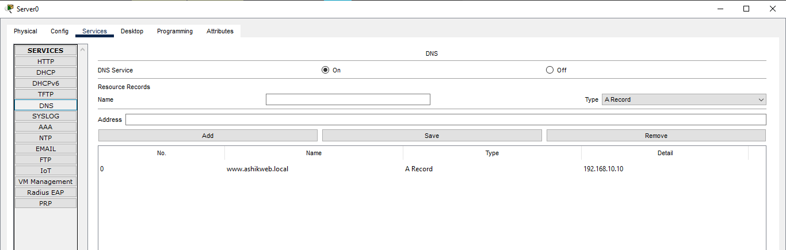
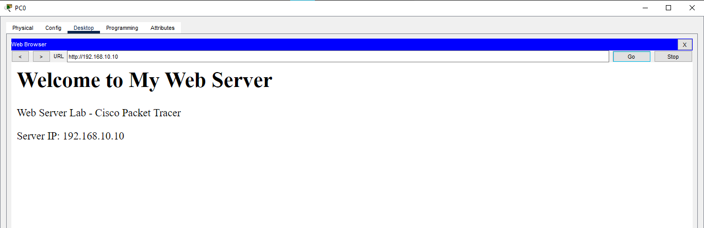
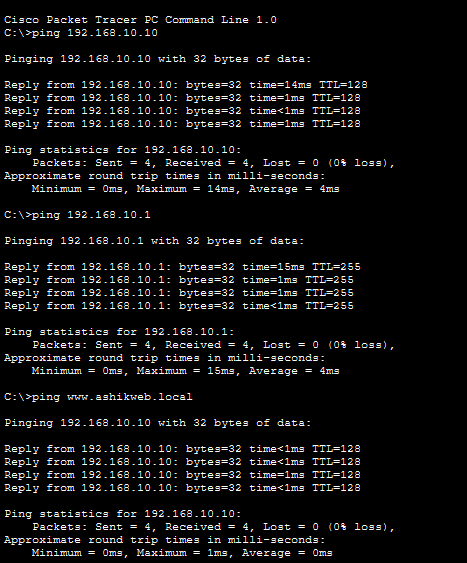
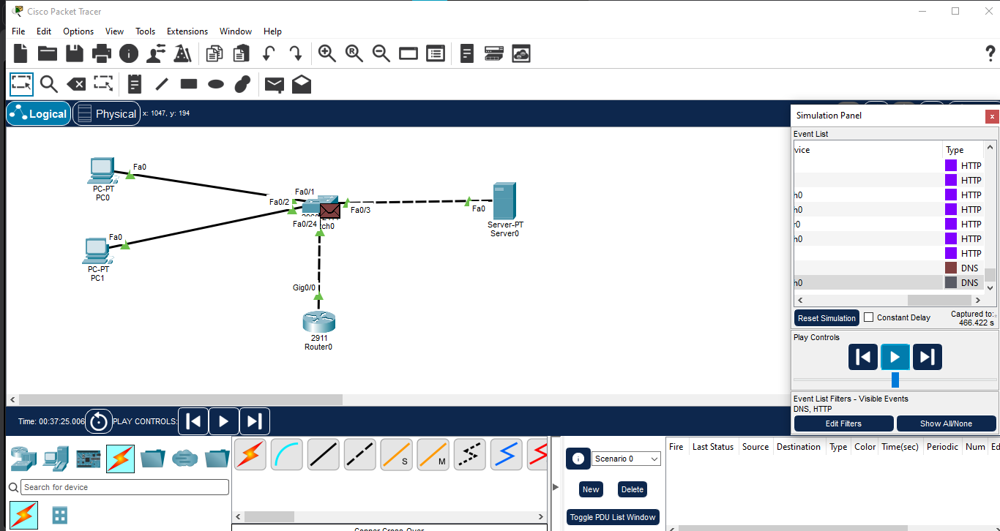

# Web Server (IIS)

## Overview

This lab demonstrates a basic web server environment using Cisco Packet Tracer. It combines HTTP web hosting with DNS name resolution so clients can access the web server using both its IP address and a DNS hostname.

> **Note:** Cisco Packet Tracer simulates web-server functionality through its Server device. It does not run a real Microsoft IIS installation.

## Objective

- Build a basic client-server network using a router and switch.
- Configure a static IP address for the web server.
- Enable HTTP/HTTPS services on the Packet Tracer Server.
- Create and host a basic web page.
- Configure DNS name resolution for the web server.
- Verify web access using an IP address and DNS hostname.
- Observe DNS and HTTP traffic using Simulation Mode.

## Network Topology

## Devices Used

| Device | Quantity | Purpose |
|---|---:|---|
| Cisco Router 2911 | 1 | Default gateway |
| Cisco Switch 2960 | 1 | LAN connectivity |
| Server | 1 | DNS and Web Server |
| PC | 2 | Client testing |

## Port Mapping

| Device | Interface | Connected To |
|---|---|---|
| PC0 | FastEthernet0 | SW1 Fa0/1 |
| PC1 | FastEthernet0 | SW1 Fa0/2 |
| Server | FastEthernet0 | SW1 Fa0/3 |
| R1 | GigabitEthernet0/0 | SW1 Fa0/24 |

## IP Addressing

Network: `192.168.10.0/24`

| Device | Interface | IP Address | Subnet Mask | Default Gateway | DNS |
|---|---|---|---|---|---|
| R1 | G0/0 | 192.168.10.1 | 255.255.255.0 | — | — |
| Server | Fa0 | 192.168.10.10 | 255.255.255.0 | 192.168.10.1 | 192.168.10.10 |
| PC0 | Fa0 | 192.168.10.11 | 255.255.255.0 | 192.168.10.1 | 192.168.10.10 |
| PC1 | Fa0 | 192.168.10.12 | 255.255.255.0 | 192.168.10.1 | 192.168.10.10 |

## Network Configuration

### Router Configuration

    enable
    configure terminal
    interface gigabitEthernet 0/0
    ip address 192.168.10.1 255.255.255.0
    no shutdown
    exit
    end

### Router Verification

    show ip interface brief

## Web Server Configuration

The Server device is configured with:

- IP Address: `192.168.10.10`
- Subnet Mask: `255.255.255.0`
- Default Gateway: `192.168.10.1`
- DNS Server: `192.168.10.10`

### HTTP Service

HTTP is enabled on the Packet Tracer Server.

Direct access:

`http://192.168.10.10`

### HTTPS Service

HTTPS may be enabled on the Packet Tracer Server for service-level testing.

## DNS Configuration

DNS service is enabled on the Server.

| Hostname | Record Type | Address |
|---|---|---|
| `www.ashikweb.local` | A | `192.168.10.10` |

## Web Page

A custom HTML page is hosted on the Packet Tracer Server.

## Verification

### Basic Connectivity

    ping 192.168.10.1
    ping 192.168.10.10

### DNS Resolution

    ping www.ashikweb.local

Expected destination: `192.168.10.10`

### Browser Testing

Test from the client PCs:

`http://192.168.10.10`

and:

`http://www.ashikweb.local`

A successful test displays the configured web page.

### Connectivity Testing

Client connectivity and DNS resolution were verified from the Packet Tracer PCs.

### Switch Verification

    show interfaces status
    show mac address-table

### Simulation Mode

The DNS and HTTP communication can be observed in Simulation Mode:

1. DNS Query
2. DNS Response
3. HTTP Request
4. HTTP Response

## Traffic Flow

Client → DNS Query → DNS Response → HTTP Request → HTTP Response → Web Page

## Important Commands

| Purpose | Command |
|---|---|
| Check router interfaces | `show ip interface brief` |
| Check running configuration | `show running-config` |
| Check switch ports | `show interfaces status` |
| Check learned MAC addresses | `show mac address-table` |
| Test gateway connectivity | `ping 192.168.10.1` |
| Test server connectivity | `ping 192.168.10.10` |
| Test DNS resolution | `ping www.ashikweb.local` |

## Files

- [Packet Tracer Lab](06-Web-Server-IIS.pkt)
- Network topology screenshot
- IP addressing screenshot
- Router configuration screenshot
- HTTP server configuration screenshot
- DNS configuration screenshot
- Web browser test screenshot
- Connectivity test screenshot
- DNS and HTTP traffic screenshot

## Concepts Learned

- IPv4 addressing
- Default gateway
- Switch-based LAN connectivity
- HTTP web service
- DNS name resolution
- DNS A records
- Browser-based web testing
- Packet Tracer Simulation Mode
- Network verification commands

## Learning Outcome

After completing this lab, I can configure a basic web-server environment in Cisco Packet Tracer, provide DNS-based hostname resolution, verify client connectivity, and trace DNS-to-HTTP communication.

## Software Used

- Cisco Packet Tracer

## Status

✅ Completed

## Author

**Mohamed Ashik**

Cisco Networking Portfolio  
GitHub: `mohamedashik-cpu/networking-labs`
