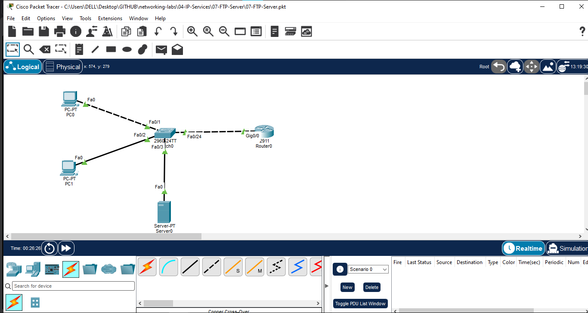
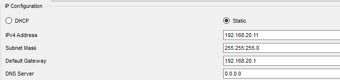
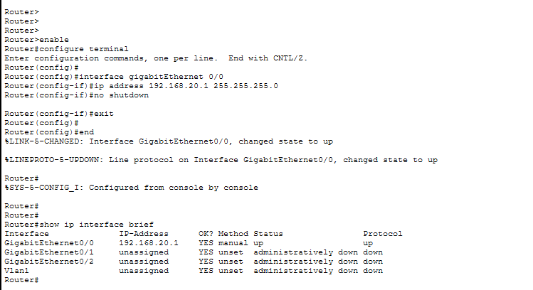
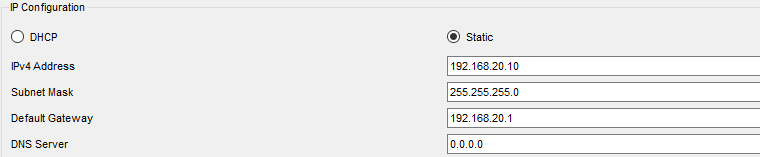
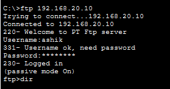
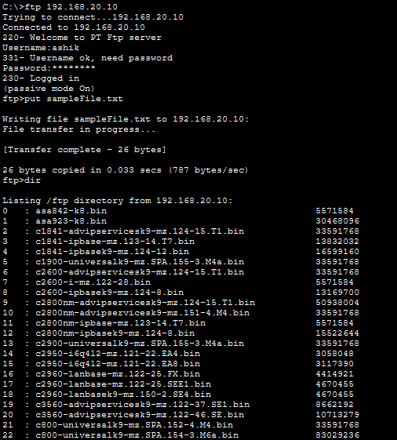
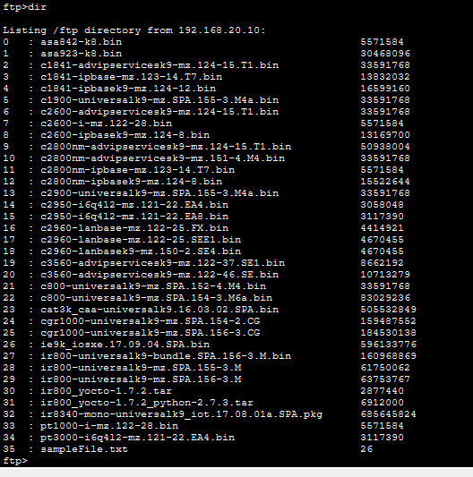

# FTP Server Lab

## Overview

This lab demonstrates the configuration and verification of an **FTP (File Transfer Protocol) server** in Cisco Packet Tracer. The lab covers FTP service configuration, user authentication, directory listing, file upload, and client-side verification.

## Objective

- Configure an FTP server in Cisco Packet Tracer.
- Configure IP connectivity between the router, switch, FTP server, and client PCs.
- Configure an FTP user account with read/write permissions.
- Verify FTP authentication and directory access.
- Perform a file upload from a client PC to the FTP server.
- Verify the uploaded file from the FTP directory.

## Network Topology



## Devices Used

- Cisco 2911 Router
- Cisco 2960 Switch
- 1 FTP Server
- 2 PCs

## Port Mapping

| Device | Interface | Connected To |
|---|---|---|
| PC0 | FastEthernet0 | SW1 Fa0/1 |
| PC1 | FastEthernet0 | SW1 Fa0/2 |
| FTP Server | FastEthernet0 | SW1 Fa0/3 |
| R1 | GigabitEthernet0/0 | SW1 Fa0/24 |

## IP Addressing

| Device | Interface | IP Address | Subnet Mask | Default Gateway |
|---|---|---|---|---|
| R1 | G0/0 | 192.168.20.1 | 255.255.255.0 | — |
| FTP Server | Fa0 | 192.168.20.10 | 255.255.255.0 | 192.168.20.1 |
| PC0 | Fa0 | 192.168.20.11 | 255.255.255.0 | 192.168.20.1 |
| PC1 | Fa0 | 192.168.20.12 | 255.255.255.0 | 192.168.20.1 |



## Router Configuration

R1 was configured with the gateway IP address:

```text
enable
configure terminal
interface gigabitEthernet 0/0
ip address 192.168.20.1 255.255.255.0
no shutdown
exit
end
```



## FTP Server Configuration

The FTP service was enabled on the Server device.

FTP user configured for the lab:

- Username: `ashik`
- Password: `cisco123`
- Permissions: Read and Write



## FTP User Authentication

The FTP client successfully connected to the server and authenticated using the configured user account.



## FTP Directory Listing

After authentication, the FTP directory was successfully accessed using the `dir` command.

The directory contained the available Packet Tracer image files and the uploaded test file.

## File Upload Test

A test file named `sampleFile.txt` was uploaded from the client PC to the FTP server.

Transfer verification:

```text
File transfer in progress...
[Transfer complete - 26 bytes]
26 bytes copied
```

The uploaded `sampleFile.txt` was then visible in the FTP server directory.



## Client Verification

The FTP service was verified from the client side to confirm connectivity, authentication, and access to the FTP directory.



## Traffic Flow

```text
PC0 / PC1
    |
    v
SW1
    |
    v
R1
    |
    v
FTP Server
192.168.20.10
```

## Important Commands

### Connectivity Verification

```text
ping 192.168.20.10
```

### FTP Connection

```text
ftp 192.168.20.10
```

### Directory Listing

```text
dir
```

### File Upload

```text
put sampleFile.txt
```

### Exit FTP Session

```text
quit
```

## Files

- [Packet Tracer Lab](07-FTP-Server.pkt)
- README.md

## Concepts Learned

- FTP service configuration
- FTP client-server communication
- User authentication
- Read/write permissions
- FTP directory listing
- File upload using FTP
- Basic client-side FTP verification
- Network connectivity testing

## Learning Outcome

This lab provided practical experience in configuring and verifying an FTP server in Cisco Packet Tracer. It demonstrated how clients authenticate to an FTP service and transfer files across a network.

## Software Used

- Cisco Packet Tracer

## Status

✅ Completed

## Author

**Mohamed Ashik**
