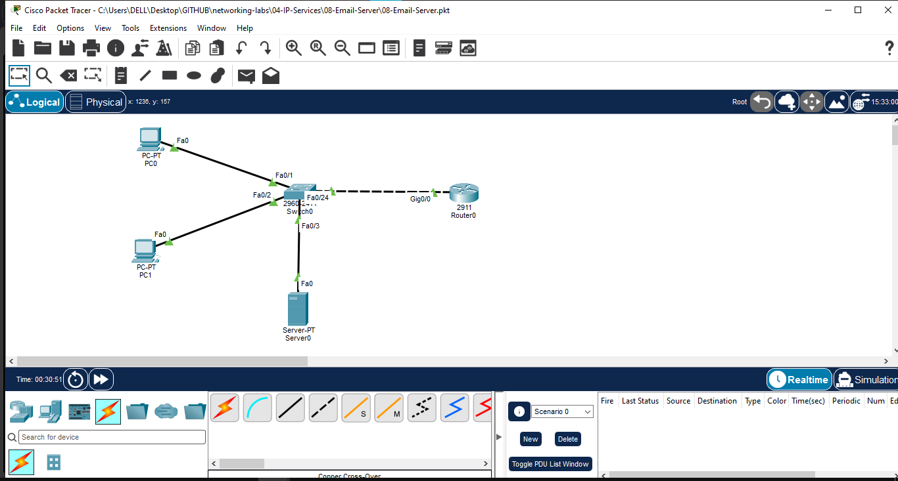
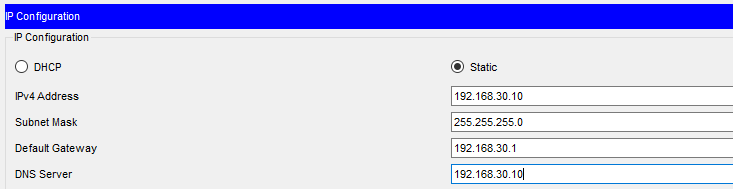
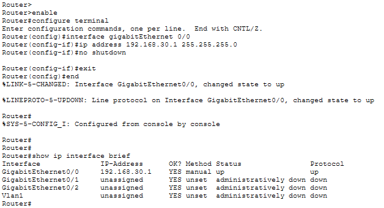
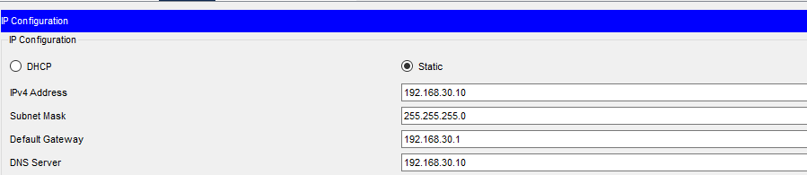
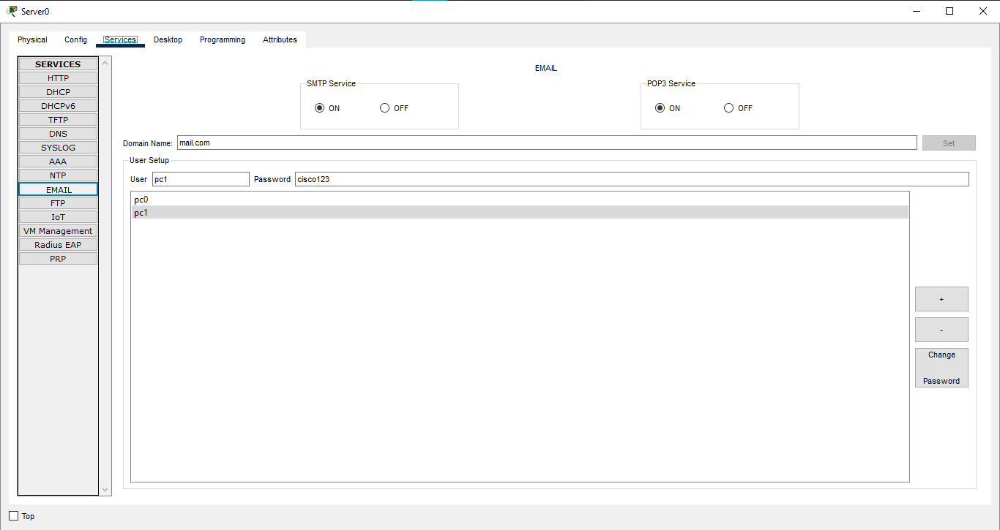
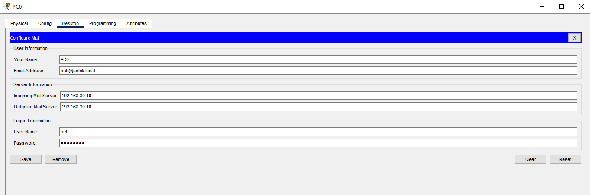
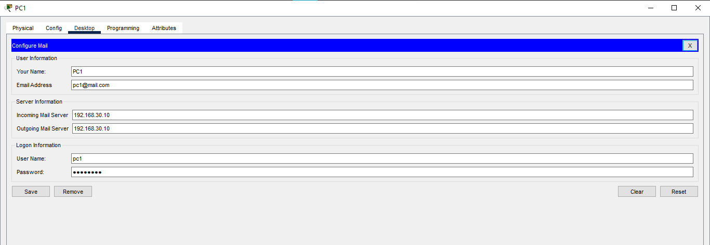
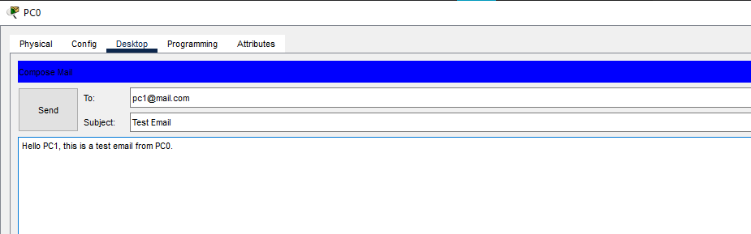
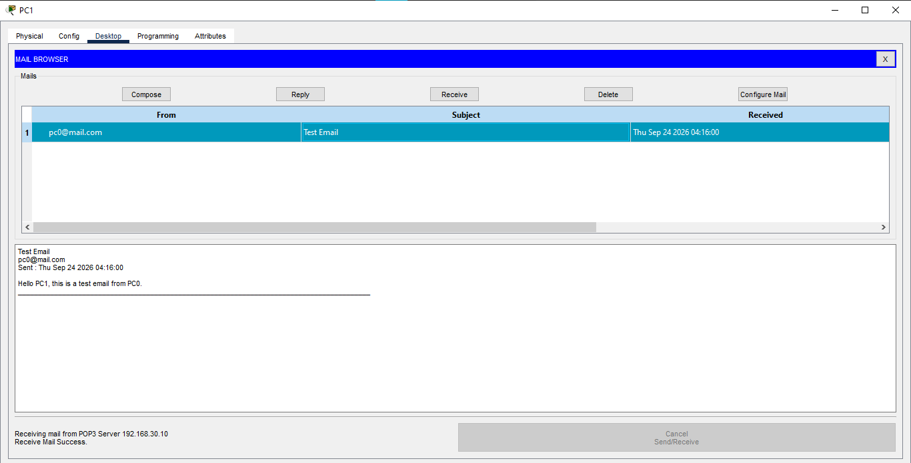

# Email Server – SMTP & POP3 Lab

## Overview

This Packet Tracer lab demonstrates how to configure an email server and enable client-to-client email communication using **SMTP** and **POP3**.

The lab includes server-side email configuration, user account creation, PC email client configuration, and end-to-end email testing.

## Objectives

- Configure an Email Server in Cisco Packet Tracer
- Enable SMTP and POP3 services
- Create email user accounts
- Configure email clients on PC0 and PC1
- Send an email from PC0 to PC1
- Verify successful email delivery

## Network Topology



## Devices Used

| Device | Quantity |
|---|---:|
| Cisco 2911 Router | 1 |
| Cisco 2960 Switch | 1 |
| Server | 1 |
| PCs | 2 |

## Port Mapping

| Device | Port | Connected To |
|---|---|---|
| R1 | GigabitEthernet0/0 | SW1 Fa0/24 |
| PC0 | FastEthernet0 | SW1 Fa0/1 |
| PC1 | FastEthernet0 | SW1 Fa0/2 |
| Email-Server | FastEthernet0 | SW1 Fa0/3 |

## IP Addressing

| Device | IP Address | Subnet Mask | Default Gateway |
|---|---|---|---|
| R1 G0/0 | 192.168.30.1 | 255.255.255.0 | — |
| Email-Server | 192.168.30.10 | 255.255.255.0 | 192.168.30.1 |
| PC0 | 192.168.30.11 | 255.255.255.0 | 192.168.30.1 |
| PC1 | 192.168.30.12 | 255.255.255.0 | 192.168.30.1 |



## Router Configuration

R1 GigabitEthernet0/0 was configured as the default gateway for the LAN.

```text
enable
configure terminal
interface gigabitEthernet 0/0
ip address 192.168.30.1 255.255.255.0
no shutdown
exit
end
```



## Email Server Configuration

The Email Server was configured with:

- IP Address: `192.168.30.10/24`
- Default Gateway: `192.168.30.1`
- SMTP: Enabled
- POP3: Enabled
- Email Domain: `mail.com`



## Email User Accounts

Two email accounts were created:

| Username | Email Address |
|---|---|
| pc0 | pc0@mail.com |
| pc1 | pc1@mail.com |



## PC Email Client Configuration

### PC0

PC0 was configured with:

- Email Address: `pc0@mail.com`
- Username: `pc0`
- Incoming Mail Server: `192.168.30.10`
- Outgoing Mail Server: `192.168.30.10`



### PC1

PC1 was configured with:

- Email Address: `pc1@mail.com`
- Username: `pc1`
- Incoming Mail Server: `192.168.30.10`
- Outgoing Mail Server: `192.168.30.10`



## Email Testing

### PC0 → PC1

A test email was sent from:

`pc0@mail.com`

to:

`pc1@mail.com`

Subject:

`Test Email`



### Email Receive Verification

The email was successfully received on PC1.



## Traffic Flow

```text
PC0
 ↓
SW1
 ↓
Email-Server
 ↓
SMTP
 ↓
Email delivery
 ↓
POP3
 ↓
PC1
```

## Concepts Learned

- SMTP for outgoing email delivery
- POP3 for retrieving email
- Email server configuration
- Email domain configuration
- User account creation
- Email client configuration
- Client-to-server communication
- End-to-end email testing

## Software Used

- Cisco Packet Tracer

## Lab Files

- `08-Email-Server.pkt`
- Configuration and verification screenshots

## Status

✅ Completed and Verified

## Author

**Mohamed Ashik**

Networking Labs Portfolio  
GitHub: `mohamedashik-cpu/networking-labs`
