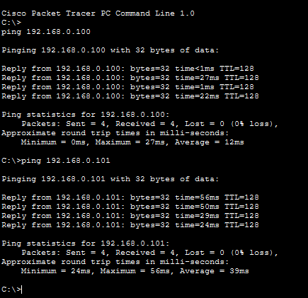
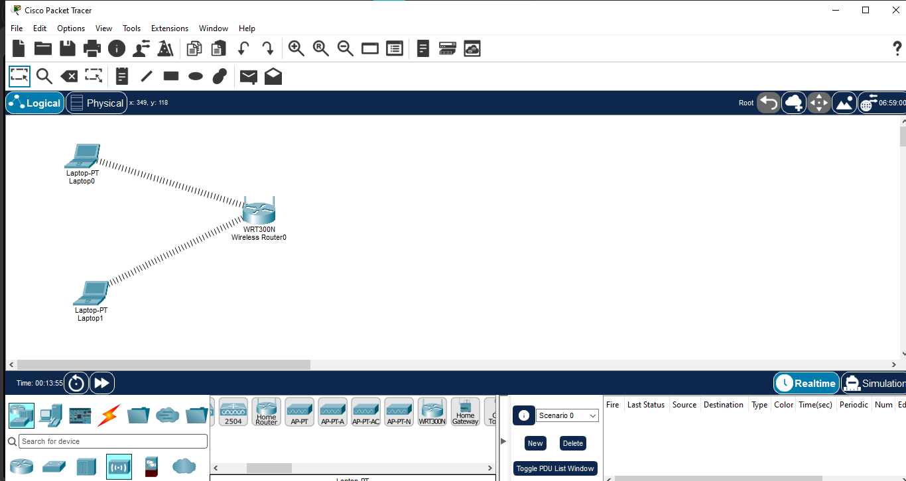
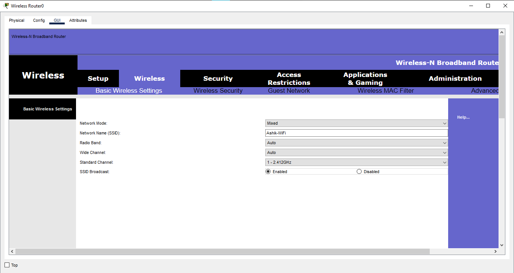
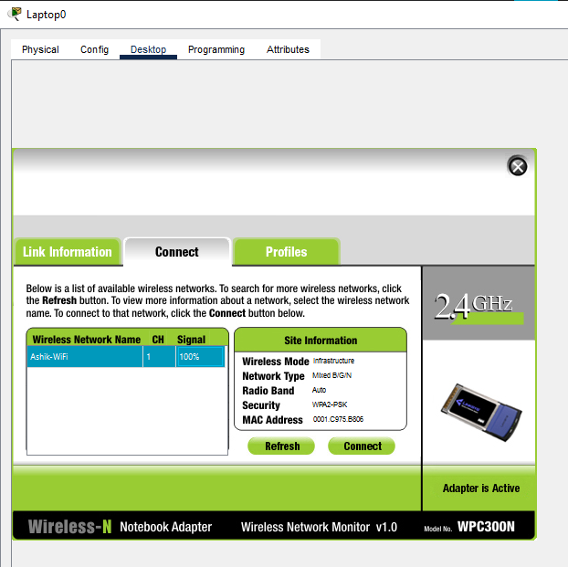
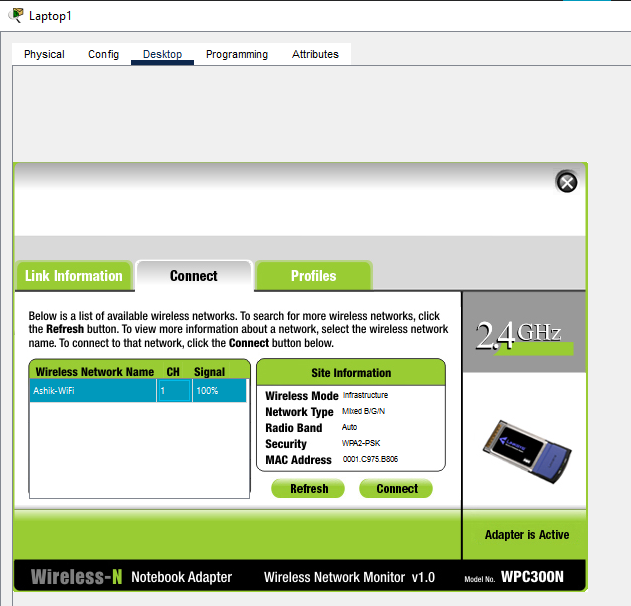
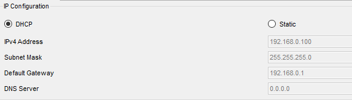

# Basic Wireless

## Overview

This Packet Tracer lab demonstrates the setup of a basic wireless LAN using a wireless router and wireless client devices. The lab focuses on SSID configuration, wireless client association, DHCP addressing, and end-to-end connectivity testing.

## Objectives

- Configure a wireless router for basic WLAN connectivity
- Configure a wireless SSID
- Configure wireless security
- Connect wireless clients to the WLAN
- Obtain IP addressing through DHCP
- Verify client-to-client connectivity using ping

## Network Topology

**Devices Used:**
- 1 × WRT300N Wireless Router
- 2 × Laptop-PT wireless clients

**Topology:**

```text
Laptop0 ))) ─── WRT300N ─── ((( Laptop1
```

> Wireless clients are connected to the WRT300N over Wi-Fi; no Ethernet cables are used between the laptops and router.

## Wireless Configuration

| Parameter | Value |
|---|---|
| SSID | `Ashik-WiFi` |
| Wireless Security | WPA2-Personal |
| Encryption | AES |
| Wi-Fi Passphrase | Configured for lab access |

## Client Configuration

Both Laptop0 and Laptop1 were equipped with the **WPC300N** wireless module and successfully associated with the configured wireless network.

IP addressing was obtained using **DHCP**.

## Verification

### Wireless Association

- Laptop0 successfully connected to `Ashik-WiFi`
- Laptop1 successfully connected to `Ashik-WiFi`

### IP Addressing

Both wireless clients successfully received IP addresses through DHCP.

### Connectivity Test

A ping test was performed between Laptop0 and Laptop1 after both clients joined the wireless network.

**Result:** Successful connectivity was verified.



## Screenshots

### 1. Network Topology


### 2. Wireless Router Configuration


### 3. Laptop0 Wireless Connection


### 4. Laptop1 Wireless Connection


### 5. DHCP IP Configuration


### 6. Connectivity Test


## Concepts Learned

- Wireless LAN fundamentals
- SSID configuration
- WPA2 wireless security
- AES encryption
- Wireless client association
- Wireless network modules
- DHCP-based IP addressing
- Basic wireless connectivity troubleshooting
- Ping-based connectivity verification

## Software Used

- Cisco Packet Tracer

## Lab File

- `01-Basic-Wireless.pkt`

## Learning Outcome

This lab provided practical experience in building a basic wireless LAN, configuring a wireless router, connecting wireless clients, obtaining IP addresses through DHCP, and verifying connectivity between wireless devices.

## Status

✅ Completed

## Author

**Mohamed Ashik**

Cisco Networking Labs Portfolio
