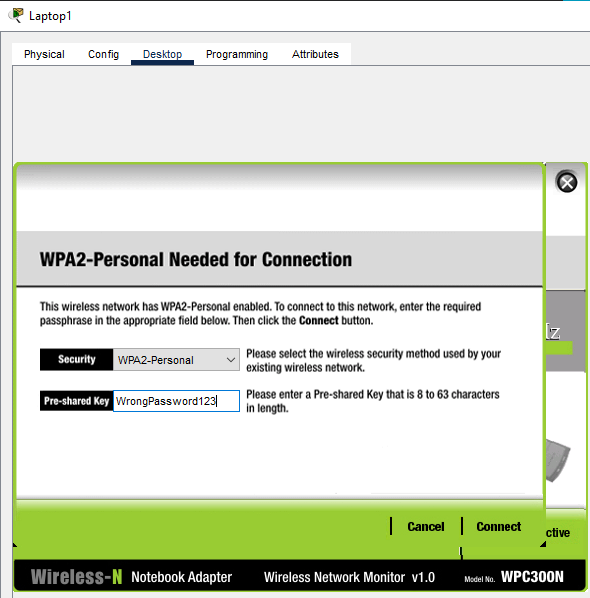
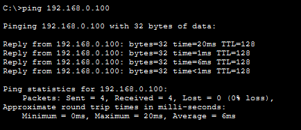
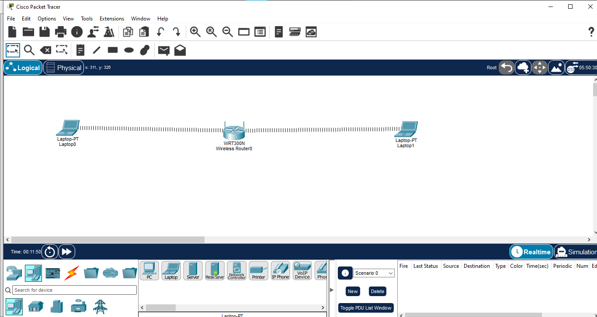
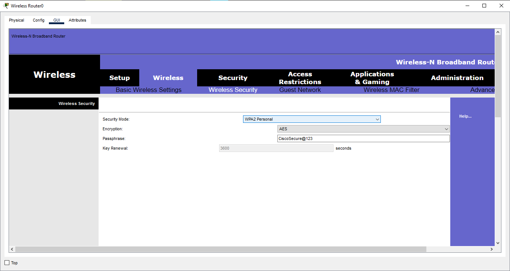
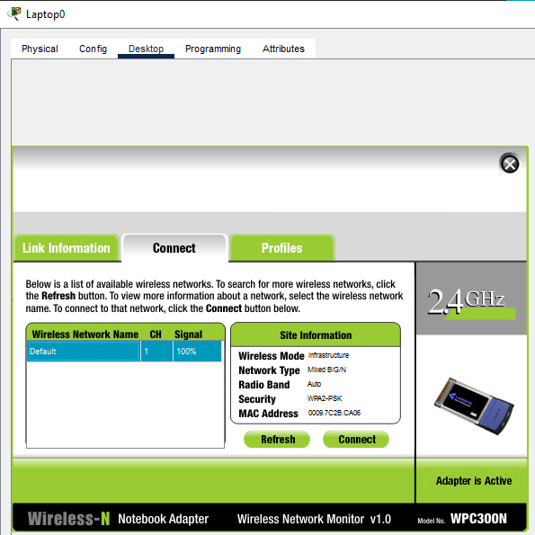
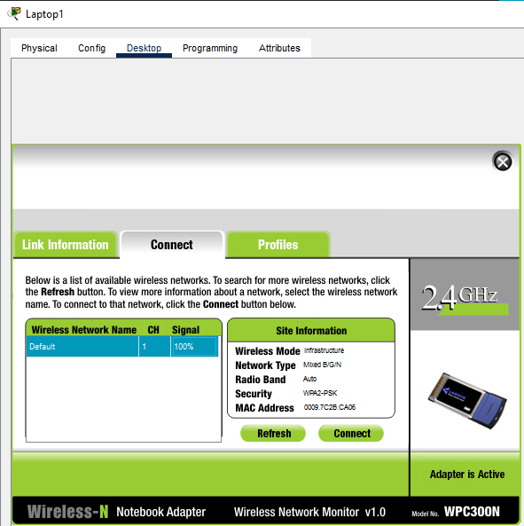

# Wireless Security

## Overview

This Packet Tracer lab demonstrates how to secure a basic wireless LAN using WPA2-Personal authentication and AES encryption. Wireless clients are configured to access the WLAN using the secured wireless credentials, followed by security and connectivity verification.

## Objectives

- Configure WPA2-Personal wireless security
- Enable AES encryption
- Connect authorized wireless clients using the configured security key
- Verify that an incorrect password does not establish a wireless connection
- Verify connectivity between authenticated wireless clients

## Network Topology

**Devices Used:**
- 1 × WRT300N Wireless Router
- 2 × Laptop-PT wireless clients
- WPC300N wireless modules for the laptops

**Topology:**

```text
Laptop0 ))) ─── WRT300N ─── ((( Laptop1
```

> Wireless clients communicate with the WRT300N over Wi-Fi without Ethernet cables.

## Wireless Security Configuration

| Parameter | Value |
|---|---|
| Security Mode | WPA2-Personal |
| Encryption | AES |
| Wireless Password | Configured for lab access |

## Client Configuration

Both Laptop0 and Laptop1 were connected to the secured wireless network using the configured WPA2 credentials.

## Security Verification

### Authorized Access

Both wireless clients successfully connected using the correct security credentials.

### Incorrect Password Test

An incorrect wireless password was tested to verify authentication behavior.

**Result:** The client was unable to establish the wireless connection with the incorrect password.



## Connectivity Verification

After reconnecting the client with the correct credentials, connectivity was tested between Laptop0 and Laptop1 using ICMP ping.

**Result:** Successful connectivity was verified.



## Screenshots

### 1. Network Topology


### 2. Wireless Security Configuration


### 3. Laptop0 Secure Connection


### 4. Laptop1 Secure Connection


### 5. Wrong Password Verification


### 6. Connectivity Test


## Concepts Learned

- Wireless LAN security fundamentals
- WPA2-Personal authentication
- AES encryption
- Wireless password configuration
- Authorized client association
- Authentication failure testing
- Wireless connectivity verification
- ICMP ping testing

## Software Used

- Cisco Packet Tracer

## Lab File

- `02-Wireless-Security.pkt`

## Learning Outcome

This lab provided practical experience in securing a wireless LAN with WPA2-Personal and AES, validating authenticated client access, testing incorrect credentials, and verifying communication between authorized wireless clients.

## Status

✅ Completed

## Author

**Mohamed Ashik**

Cisco Networking Labs Portfolio
