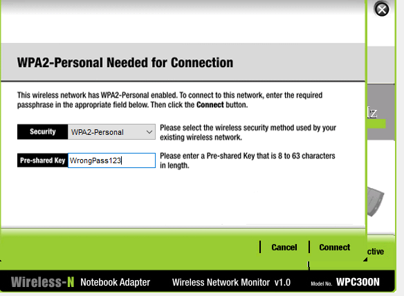
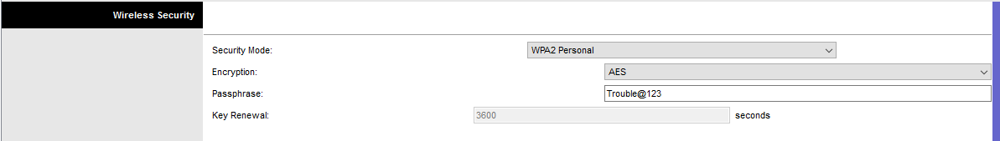
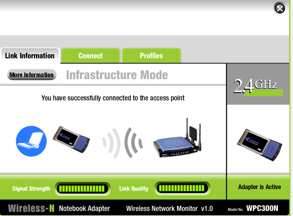
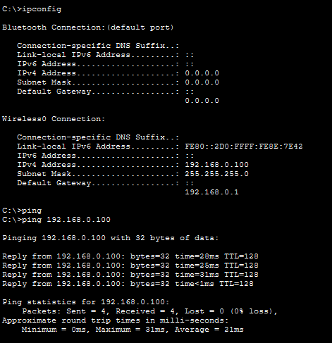
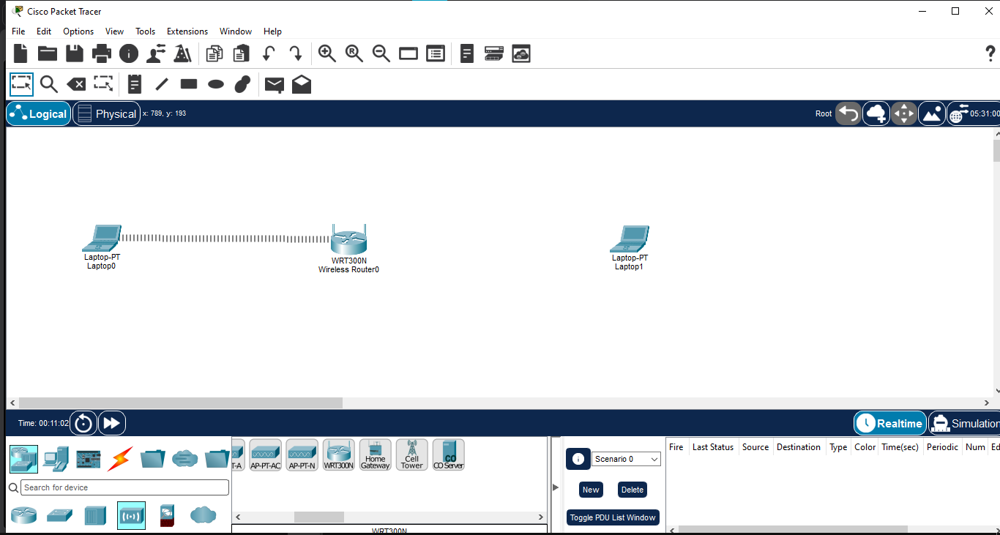
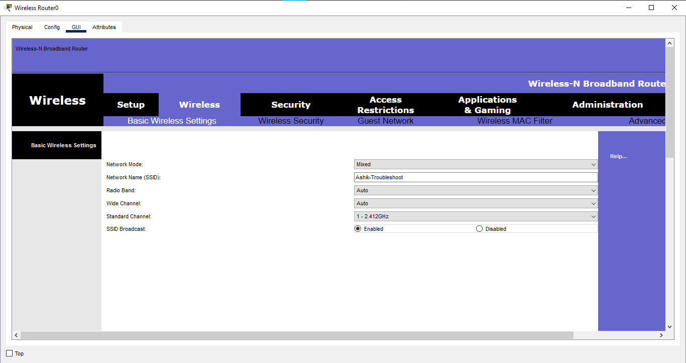

# Wireless Troubleshooting

## Overview

This Packet Tracer lab demonstrates a practical wireless connectivity troubleshooting workflow. An authentication failure was intentionally introduced, investigated, corrected, and then verified through successful wireless connectivity testing.

## Objectives

- Identify common wireless connectivity issues
- Verify the configured SSID
- Check wireless security settings
- Identify an authentication/password mismatch
- Restore wireless client connectivity
- Verify end-to-end communication after the fix

## Network Topology

**Devices Used:**
- 1 × WRT300N Wireless Router
- 2 × Laptop-PT wireless clients
- WPC300N wireless modules for the laptops

**Topology:**

```text
Laptop0 ))) ─── WRT300N ─── ((( Laptop1
```

## Initial Wireless Configuration

| Parameter | Value |
|---|---|
| SSID | `Ashik-Troubleshoot` |
| Security Mode | WPA2-Personal |
| Encryption | AES |
| Configured Password | Lab security key |

## Troubleshooting Scenario

An authentication failure was intentionally introduced on Laptop0 by attempting to connect with an incorrect wireless password.

**Observed Issue:** Laptop0 could not establish a wireless connection.



## Troubleshooting Process

### 1. SSID Verification

The available wireless network was checked to confirm that the expected SSID, `Ashik-Troubleshoot`, was visible.

### 2. Wireless Interface Verification

The Laptop0 wireless interface was checked to confirm that the WPC300N wireless module was available and active.

### 3. Security Verification

The WRT300N wireless security configuration was checked for:

- WPA2-Personal authentication
- AES encryption

### 4. Credential Verification

The client credentials were compared with the configured wireless security credentials.

The mismatch was identified as the cause of the authentication failure.



## Root Cause

**Incorrect WPA2 authentication password entered on the wireless client.**

## Corrective Action

The correct wireless password was entered on Laptop0 and the client was reconnected to the `Ashik-Troubleshoot` network.



## Final Verification

After the correction:

- Laptop0 successfully reconnected to the wireless network.
- DHCP addressing was verified.
- Connectivity between the wireless clients was tested using ICMP ping.
- Successful communication was verified.



## Troubleshooting Workflow

```text
Wireless Connection Failure
          ↓
Check SSID
          ↓
Check Wireless Interface
          ↓
Check Security Configuration
          ↓
Verify Credentials
          ↓
Identify Password Mismatch
          ↓
Enter Correct Password
          ↓
Reconnect Client
          ↓
Verify IP + Ping Connectivity
```

## Screenshots

### 1. Network Topology


### 2. Wireless Configuration


### 3. Wrong Password Fault


### 4. Troubleshooting Verification


### 5. Correct Password Reconnect


### 6. Connectivity Test


## Concepts Learned

- Wireless LAN troubleshooting
- SSID verification
- Wireless interface verification
- WPA2-Personal authentication
- AES encryption
- Credential troubleshooting
- DHCP verification
- ICMP ping testing
- Root cause identification
- Corrective action and post-fix verification

## Software Used

- Cisco Packet Tracer

## Lab File

- `03-Wireless-Troubleshooting.pkt`

## Learning Outcome

This lab provided practical experience in following a structured wireless troubleshooting methodology: identify the symptom, verify configuration, isolate the cause, apply the corrective action, and validate the result.

## Status

✅ Completed

## Author

**Mohamed Ashik**

Cisco Networking Labs Portfolio
