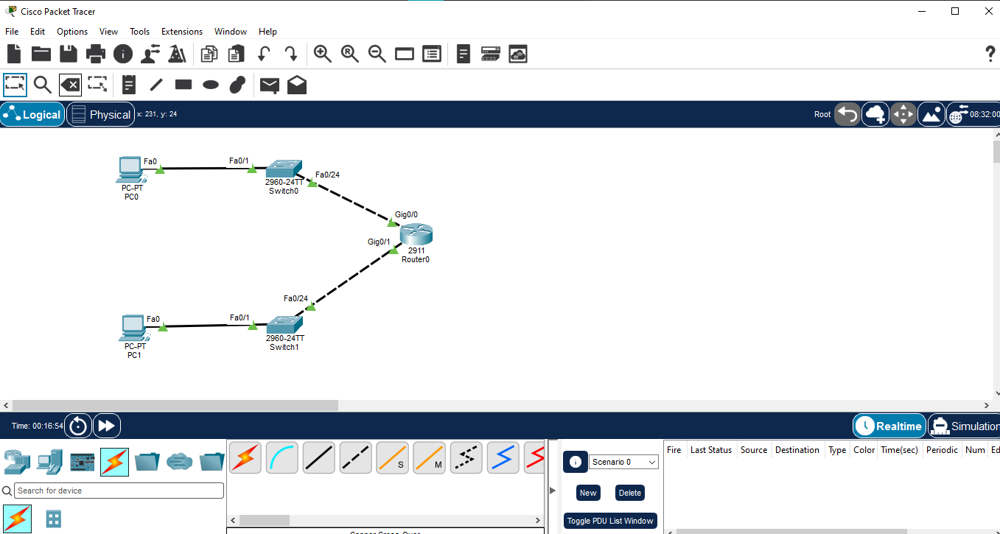
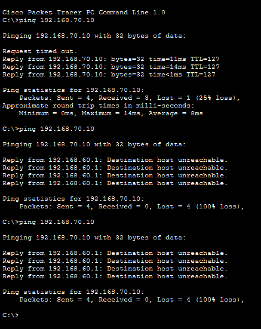
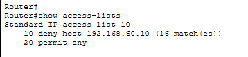
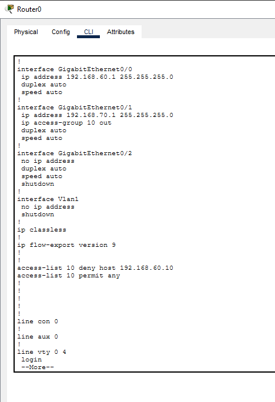
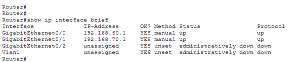

# Standard ACL – Source-Based Traffic Filtering

## 📌 Overview

This lab demonstrates the configuration and verification of a **Standard Access Control List (ACL)** on a Cisco router using Cisco Packet Tracer.

A Standard ACL filters traffic primarily based on the **source IP address**. In this lab, traffic originating from PC0 is denied while other traffic is permitted.

## 🎯 Objectives

- Understand the purpose of Standard ACLs
- Configure a Standard ACL using a numbered ACL
- Filter traffic based on a source host IP address
- Apply an ACL to a router interface
- Understand inbound and outbound ACL direction
- Verify ACL operation using Cisco IOS commands
- Analyze ACL match counters

## 🖥️ Devices Used

| Device | Model | Quantity |
|---|---|---:|
| Router | Cisco 2911 | 1 |
| Switch | Cisco 2960 | 2 |
| PC | PC-PT | 2 |

## 🌐 Network Topology



```text
PC0 (192.168.60.10)
        |
       SW1
        |
      G0/0
       R1
      G0/1
        |
       SW2
        |
PC1 (192.168.70.10)
```

## 🔌 Port Mapping

| Device | Interface | Connected To |
|---|---|---|
| PC0 | Fa0 | SW1 Fa0/1 |
| SW1 | Fa0/24 | R1 G0/0 |
| R1 | G0/0 | SW1 Fa0/24 |
| R1 | G0/1 | SW2 Fa0/24 |
| SW2 | Fa0/1 | PC1 Fa0 |

## 🗺️ IP Addressing

| Device | Interface | IP Address | Subnet Mask | Gateway |
|---|---|---|---|---|
| R1 | G0/0 | 192.168.60.1 | 255.255.255.0 | — |
| R1 | G0/1 | 192.168.70.1 | 255.255.255.0 | — |
| PC0 | Fa0 | 192.168.60.10 | 255.255.255.0 | 192.168.60.1 |
| PC1 | Fa0 | 192.168.70.10 | 255.255.255.0 | 192.168.70.1 |

## ⚙️ Router Interface Configuration

```text
enable
configure terminal

interface gigabitEthernet 0/0
ip address 192.168.60.1 255.255.255.0
no shutdown
exit

interface gigabitEthernet 0/1
ip address 192.168.70.1 255.255.255.0
no shutdown
exit
```

## 🔐 Standard ACL Configuration

The ACL denies traffic originating from PC0 and permits other traffic:

```text
access-list 10 deny host 192.168.60.10
access-list 10 permit any
```

### ACL Rule Explanation

| Rule | Purpose |
|---|---|
| `deny host 192.168.60.10` | Blocks traffic originating from PC0 |
| `permit any` | Permits other traffic |

ACL 10 is a **Standard ACL** because the filtering decision is based on the source IP address.

## 🔗 ACL Application

The ACL was applied outbound on R1 GigabitEthernet0/1:

```text
interface gigabitEthernet 0/1
ip access-group 10 out
```

Traffic from PC0 toward the 192.168.70.0/24 network therefore matches the ACL before leaving G0/1.

## 🧪 Connectivity Testing

Before applying the ACL, connectivity between the two networks was verified successfully.

After applying the ACL, PC0 tested connectivity to PC1:

```text
ping 192.168.70.10
```

The traffic was subsequently blocked by the configured ACL.



## 🔍 ACL Verification

The ACL was verified using:

```text
show access-lists
```

Verified output included:

```text
Standard IP access list 10
    10 deny host 192.168.60.10 (16 match(es))
    20 permit any
```

The **16 match(es)** counter confirms that traffic from 192.168.60.10 matched the deny rule during testing.



## 🖥️ Router Configuration Verification

The complete running configuration was verified using:

```text
show running-config
```

The configuration confirmed the ACL and its application:

```text
interface GigabitEthernet0/1
 ip address 192.168.70.1 255.255.255.0
 ip access-group 10 out

access-list 10 deny host 192.168.60.10
access-list 10 permit any
```



## 📡 Interface Verification

The router interfaces were verified using:

```text
show ip interface brief
```

Verified status:

```text
GigabitEthernet0/0    192.168.60.1    up    up
GigabitEthernet0/1    192.168.70.1    up    up
```



## 📚 Key Concepts Learned

- Standard ACL
- Numbered ACL
- Source IP-based filtering
- ACL sequence numbers
- Deny and permit rules
- ACL interface application
- Inbound vs outbound ACL direction
- ACL match counters
- Cisco IOS verification commands
- Traffic filtering

## 💡 Learning Outcome

This lab provided practical experience in configuring a **Standard ACL** to control traffic based on the source IP address.

It also demonstrated how ACL placement and interface direction affect traffic filtering and how ACL match counters can be used to verify that traffic is being processed by the ACL.

## 🛠️ Software Used

- Cisco Packet Tracer

## 📂 Project Files

```text
01-Standard-ACL/
├── 01-topology.png
├── 02-acl-block-test.png
├── 03-acl-verification.png
├── 04-router-configuration.png
├── 05-interface-verification.png
├── 01-Standard-ACL.pkt
└── README.md
```

## 📌 Status

**Completed and Verified ✅**

## 👨‍💻 Author

**Mohamed Ashik**

GitHub: `mohamedashik-cpu/networking-labs`
