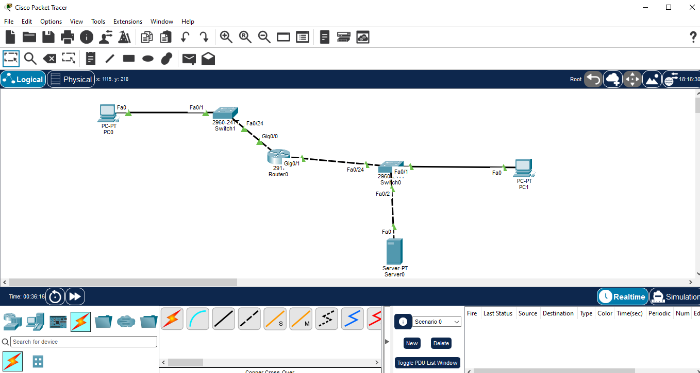
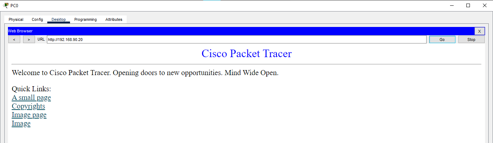
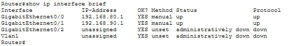
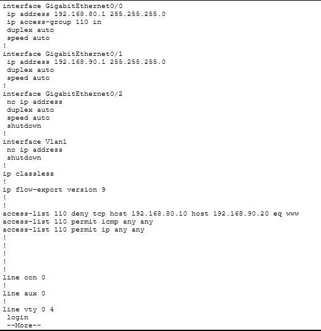

# Extended ACL – HTTP Traffic Filtering

## Overview

This Packet Tracer lab demonstrates the use of an **Extended Access Control List (ACL)** to control traffic based on source IP, destination IP, protocol, and TCP port.

The lab uses a practical web-server scenario where HTTP traffic from a specific PC is blocked while ICMP traffic is permitted.

## Objective

- Configure an Extended ACL on a Cisco router.
- Filter traffic using source and destination IP addresses.
- Block HTTP traffic using TCP port 80.
- Permit ICMP traffic for connectivity testing.
- Verify ACL application and match counters.

## Network Topology



## Devices Used

| Device | Quantity |
|---|---:|
| Cisco 2911 Router | 1 |
| Cisco 2960 Switch | 2 |
| PC | 2 |
| Server | 1 |

## Port Mapping

| Connection | Interface |
|---|---|
| PC0 → SW1 | PC0 Fa0 → SW1 Fa0/1 |
| SW1 → R1 | SW1 Fa0/24 → R1 G0/0 |
| R1 → SW2 | R1 G0/1 → SW2 Fa0/24 |
| PC1 → SW2 | PC1 Fa0 → SW2 Fa0/1 |
| Server0 → SW2 | Server0 Fa0 → SW2 Fa0/2 |

## IP Addressing

| Device | Interface | IP Address | Subnet Mask | Default Gateway |
|---|---|---|---|---|
| R1 | G0/0 | 192.168.80.1 | 255.255.255.0 | — |
| R1 | G0/1 | 192.168.90.1 | 255.255.255.0 | — |
| PC0 | Fa0 | 192.168.80.10 | 255.255.255.0 | 192.168.80.1 |
| PC1 | Fa0 | 192.168.90.10 | 255.255.255.0 | 192.168.90.1 |
| Server0 | Fa0 | 192.168.90.20 | 255.255.255.0 | 192.168.90.1 |

## Router Interface Configuration

```text
interface gigabitEthernet 0/0
 ip address 192.168.80.1 255.255.255.0
 no shutdown

interface gigabitEthernet 0/1
 ip address 192.168.90.1 255.255.255.0
 no shutdown
```

## Server HTTP Configuration

Server0 HTTP service was enabled before applying the ACL.

## Connectivity Test – Before ACL

Before ACL enforcement, PC0 successfully accessed the HTTP web page hosted on Server0 at `192.168.90.20`.



This confirms that HTTP connectivity was available before traffic filtering was applied.

## Extended ACL Configuration

ACL 110 was configured to block HTTP traffic from PC0 to Server0 while allowing ICMP and other IP traffic:

```text
access-list 110 deny tcp host 192.168.80.10 host 192.168.90.20 eq 80
access-list 110 permit icmp any any
access-list 110 permit ip any any
```

## ACL Application

The ACL was applied inbound on R1 GigabitEthernet0/0:

```text
interface gigabitEthernet 0/0
 ip access-group 110 in
```

## Testing After ACL

### HTTP Test

PC0 attempted to access Server0 using HTTP after ACL enforcement.

**Expected behavior:** HTTP traffic is blocked by ACL 110.


### ICMP Test

PC0 tested connectivity to Server0 using ICMP.

**Expected behavior:** ICMP traffic is permitted by ACL 110.


## ACL Verification

The ACL was verified using:

```text
show access-lists 110
```


## Interface Verification

The ACL application and router interface status were verified using:

```text
show ip interface gigabitEthernet 0/0
show ip interface brief
```



## Router Configuration Verification

The final router configuration was saved after verification.



## Traffic Flow

```text
PC0 (192.168.80.10)
        |
       SW1
        |
   R1 G0/0
        |
      R1
        |
   R1 G0/1
        |
       SW2
      /   \
   PC1   Server0
         192.168.90.20
```

For HTTP traffic from PC0 to Server0:

```text
PC0 → TCP/80 → R1 → ACL 110 → DENY → Server0
```

For ICMP traffic:

```text
PC0 → ICMP → R1 → ACL 110 → PERMIT → Server0
```

## Important Commands

```text
show access-lists 110
show ip interface gigabitEthernet 0/0
show ip interface brief
copy running-config startup-config
```

## Concepts Learned

- Extended ACLs
- Source and destination IP filtering
- TCP protocol filtering
- Port-based traffic filtering
- ACL direction and interface application
- ICMP permit rules
- ACL verification and match counters
- Basic network access control

## Learning Outcome

This lab demonstrates how an Extended ACL can provide more granular traffic control than a Standard ACL by filtering traffic using protocol, source, destination, and port information.

## Software Used

- Cisco Packet Tracer

## Project Files

- `02-Extended-ACL.pkt`
- `01-topology.png`
- `02-before-acl-http-success.png`
- `03-http-block-test.png`
- `04-icmp-allow-test.png`
- `05-acl-verification.png`
- `06-router-configuration.png`
- `07-interface-verification.png`

## Status

✅ Completed and verified

## Author

**Mohamed Ashik**  
GitHub: [mohamedashik-cpu](https://github.com/mohamedashik-cpu)
