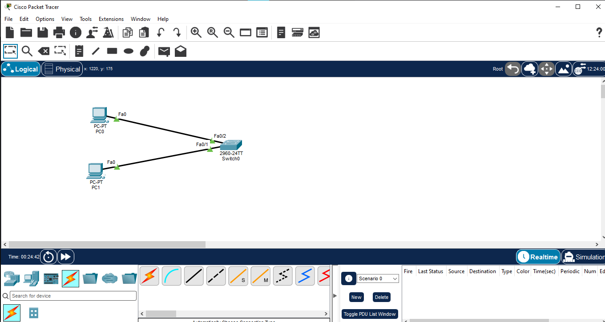
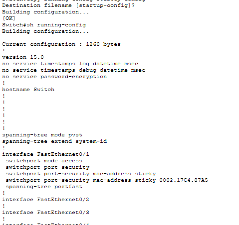
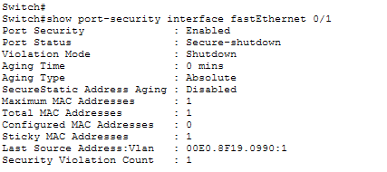
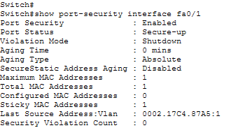

# Port Security

## Overview

This lab demonstrates Cisco switch port security using a Layer 2 access port. Port Security is configured on **SW1 FastEthernet0/1** to allow only one learned MAC address and to shut down the port when an unauthorized MAC address is detected.

## Objective

- Configure switch port security on an access port
- Limit the port to one MAC address
- Learn and retain the authorized MAC using sticky learning
- Configure violation mode as shutdown
- Test unauthorized device access
- Verify port-security status and learned MAC information
- Recover the secured port after a violation

## Topology

### Devices Used

| Device | Model | Quantity |
|---|---|---:|
| Switch | Cisco 2960 | 1 |
| PC | Generic PC | 2 |

### Connections

| Device | Interface | Connected To |
|---|---|---|
| PC1 | Fa0 | SW1 Fa0/1 |
| PC0 | Fa0 | SW1 Fa0/2 |

> Note: PC1 is the authorized device on Fa0/1. Its MAC address is **0002.17C4.87A5**.

## IP Addressing

| Device | IP Address | Subnet Mask |
|---|---|---|
| PC0 | 192.168.100.10 | 255.255.255.0 |
| PC1 | 192.168.100.20 | 255.255.255.0 |

No default gateway is required because both PCs are in the same subnet.

## Port Security Configuration

Port Security was configured on **SW1 Fa0/1**:

~~~cisco
interface fastEthernet 0/1
switchport mode access
switchport port-security
switchport port-security maximum 1
switchport port-security mac-address sticky
switchport port-security violation shutdown
spanning-tree portfast
~~~

### Configuration Explanation

- `switchport mode access` — Forces the interface into access mode.
- `switchport port-security` — Enables port security.
- `maximum 1` — Allows only one secure MAC address.
- `mac-address sticky` — Dynamically learns the connected device MAC and stores it as a secure sticky MAC.
- `violation shutdown` — Places the port into a shutdown/err-disabled state when an unauthorized MAC is detected.
- `spanning-tree portfast` — Enables PortFast for the end-device access port.

## Security Violation Test

During testing, an unauthorized MAC address **00E0.8F19.0990** was detected on Fa0/1.

The switch generated a port-security violation and placed Fa0/1 into an err-disabled state.

Verified output included:

- **Port Status:** Secure-shutdown
- **Violation Mode:** Shutdown
- **Maximum MAC Addresses:** 1
- **Sticky MAC Addresses:** 1
- **Security Violation Count:** 1

## Port Recovery

After the violation test, Fa0/1 was recovered using:

~~~cisco
interface fastEthernet 0/1
shutdown
no shutdown
~~~

The authorized device was then connected back to Fa0/1.

## Final Verification

The final verified state of Fa0/1 was:

- **Port Security:** Enabled
- **Port Status:** Secure-up
- **Violation Mode:** Shutdown
- **Maximum MAC Addresses:** 1
- **Sticky MAC Addresses:** 1
- **Last Source Address:** 0002.17C4.87A5
- **Security Violation Count:** 0

## Verification Commands

~~~cisco
show port-security interface fastEthernet 0/1
show port-security address
show interfaces status
~~~

## Key Concepts Learned

- Layer 2 port security
- Secure MAC addresses
- Sticky MAC learning
- MAC address limitation
- Port-security violation modes
- Err-disabled state
- Port recovery
- PortFast on access ports

## Learning Outcome

This lab provided hands-on practice securing a switch access port against unauthorized MAC addresses. The lab also demonstrated how a port-security violation can place an interface into an err-disabled state and how the interface can be recovered after the security test.

## Files

- `03-Port-Security.pkt` — Packet Tracer project
- `01-topology.png` — Network topology
- `02-port-security-config.png` — Port Security configuration
- `03-violation-test.png` — Security violation evidence
- `04-port-security-verification.png` — Final verification

## Software Used

- Cisco Packet Tracer

## Status

✅ Completed

## Author

**Mohamed Ashik**

Cisco Networking Labs Portfolio  
GitHub: [mohamedashik-cpu](https://github.com/mohamedashik-cpu)
