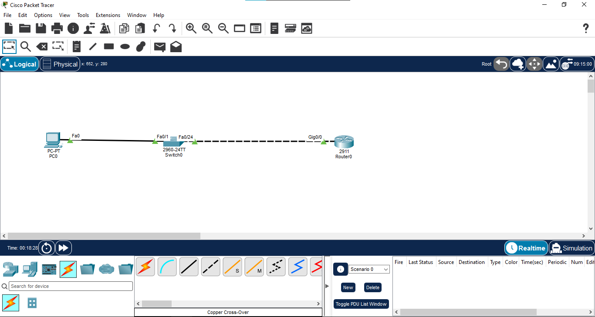
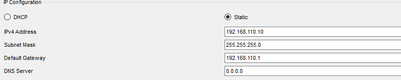
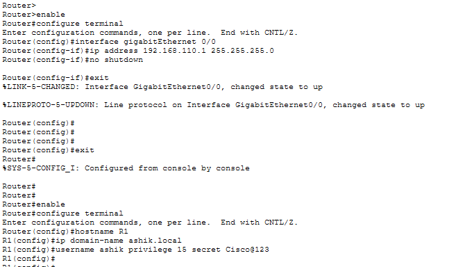
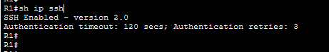
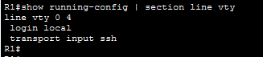
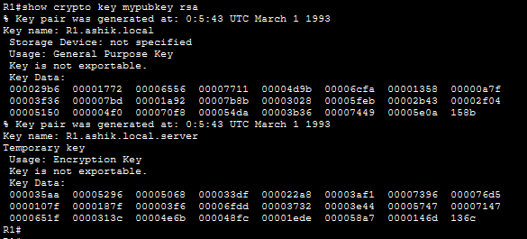
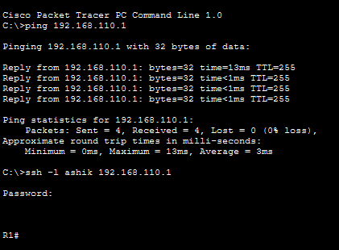
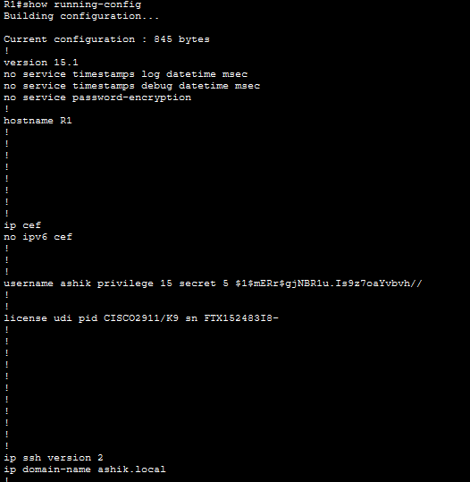
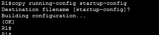

# 🔐 SSH (Secure Shell) – Cisco Router

## 📌 Overview

This lab demonstrates SSH-based secure remote management on a Cisco router using Cisco Packet Tracer.

The lab covers local user authentication, RSA key generation, SSH Version 2, VTY line security, and remote SSH login verification from a client PC.

## 🎯 Objectives

- Configure a management IP address on a Cisco router
- Create a local privileged user for authentication
- Configure a domain name required for RSA key generation
- Generate RSA cryptographic keys
- Enable SSH Version 2
- Configure VTY lines for local authentication
- Restrict remote access to SSH
- Verify successful SSH login from a PC
- Save the final router configuration

## 🖥️ Topology

### Devices Used

| Device | Model | Hostname |
|---|---|---|
| Router | Cisco 2911 | R1 |
| Switch | Cisco 2960 | SW1 |
| PC | PC-PT | PC0 |

### Connections

| Device | Interface | Connected To | Interface |
|---|---|---|---|
| PC0 | FastEthernet0 | SW1 | FastEthernet0/1 |
| SW1 | FastEthernet0/24 | R1 | GigabitEthernet0/0 |

## 🌐 IP Addressing

| Device | Interface | IP Address | Subnet Mask |
|---|---|---|---|
| R1 | G0/0 | 192.168.110.1 | 255.255.255.0 |
| PC0 | Fa0 | 192.168.110.10 | 255.255.255.0 |

**Default Gateway for PC0:** 192.168.110.1

## ⚙️ Configuration

### 1. Router Basic Configuration

~~~text
enable
configure terminal
hostname R1
ip domain-name ashik.local
username ashik privilege 15 secret Cisco@123
~~~

### 2. RSA Key Generation

~~~text
crypto key generate rsa
~~~

RSA modulus used in the lab: **1024 bits**.

### 3. Enable SSH Version 2

~~~text
ip ssh version 2
~~~

### 4. Configure VTY Lines

~~~text
line vty 0 4
login local
transport input ssh
exit
~~~

This configuration uses the locally created ashik account for authentication and permits SSH as the remote-access protocol.

## 🔎 Verification

### SSH Version Verification

The router was verified with:

~~~text
do show ip ssh
~~~

Verified result:

~~~text
SSH Enabled - version 2.0
Authentication timeout: 120 secs
Authentication retries: 3
~~~

### VTY Configuration Verification

~~~text
show running-config | section line vty
~~~

The VTY configuration was verified with local authentication enabled and SSH-only remote transport configured.

### RSA Key Verification

~~~text
show crypto key mypubkey rsa
~~~

## 🧪 SSH Login Test

From PC0 Command Prompt, the router was accessed using:

~~~text
ssh -l ashik 192.168.110.1
~~~

The SSH login was successfully established and the router CLI prompt was reached.

## 🧾 Final Configuration

The completed router configuration was reviewed after SSH setup.

The running configuration was saved to startup configuration:

~~~text
copy running-config startup-config
~~~

## 🔄 SSH Traffic Flow

~~~text
PC0 (192.168.110.10)
        │
        │ SSH
        ▼
      SW1
        │
        ▼
R1 (192.168.110.1)
        │
        ▼
Local User Authentication
        │
        ▼
SSH Session Established
~~~

## 🧠 Key Concepts Learned

- Secure remote device management using SSH
- Local username/password authentication
- RSA public-key generation
- SSH Version 2
- VTY line configuration
- Restricting remote access to SSH
- Verification of SSH services and cryptographic keys
- Saving Cisco IOS configuration

## 📂 Files

- `04-SSH.pkt` – Cisco Packet Tracer project
- `01-topology.png` – Network topology
- `02-ip-configuration.png` – IP configuration
- `03-ssh-configuration.png` – SSH/RSA configuration
- `04-ssh-verification.png` – SSH Version 2 verification
- `05-vty-verification.png` – VTY configuration verification
- `06-ssh-login-success.png` – Successful SSH login
- `07-rsa-key-verification.png` – RSA key verification
- `08-final-configuration.png` – Final configuration
- `09-config-saved.png` – Configuration save verification

## 🛠️ Software Used

- Cisco Packet Tracer

## 📊 Status

✅ **Completed and Verified**

## 👤 Author

**Mohamed Ashik**
