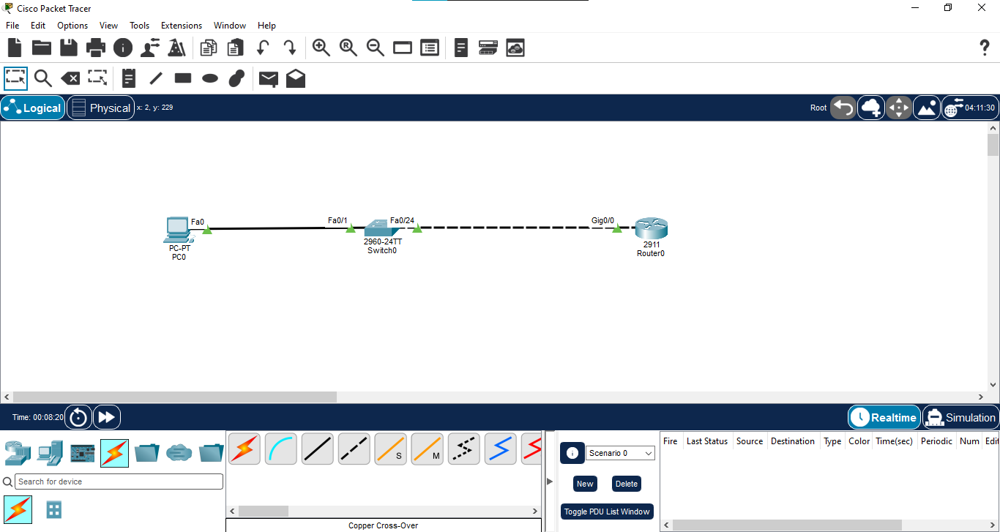
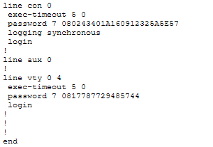
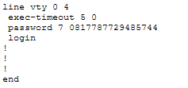
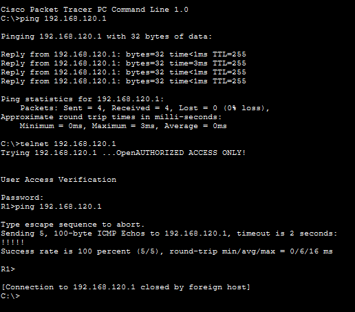

# Device Hardening

## Overview

This lab demonstrates basic Cisco IOS device-hardening techniques on a Cisco 2911 router. The configuration focuses on reducing unnecessary access, protecting management access, securing passwords, displaying an authorized-access warning, and disabling unused interfaces.

## Objective

- Configure basic Cisco IOS device hardening.
- Protect privileged EXEC access with an enable secret.
- Encrypt plaintext passwords in the configuration.
- Disable DNS lookup to avoid unnecessary CLI delays.
- Configure a MOTD banner for authorized access.
- Harden console and VTY access.
- Configure session timeout and logging behavior.
- Disable unused router interfaces.
- Verify management access and network connectivity.

---

## Topology



### Devices

| Device | Model | Hostname |
|---|---|---|
| Router | Cisco 2911 | R1 |
| Switch | Cisco 2960 | SW1 |
| PC | PC | PC0 |

### Connections

- PC0 Fa0 → SW1 Fa0/1
- SW1 Fa0/24 → R1 G0/0

---

## IP Addressing

| Device | Interface | IP Address | Subnet Mask | Gateway |
|---|---|---|---|---|
| R1 | G0/0 | 192.168.120.1 | 255.255.255.0 | — |
| PC0 | Fa0 | 192.168.120.10 | 255.255.255.0 | 192.168.120.1 |


---

## Basic Device Hardening

The following settings were applied on R1:

```cisco
hostname R1
no ip domain-lookup

enable secret Cisco@123

service password-encryption

banner motd #AUTHORIZED ACCESS ONLY!#
```


### Purpose

- **hostname R1** — identifies the device clearly.
- **no ip domain-lookup** — prevents unwanted DNS lookup when an invalid CLI command is entered.
- **enable secret** — protects privileged EXEC mode.
- **service password-encryption** — encrypts supported plaintext passwords in the configuration.
- **banner motd** — displays an authorized-access warning.

---

## Console Hardening

Console access was configured with a password, login requirement, session timeout, and synchronized logging.

```cisco
line console 0
 password Console@123
 login
 exec-timeout 5 0
 logging synchronous
```



### Purpose

- Requires authentication for console access.
- Automatically terminates an idle console session after 5 minutes.
- Prevents console log messages from disrupting command-line input.

---

## VTY Hardening

VTY lines were protected with password authentication and an idle session timeout.

```cisco
line vty 0 4
 password VTY@123
 login
 exec-timeout 5 0
```



> **Note:** Telnet was used only to test VTY password authentication in this lab. Telnet does not provide encrypted management traffic. Secure remote management with SSH is covered separately in **04-SSH**.

---

## Unused Interface Shutdown

Unused router interfaces were administratively disabled.

```cisco
interface gigabitEthernet 0/1
 shutdown

interface gigabitEthernet 0/2
 shutdown
```


Disabling unused interfaces reduces unnecessary active access points on the device.

---

## Verification & Testing

The following checks were performed during the lab:

- R1 G0/0 configured with 192.168.120.1/24.
- PC0 configured with 192.168.120.10/24 and gateway 192.168.120.1.
- Console password authentication was tested.
- VTY password authentication was tested from PC0.
- Connectivity to R1 was tested with ping.
- Unused G0/1 and G0/2 interfaces were shut down.



---

## Complete Hardening Configuration

The main configuration used in this lab:

```cisco
hostname R1
no ip domain-lookup

enable secret Cisco@123
service password-encryption
banner motd #AUTHORIZED ACCESS ONLY!#

interface gigabitEthernet 0/0
 ip address 192.168.120.1 255.255.255.0
 no shutdown

interface gigabitEthernet 0/1
 shutdown

interface gigabitEthernet 0/2
 shutdown

line console 0
 password Console@123
 login
 exec-timeout 5 0
 logging synchronous

line vty 0 4
 password VTY@123
 login
 exec-timeout 5 0
```

---

## Key Verification Commands

```cisco
show running-config
show ip interface brief
```

These commands were used to review the device configuration, interface states, IP addressing, and administrative status.

---

## Traffic / Access Flow

```text
PC0
 |
 | 192.168.120.10/24
 |
SW1
 |
 | Fa0/24
 |
R1 G0/0
192.168.120.1/24
```

Management access is protected through console and VTY authentication, while unused router interfaces remain administratively shut down.

---

## Key Concepts Learned

- Cisco IOS device hardening
- Privileged EXEC protection
- Password encryption
- Console line security
- VTY line security
- Session timeout
- Logging synchronization
- MOTD banners
- Interface shutdown
- Basic management-plane security
- Configuration verification

---

## Learning Outcome

This lab provided practical experience with securing a Cisco router against common basic management-access risks. It also reinforced the importance of disabling unused interfaces and verifying security configurations after applying hardening controls.

---

## Files

| File | Description |
|---|---|
| `01-topology.png` | Packet Tracer topology |
| `02-ip-connectivity.png` | IP/interface connectivity verification |
| `03-basic-hardening.png` | Basic device hardening configuration |
| `04-console-hardening.png` | Console security configuration |
| `05-vty-hardening.png` | VTY security configuration |
| `06-unused-interfaces.png` | Unused interface shutdown verification |
| `07-access-test.png` | Access and connectivity testing |
| `05-Device-Hardening.pkt` | Packet Tracer project file |

---

## Software Used

- Cisco Packet Tracer

## Status

✅ **Completed**

## Author

**Mohamed Ashik**  
GitHub: [mohamedashik-cpu](https://github.com/mohamedashik-cpu)
