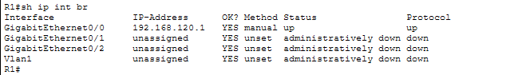
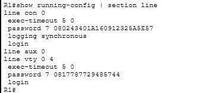

# Password Security

## Overview

This lab demonstrates Cisco IOS password-security techniques for protecting privileged EXEC access and device management sessions. The configuration covers enable passwords, enable secret, console authentication, VTY authentication, password encryption, and session timeouts.

## Objective

- Configure privileged EXEC password protection.
- Understand the difference between `enable password` and `enable secret`.
- Enable password encryption for supported plaintext passwords.
- Secure console access.
- Secure VTY remote-access lines with password authentication.
- Configure management session timeouts.
- Verify password authentication and basic connectivity.

---

## Topology


### Devices

| Device | Model | Hostname |
|---|---|---|
| Router | Cisco 2911 | R1 |
| Switch | Cisco 2960 | SW1 |
| PC | PC | PC0 |

### Connections

- PC0 Fa0 → SW1 Fa0/1
- SW1 Fa0/24 → R1 G0/0

---

## IP Addressing

| Device | Interface | IP Address | Subnet Mask | Gateway |
|---|---|---|---|---|
| R1 | G0/0 | 192.168.130.1 | 255.255.255.0 | — |
| PC0 | Fa0 | 192.168.130.10 | 255.255.255.0 | 192.168.130.1 |



---

## Privileged EXEC Password Security

Both an enable password and an enable secret were configured to demonstrate their behavior. The enable secret takes precedence for privileged EXEC authentication.

```cisco
enable password Cisco123
enable secret Cisco@123
service password-encryption
```



### Key Points

- `enable password` provides legacy privileged EXEC password protection.
- `enable secret` provides the preferred privileged EXEC password mechanism.
- `enable secret` takes precedence when both are configured.
- `service password-encryption` encrypts supported plaintext passwords in the running configuration.

---

## Console Password Security

Console access was protected with password authentication and an idle session timeout.

```cisco
line console 0
 password Console@123
 login
 exec-timeout 5 0
 logging synchronous
```


### Verification

The console authentication was tested successfully using the configured `Console@123` password.

---

## VTY Password Security

VTY lines were protected with password authentication and a 5-minute idle timeout.

```cisco
line vty 0 4
 password VTY@123
 login
 exec-timeout 5 0
```


### Verification

Remote VTY authentication was tested from PC0 using Telnet to the router's management IP.

> **Security note:** Telnet was used only as a lab authentication test. Telnet sends management traffic without encryption. Secure remote management with SSH is covered separately in **04-SSH**.

---

## Password Encryption

The router was configured with:

```cisco
service password-encryption
```

This causes supported line passwords such as console and VTY passwords to appear in encrypted Type 7 form in the running configuration.

The enable secret is stored using a separate secret mechanism and is displayed as an encrypted value in the configuration.

---

## Session Security

Both console and VTY sessions were configured with:

```cisco
exec-timeout 5 0
```

This automatically terminates an idle management session after 5 minutes.

---

## Verification & Testing

The following tests were completed:

- Enable secret authentication → successful.
- Console password authentication → successful.
- VTY password authentication through Telnet → successful.
- IP connectivity between PC0 and R1 was tested.
- Password entries were verified in encrypted form in the running configuration.
- Console and VTY session timeouts were verified in the configuration.


---

## Unused Interfaces

The router's unused interfaces remained administratively shut down.


This keeps the lab router configuration consistent with basic device-hardening practices.

---

## Configuration Reference

```cisco
service password-encryption

enable password Cisco123
enable secret Cisco@123

line console 0
 password Console@123
 login
 exec-timeout 5 0
 logging synchronous

line vty 0 4
 password VTY@123
 login
 exec-timeout 5 0
```

---

## Key Verification Commands

```cisco
show running-config
show running-config | section line con
show running-config | section line vty
show running-config | include enable|password
show ip interface brief
```

---

## Access Flow

```text
PC0
 |
 | 192.168.130.10/24
 |
SW1
 |
 | Fa0/24
 |
R1 G0/0
192.168.130.1/24
 |
 +-- Console authentication
 |
 +-- VTY password authentication
 |
 +-- Privileged EXEC via enable secret
```

---

## Key Concepts Learned

- Enable password
- Enable secret
- Password precedence
- Cisco password encryption
- Console authentication
- VTY authentication
- Session timeout
- Management-plane security
- Authentication verification
- Basic IOS security practices

---

## Files

| File | Description |
|---|---|
| `01-topology.png` | Packet Tracer topology |
| `02-ip-connectivity.png` | IP/interface verification |
| `03-basic-hardening.png` | Privileged password configuration |
| `04-console-hardening.png` | Console password configuration |
| `05-vty-hardening.png` | VTY password configuration |
| `06-unused-interfaces.png` | Interface-state verification |
| `07-access-test.png` | Authentication/access testing |
| `05-Device-Hardening.pkt` | Packet Tracer project file currently uploaded in this folder |

> **File note:** The Packet Tracer file currently uploaded is named `05-Device-Hardening.pkt`. For consistency with this lab, it should ideally be renamed to `06-Password-Security.pkt`.

---

## Software Used

- Cisco Packet Tracer

## Status

✅ **Completed**

## Author

**Mohamed Ashik**  
GitHub: [mohamedashik-cpu](https://github.com/mohamedashik-cpu)
