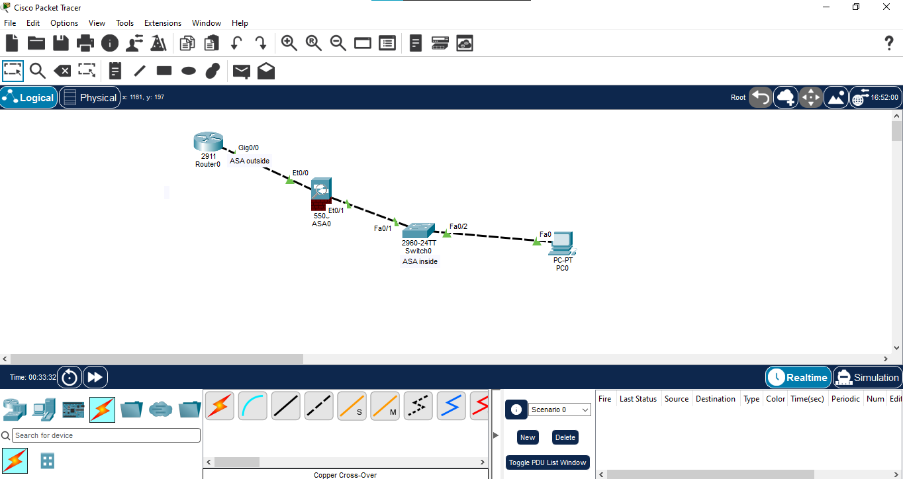
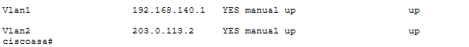
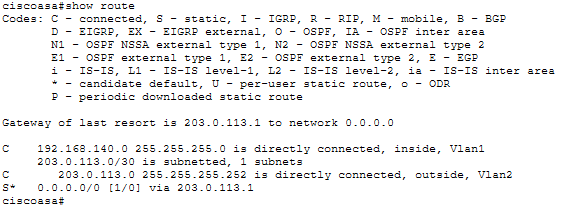
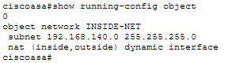
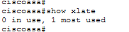
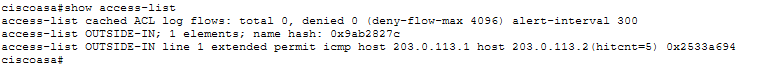
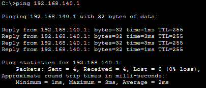
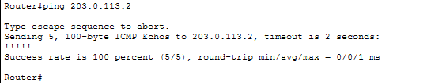
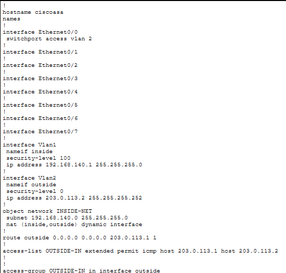

# 07 - Firewall Basics

## Overview

This Packet Tracer lab demonstrates the fundamentals of a stateful firewall using a **Cisco ASA 5505**. The lab covers inside/outside security zones, ASA interface configuration, a default route, dynamic PAT, and an outside inbound ACL.

The lab also includes verification of NAT translation and ACL hit counts using Cisco ASA CLI commands.

## Objectives

- Configure ASA inside and outside interfaces
- Understand ASA security levels
- Configure an ASA default route
- Configure dynamic PAT using an ASA network object
- Configure an outside inbound ACL
- Verify NAT translation
- Verify ACL hit counts
- Test connectivity between the ASA and upstream router
- Save the ASA configuration

## Network Topology

### Devices Used

| Device | Model | Hostname |
|---|---|---|
| Firewall | Cisco ASA 5505 | ciscoasa |
| Router | Cisco 2911 | Router |
| Switch | Cisco 2960 | Switch |
| End Device | PC | PC0 |

## Network Addressing

| Device | Interface | IP Address | Subnet Mask | Role |
|---|---|---|---|---|
| Router | G0/0 | 203.0.113.1 | 255.255.255.252 | Outside/Upstream |
| ASA | VLAN 2 | 203.0.113.2 | 255.255.255.252 | Outside |
| ASA | VLAN 1 | 192.168.140.1 | 255.255.255.0 | Inside |
| PC0 | NIC | 192.168.140.10 | 255.255.255.0 | Inside Host |

**PC0 Default Gateway:** `192.168.140.1`

## Port Mapping

| ASA Port | VLAN | Zone | Connected Device |
|---|---:|---|---|
| Ethernet0/0 | VLAN 2 | Outside | Router |
| Ethernet0/1 | VLAN 1 | Inside | Switch |

## ASA Interface Configuration

The ASA was configured with two security zones:

- **Inside:** `192.168.140.1/24`, security level **100**
- **Outside:** `203.0.113.2/30`, security level **0**

## Default Route

A default route was configured on the ASA toward the upstream router:

`route outside 0.0.0.0 0.0.0.0 203.0.113.1`

The ASA successfully reached the upstream router, and the route appeared as the gateway of last resort.

## Dynamic PAT

Dynamic PAT was configured for the inside network using the ASA outside interface:

`object network INSIDE-NET`
` subnet 192.168.140.0 255.255.255.0`
` nat (inside,outside) dynamic interface`

### NAT Translation Verification

After generating ICMP traffic from PC0 toward the outside network, the ASA created an ICMP PAT translation.

The verified translation showed:

`192.168.140.10` → `203.0.113.2`

## Outside Inbound ACL

An inbound ACL was applied to the ASA outside interface to permit ICMP from the upstream router to the ASA outside interface:

`access-list OUTSIDE-IN extended permit icmp host 203.0.113.1 host 203.0.113.2`

Applied with:

`access-group OUTSIDE-IN in interface outside`

### ACL Verification Result

The ACL showed:

`hitcnt=5`

This confirms that the configured ICMP rule processed five matching packets during testing.

## Connectivity Verification

### PC0 to ASA Inside

PC0 successfully pinged the ASA inside interface:

`192.168.140.10 → 192.168.140.1`

Result: **4/4 replies, 0% packet loss**

### Router to ASA Outside

The upstream router successfully pinged the ASA outside interface:

`203.0.113.1 → 203.0.113.2`

Result: **5/5 replies, 0% packet loss**

## Return Route

A static route was configured on the upstream router for the ASA inside network:

`ip route 192.168.140.0 255.255.255.0 203.0.113.2`

This provides a return path toward the inside network for the lab topology.

## Final Configuration

The final ASA running configuration confirms the interfaces, default route, NAT object, ACL, and ACL application.

## Verification Commands

### ASA

`show interface ip brief`

`show route`

`show running-config object`

`show xlate`

`show access-list`

`show running-config`

### Router

`show ip interface brief`

`show ip route 192.168.140.0`

`show arp`

`ping 203.0.113.2`

## Key Concepts Learned

- Cisco ASA security levels
- Inside and outside security zones
- ASA VLAN interfaces
- Default routing on ASA
- Dynamic PAT
- NAT translation tables
- Extended ACLs
- ACL application using `access-group`
- ACL hit counters
- Return routing
- Firewall connectivity verification

## Files

| File | Description |
|---|---|
| `01-topology.png` | Complete Packet Tracer topology |
| `02-ip-connectivity.png` | PC0 to ASA inside connectivity |
| `03-asa-interface-verification.png` | ASA interface status and IP verification |
| `04-default-route.png` | ASA default route verification |
| `05-nat-configuration.png` | Dynamic PAT configuration |
| `06-nat-translation.png` | Verified NAT/PAT translation |
| `07-acl-verification.png` | ACL configuration and hit count |
| `08-outside-connectivity.png` | Router to ASA outside connectivity |
| `09-final-running-config.png` | Final ASA running configuration |
| `07-Firewall-Basics.pkt` | Packet Tracer project file |

## Configuration Status

- [x] ASA interfaces configured
- [x] Security levels configured
- [x] Default route configured
- [x] Dynamic PAT configured
- [x] NAT translation verified
- [x] Outside ACL configured
- [x] ACL hit count verified
- [x] Router return route configured
- [x] Connectivity verified
- [x] Configuration saved

## Important Lab Note

During testing, direct PC0-to-router ICMP connectivity did not complete end-to-end in Packet Tracer even after the NAT translation was created. Therefore, this README does **not** claim successful PC0-to-router end-to-end connectivity. The documented results are limited to the configurations and verification results actually observed during the lab.

## Software Used

- Cisco Packet Tracer

## Status

**Completed — Verified in Cisco Packet Tracer**

## Author

**Mohamed Ashik**
