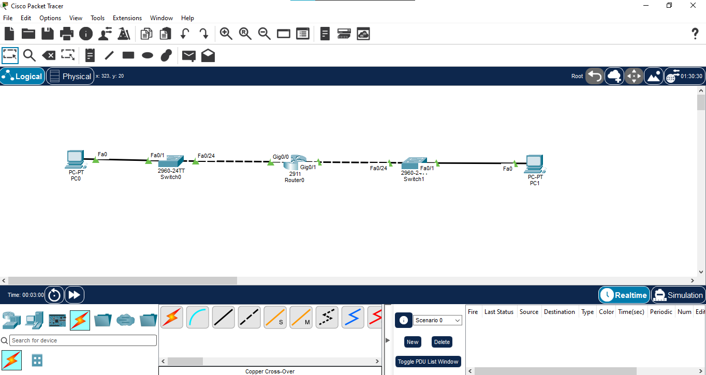
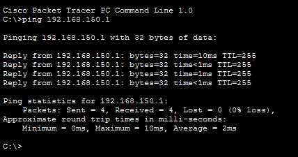
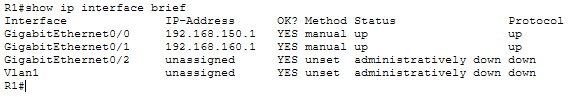
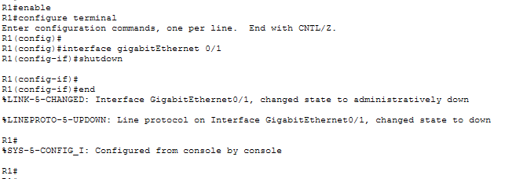
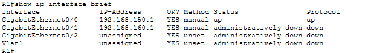
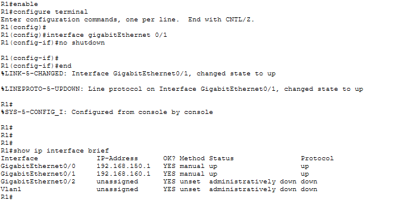
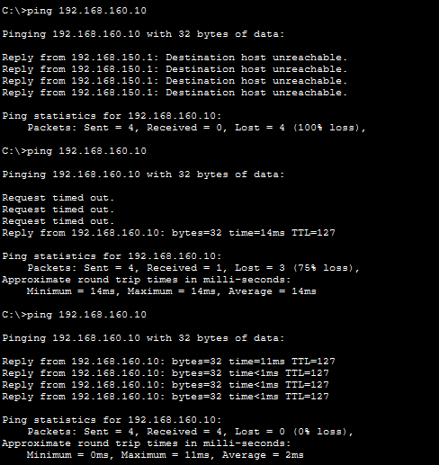
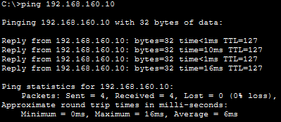

# End-to-End Troubleshooting

## 📌 Overview

This lab demonstrates a structured **end-to-end network troubleshooting workflow** using Cisco Packet Tracer.

An intentional interface failure was introduced, diagnosed using Cisco IOS verification commands, corrected, and verified through end-to-end connectivity testing.

## 🎯 Objectives

- Apply a structured troubleshooting methodology
- Identify an interface-level connectivity issue
- Use CLI verification commands to isolate the fault
- Restore the affected interface
- Verify end-to-end connectivity
- Save the corrected configuration

## 🖥️ Devices Used

| Device | Model | Quantity |
|---|---|---:|
| Router | Cisco 2911 | 1 |
| Switch | Cisco 2960 | 2 |
| PC | PC-PT | 2 |

## 🌐 Network Topology



```text
PC0 (192.168.150.10)
        |
       SW1
        |
      G0/0
       R1
      G0/1
        |
       SW2
        |
PC1 (192.168.160.10)
```

## 🔌 Port Mapping

| Device | Interface | Connected To |
|---|---|---|
| PC0 | Fa0 | SW1 Fa0/1 |
| SW1 | Fa0/24 | R1 G0/0 |
| R1 | G0/0 | SW1 Fa0/24 |
| R1 | G0/1 | SW2 Fa0/24 |
| SW2 | Fa0/1 | PC1 Fa0 |

## 🗺️ IP Addressing

| Device | Interface | IP Address | Subnet Mask | Gateway |
|---|---|---|---|---|
| R1 | G0/0 | 192.168.150.1 | 255.255.255.0 | — |
| R1 | G0/1 | 192.168.160.1 | 255.255.255.0 | — |
| PC0 | Fa0 | 192.168.150.10 | 255.255.255.0 | 192.168.150.1 |
| PC1 | Fa0 | 192.168.160.10 | 255.255.255.0 | 192.168.160.1 |

## ⚙️ Router Interface Configuration

The router interfaces were configured with IP addresses and enabled:

```text
enable
configure terminal

interface gigabitEthernet 0/0
ip address 192.168.150.1 255.255.255.0
no shutdown
exit

interface gigabitEthernet 0/1
ip address 192.168.160.1 255.255.255.0
no shutdown
exit
```

## 🧪 Baseline Connectivity

Before introducing the fault, end-to-end connectivity was tested from PC0 to PC1:

```text
ping 192.168.160.10
```

The initial connectivity test was successful.



## 🔍 Interface Verification Before Fault

The router interface status was verified using:

```text
show ip interface brief
```

Both routed interfaces were verified in an **up/up** state before the fault was introduced.



## ⚠️ Troubleshooting Scenario – Fault Creation

An intentional fault was introduced by administratively shutting down R1 G0/1:

```text
interface gigabitEthernet 0/1
shutdown
```

After the interface was disabled, the end-to-end ping from PC0 to PC1 failed.



## 🔎 Fault Identification

The fault was isolated using:

```text
show ip interface brief
```

R1 G0/1 was identified in an **administratively down** state.



## 🔧 Fault Correction

The affected interface was restored using:

```text
interface gigabitEthernet 0/1
no shutdown
```

After applying the correction, R1 G0/1 returned to an **up/up** state.



## 🔗 End-to-End Connectivity Verification

After restoring the interface, PC0 tested connectivity to PC1 again:

```text
ping 192.168.160.10
```

The end-to-end ping was successful after the fault was corrected.



## 💾 Final Verification and Configuration Save

The final router interface status and end-to-end connectivity were verified.

The corrected configuration was saved using:

```text
copy running-config startup-config
```



## 🧭 Troubleshooting Methodology

**Test → Identify → Isolate → Fix → Verify → Save**

This workflow provides a structured approach for diagnosing and resolving basic network connectivity issues.

## 📚 Key Concepts Learned

- End-to-end connectivity testing
- Interface status verification
- Administrative shutdown
- `show ip interface brief`
- Ping-based troubleshooting
- Fault isolation
- Interface recovery
- Configuration persistence

## 💡 Learning Outcome

This lab provided practical experience in troubleshooting an end-to-end connectivity failure by identifying an administratively down router interface, restoring the interface, and verifying successful communication after the fix.

## 🛠️ Software Used

- Cisco Packet Tracer

## 📂 Project Files

```text
01-End-to-End-Troubleshooting/
├── 01-topology.png
├── 02-baseline-connectivity.png
├── 03-interface-verification.png
├── 04-fault-created.png
├── 05-fault-identification.png
├── 06-interface-restored.png
├── 07-end-to-end-ping-success.png
├── 08-final-verification.png
├── 01-End-to-End-Troubleshooting.pkt
└── README.md
```

## 📌 Status

**Completed and Verified ✅**

## 👨‍💻 Author

**Mohamed Ashik**

GitHub: `mohamedashik-cpu/networking-labs`
